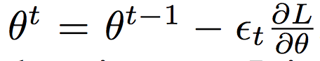
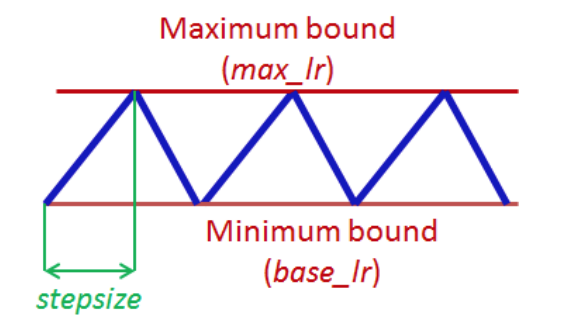
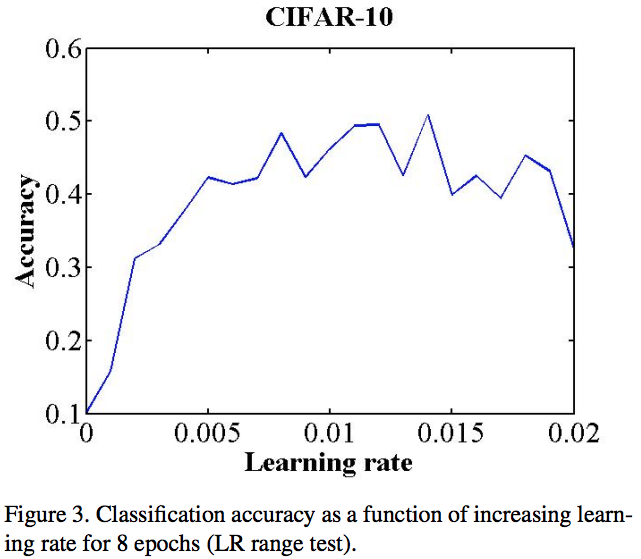
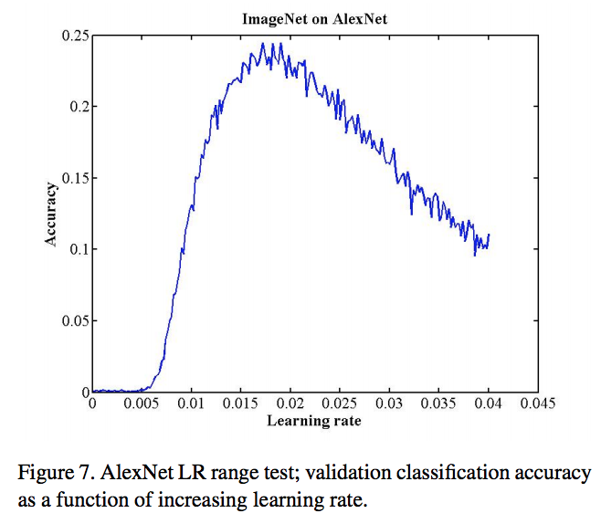
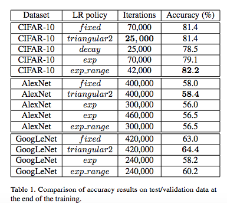
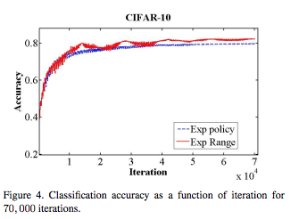
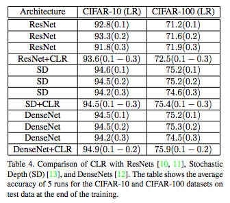
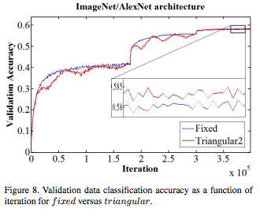
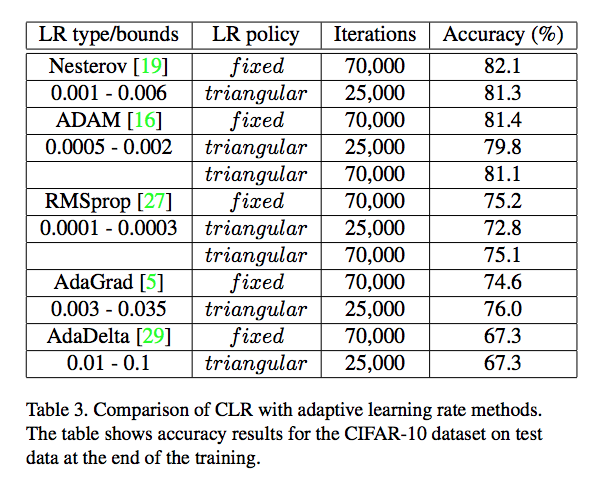

Cyclical Learning Rates for Training Neural Networks
===

Leslie N. Smith
U.S. Naval Research Laboratory, Code 5514
4555 Overlook Ave., SW., Washington, D.C. 20375

Submitted on 3 Jun 2015 (v1), last revised 4 Apr 2017 (this version, v6)

https://arxiv.org/abs/1506.01186v6

(まとめ：[wkluk-hk](https://github.com/wkluk-hk))

----

## どんなもの？

+ learning rate(LR) は、DNNにおける最重要なハイパーパラメータ
+ 最適なLRを繰り探さなくてよい「cyclical learning rate」(CLR)という手法を紹介
+ 様々なモデルとデータセットで、新手法が、通常のLR与え方よりよい結果が得られることを確認
	+ ResNets, Stochastic Depth networks, and DenseNets on the
CIFAR-10 and CIFAR-100 datasets
	+ AlexNet and GoogleNet on ImageNet

	 
----

## 先行研究と比べてどこがすごい？

### 背景
+ Learngin Rate: Loss Lに対し、最適なモデルパラメータ θを探すときの「変更度合」(ε)を探すパラメータ

+ 伝統的な手法：大きい目な値から学習を開始し、徐々に減らしていくのがよいとされる

### より凝ったやり方：Adaptive learning rates
+ 最適なLR自体を、学習結果から計算する (大体 Lossの gradientを使うのが多い）
+ 例: AdaGrad, RMSProp, Adam ... 
	+ 参考: <https://qiita.com/skitaoka/items/e6afbe238cd69c899b2a>
+ CLRの利点：シンプル、計算リソースがかからない

----

## 技術や手法の肝は？
### CLRによるLRの変え方
+ 極めてシンプル

+ stepsizeは 2〜10 * (1 epochのstep数)
+ これをtriangelとしてが、他の形も試している（結果は大体同じとのこと）：

#### triangular2
+ 振動の幅を、１周期ごとに徐々に半分にする

#### exp_range
+ 振動の幅を、exponentialに減らしていく

### Minimum, Maximum Boundの出し方も提案
+ Minimum, Maximumは、データセットとモデル両方に依存するので、その都度決める必要あり
+ 数epoch分、LRを増やしながら学習かける。その間、精度を図り続ける
+ 精度の上がり始めがMinimum, 上がるが止まる場所がMaximum　とすればうまくいく

### 手法の効果
「CLRを使うと、学習が早い。しかも精度が高い」

----

## どうやって有効だと検証した？
+ 従来手法のLR (fixed や exp)と比較した場合：
	+ 	CIFAR-10 と書いてあるのは Caffeのサンプル

+ 他のアーキテクチャー

----

## 議論はある？
+ Adaptive な手法にも組み合わせてみた

+ 必ずしも精度が上回らないが、ほとんどの場合学習は早くなった => 「CLRを使う意味あり」

----

## 次に読むべきタイトルは？

+ 手軽に試せる手法としてCLRを取り上げた。その対極として、超手の混んだ手法もある：
	+ [Reinforcement Learning for Learning Rate Control](https://arxiv.org/abs/1705.11159)

+ CLRに対する理論的な掘り下げを試みた論文
	+ [EXPLORING LOSS FUNCTION TOPOLOGY WITH
CYCLICAL LEARNING RATES](https://openreview.net/pdf?id=H1PMaa1Yg)

