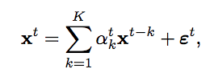
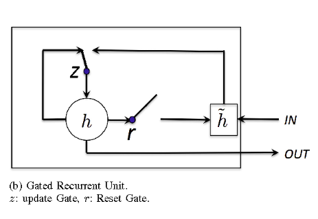
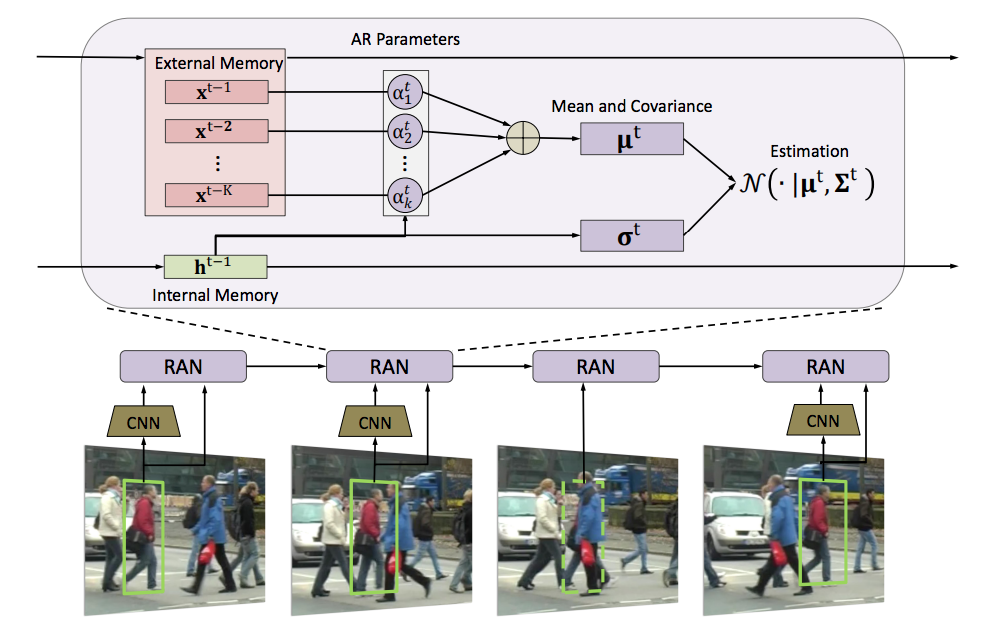
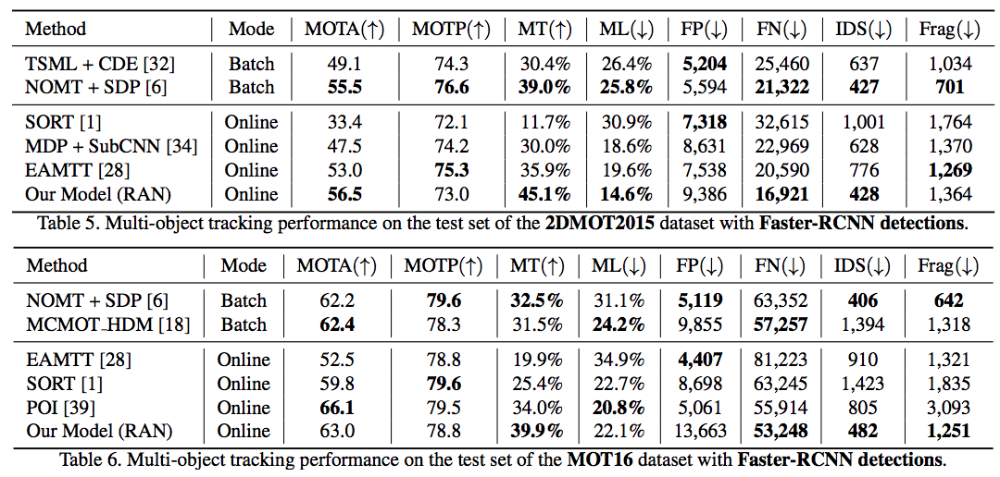
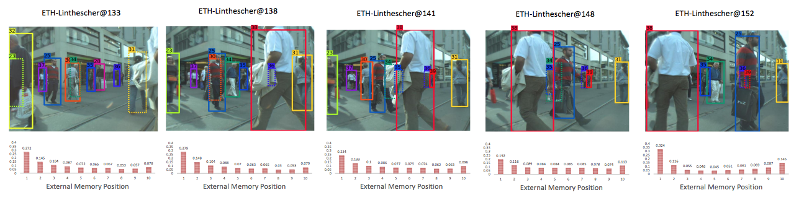

#### Recurrent Autoregressive Networks for Online Multi-Object Tracking
	まとめ：　陸　衛強 (ろく　わいけん) wkluk-hk@github

---
+ Kuan Fang(1), Yu Xiang(2), Xiaocheng Li(1), Silvio Savarese(1)
	1.Stanford University, 2.University of Washington
+ Submitted on 7 Nov 2017 (v1), last revised 4 Mar 2018 (this version, v2)
+ https://arxiv.org/abs/1711.02741

---

## どんなもの？

+ 対象： MOT(Multi-Object Tracking)問題
+ 物体軌跡を任意長の時系列として扱い、時系列手法
	+ Autoregression (自己回帰モデル)
	+ GRU (Gated Recurrent Unit, RNNの一種)
 
 を組み合わせて、物体軌跡を生成
+ 名付けて 「Recurrent Autoregressive Network (RAN)」

---
## 先行研究と比べてどこがすごい？

+ MOTのよくあるアプローチ “tracking-by-detection” 
+ MOT = 「個別フレームの検出器」+ 「フレーム間検出結果同士をつなげるアルゴ」
+ 「つなげるアルゴ」の入力は大体「見た目」と「位置」。出力は「位置の時系列」
+ RNNで「つなげるアルゴ」を作る試みはあったが、「見た目空間の複雑さ」>>>「訓練データセットサイズ」で訓練困難
+ RANの場合
	+ 外部メモリ（後述）で過去特徴を持ち続けるのでocclusionや検出ミスに強い
	+ 軌跡そのものではなく、Autoregressionのパラメータが出力だから訓練しやすい


---

## 技術や手法の肝は？

### まず、自己Autoregression（自己回帰モデル)



+ Xは、「見た目」や「位置」を表すベクトル。εは標準偏差σのホワイトノイズ
+ このモデルで、過去K FrameのX(見た目、位置)から次のFrameを推定して、実際のDetection結果と突き合わせる
+ 過去K Frameのことを「外部メモリ」と、GRUにあるhidden層を「内部メモリ」と作者は呼んでいる

---

### Autogressionの各パラメータ（α,σ）はRNN(GRU)の出力



+ internal memoryを持つRNN Unit (LSTMの簡単版？）
+ INとなるのは、やはり「見た目」や「位置」の時系列
+ ｈ(チルダ付き），ｒ，ｚはすべて IN の Full Connect Layer で制御
+ 出力としてhidden層のhを得る
+ このhに、Full Connect Layerをつないで 先程のAutogressionのパラメータを出す


---

### 一枚の絵にすると




+ 「見た目」特徴：実験ではinception networkのperson classifierから取得


---

## どうやって有効だと検証した？

### 精度評価
+ RAN(AR+RNN)を単純化した手法 (例：ARしないでRNNだけ、パラメータ固定のARなど)とのMOT精度評価でRANが勝つ

+ MOT Benchmarkとの比較でも、一部指標で今のstate-of-the-artに勝つ




+ RNNの出力パラメータを見て、occlusionに強いことを確認
25番の人に対する、見た目特徴 Autogressionパラメータの変化



---

## 議論はある？
+ とくにない

---


## 次に読むべきタイトルは？

とくにないが、参考情報として... 

##### MOT系のBenchmark
https://motchallenge.net/results/MOT16/?det=All

今の state-of-the-art MOTAは 70%超えている。

[参考動画](https://motchallenge.net/vis/MOT16-03/HT_SJTUZTE)

---

## Template Features

- Code Presenting |
- Repo Source, Static Blocks, GIST |
- Custom CSS Styling |
- Slideshow Background Image |
- Slide-specific Background Images |
- Custom Logo, TOC, and Footnotes |

---?code=sample/go/server.go&lang=golang&title=Golang File

@[1,3-6](Present code found within any repo source file.)
@[8-18](Without ever leaving your slideshow.)
@[19-28](Using GitPitch code-presenting with (optional) annotations.)

---

@title[JavaScript Block]

<p><span class="slide-title">JavaScript Block</span></p>

```javascript
// Include http module.
var http = require("http");

// Create the server. Function passed as parameter
// is called on every request made.
http.createServer(function (request, response) {
  // Attach listener on end event.  This event is
  // called when client sent, awaiting response.
  request.on("end", function () {
    // Write headers to the response.
    // HTTP 200 status, Content-Type text/plain.
    response.writeHead(200, {
      'Content-Type': 'text/plain'
    });
    // Send data and end response.
    response.end('Hello HTTP!');
  });

// Listen on the 8080 port.
}).listen(8080);
```

@[1,2](You can present code inlined within your slide markdown too.)
@[9-17](Displayed using code-syntax highlighting just like your IDE.)
@[19-20](Again, all of this without ever leaving your slideshow.)

---?gist=onetapbeyond/494e0fecaf0d6a2aa2acadfb8eb9d6e8&lang=scala&title=Scala GIST

@[23](You can even present code found within any GitHub GIST.)
@[41-53](GIST source code is beautifully rendered on any slide.)
@[57-62](And code-presenting works seamlessly for GIST too, both online and offline.)

---

## Template Help

- [Code Presenting](https://github.com/gitpitch/gitpitch/wiki/Code-Presenting)
  + [Repo Source](https://github.com/gitpitch/gitpitch/wiki/Code-Delimiter-Slides), [Static Blocks](https://github.com/gitpitch/gitpitch/wiki/Code-Slides), [GIST](https://github.com/gitpitch/gitpitch/wiki/GIST-Slides) 
- [Custom CSS Styling](https://github.com/gitpitch/gitpitch/wiki/Slideshow-Custom-CSS)
- [Slideshow Background Image](https://github.com/gitpitch/gitpitch/wiki/Background-Setting)
- [Slide-specific Background Images](https://github.com/gitpitch/gitpitch/wiki/Image-Slides#background)
- [Custom Logo](https://github.com/gitpitch/gitpitch/wiki/Logo-Setting) [TOC](https://github.com/gitpitch/gitpitch/wiki/Table-of-Contents) [Footnotes](https://github.com/gitpitch/gitpitch/wiki/Footnote-Setting)

---

## Go GitPitch Pro!

<br>
<div class="left">
    <i class="fa fa-user-secret fa-5x" aria-hidden="true"> </i><br>
    <a href="https://gitpitch.com/pro-features" class="pro-link">
    More details here.</a>
</div>
<div class="right">
    <ul>
        <li>Private Repos</li>
        <li>Private URLs</li>
        <li>Password-Protection</li>
        <li>Image Opacity</li>
        <li>SVG Image Support</li>
    </ul>
</div>

---

### Questions?

<br>

@fa[twitter gp-contact](@gitpitch)

@fa[github gp-contact](gitpitch)

@fa[medium gp-contact](@gitpitch)

---?image=assets/image/gitpitch-audience.jpg&opacity=100

@title[Download this Template!]

### Get your presentation started!
### [Download this template @fa[external-link gp-download]](https://gitpitch.com/template/download/black)

