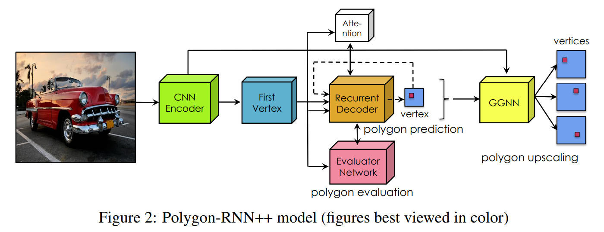
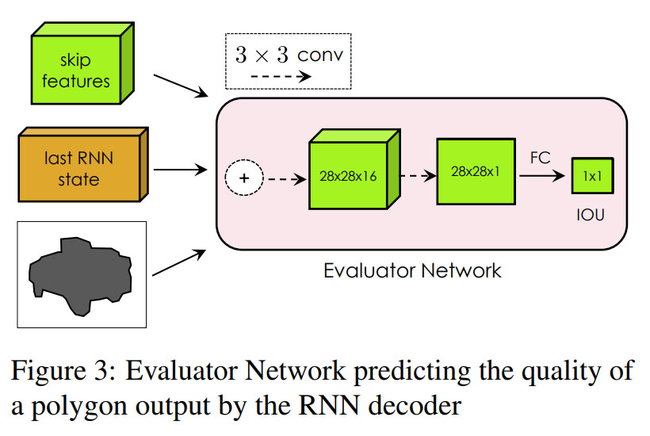
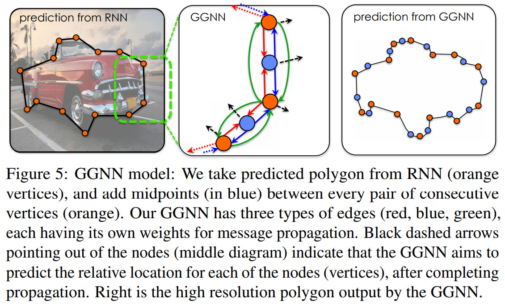
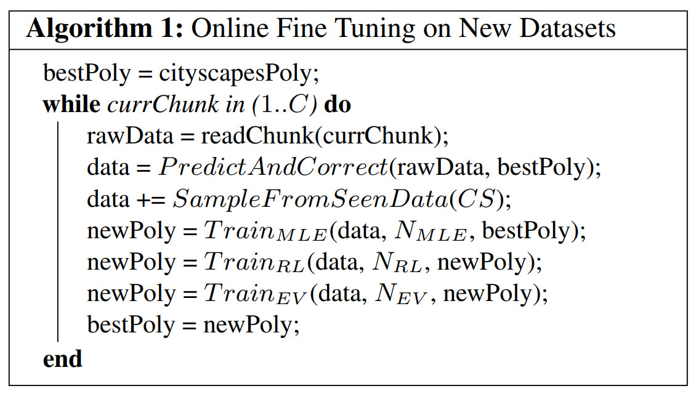
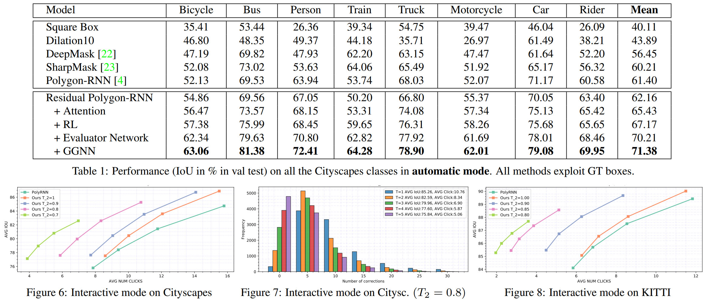
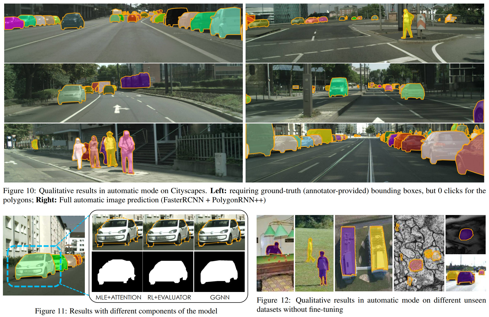

# Efficient Interactive Annotation of Segmentation Datasets with Polygon-RNN++ [arxiv](https://arxiv.org/abs/1803.09693)

- 著者
    - David Acuna *1 *3
    - Huan Ling *1 *2
    - Amlan Kar *1 *2
    - Sanja Fidler *1 *2
- 所属
    - 1: University of Toronto
    - 2: Vector Institute
    - 3: NVIDIA

## どんなもの？
- Polygon-RNN++
    - Polygon-RNN を改良したもの
        - Residual Polygon-RNN
        - Gated Feature Map
        - Reinforcement Learning
        - Evaluator Network
        - Upscaling with a Graph Neural Network
        - Online Fine-Tuning
- Polygon-RNN
    - 物体矩形からポリゴンを生成する DNN
        - 物体矩形から特徴マップと最初の頂点を出力する CNN
        - 特徴マップと指定された頂点から次の頂点を出力する RNN
    - セグメンテーションのためのアノテーション (ポリゴン) を半自動化したい。具体的には次のように。
        - 矩形 (手動) ⇒ ポリゴン (自動)
        - 矩形・頂点 (手動) ⇒ 次の頂点 (自動)

## 先行研究と比べてどこがすごい？
- automatic mode: 既存手法 (Polygon-RNN) よりも平均 IoU で 10% の性能改善
- interactive mode: クリック数を 50% 削減
- ドメイン横断シナリオ（あるデータセットで学習したモデルを他のデータセットへ適用）でも高い汎化性能を実現
- オンラインファインチューニングでより高性能化

## 技術や手法の肝は？
### Residual Polygon-RNN
- VGG16 から ResNet-50 へ変更
- dilation で高解像度化し、stride を廃止

### Gated Feature Map
- 前の時刻の RNN の隠れ層からソフトアテンションを構築し、フィーチャーマップをマスク
- 直近出力した２つの頂点のためのフィーチャーマップを次の頂点の予測に活用

### Reinforcement Learning
- 次の頂点の座標の予測を分類問題として定式化していたが、良くなかった。
    - 余計なペナルティ
        - 物体矩形上を DxD のマスに区切り、「どのマスか」または「出力なし」を分類する問題にしていたので、注目する頂点以外が負事例点扱いになっていた。
    - 最終的な評価とはかけ離れた尺度
        - 本来は IoU を最大化したい。
- 次の頂点を正しく選択できたときに報酬が発生し、その時の報酬が IoU となるような強化学習として定式化した。

### Evaluator Network
- 次のようなことを考慮したビームサーチで、最初の頂点を K 個 (5 個くらい) 選択する。
    - 最初の頂点の選択は重要（特に最初の頂点はオクルージョンの境界から遠い方が望ましい）
- 各頂点から出発するポリゴンを求め、各ポリゴンの質を評価し、最も良いものを選択する。
- 質の評価には RNN の出力を畳み込んで IoU を予測する DNN を用いる。

### Upscaling with a Graph Neural Network
- ここまでの手法で出力されるポリゴンの解像度は低いので、アップスケーリングする Gated Graph Neural Network（グラフの各頂点の情報をメッセージ交換するリカレントネットワーク）を用いた。

### Online Fine-Tuning
- 学習済みモデルが出力したポリゴンをアノテータが訂正するので、それ（チャンク）がある程度たまったら、チャンクを用いてファインチューニングする。

## どうやって有効だと検証した？
- セグメンテーションの性能 (automatic mode / interactive mode) については、インスタンスセグメンテーションのデータセット Cityscapes　dataset (訓練: 2975枚, 検証: 1525枚, クラス: 8種類) で評価した。
- ドメイン横断シナリオについては ADE20K、Aerial Imagery、Medical Imagery を用いて評価した。

## 議論はある？
- 特に書いてなかった。

## 次に読むべきタイトルは？

### Polygon-RNN
- [arxiv](https://arxiv.org/abs/1704.05548) L. Castrejon, K. Kundu, R. Urtasun, and S. Fidler, "Annotating Object Instances with a Polygon-RNN", CVPR, 2017
