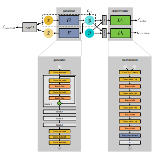

# タイトル
[WESPE: Weakly Supervised Photo Enhancer for Digital Cameras](https://arxiv.org/abs/1709.01118)

* Andrey Ignatov
* Nikolay Kobyshev
* Radu Timofte
* Kenneth Vanhoey
* Luc Van Gool

# どんなもの？
画像を綺麗にする生成モデル。
訓練には、綺麗な画像と微妙な画像のデータセットがあればいい。対応とかは不要。

## 何故読んだ？
[CVPR2018のあるまとめブログで紹介されていた。](https://towardsdatascience.com/the-10-coolest-papers-from-cvpr-2018-11cb48585a49)

# 先行研究と比べてどこがすごい？

* 綺麗な画像と微妙な画像が対になっていなくて良い
* CycleGANと比べると、特徴ベクトルベースで再現性の損失関数をつくるため、繊細さが増す
* Discriminatorの工夫がおもしろい

# 技術や手法の肝は？

* 再現性のLoss
* 色合いについてのDiscriminator
* テクスチャについてのDiscriminator
* Generatorの勾配に対する正則化

の4つの損失関数の重みつきの和を損失関数に使う。

再現性のLossには、VGG19の特徴ベクトルを利用。微妙な画像→生成した画像→微妙な画像の変換が再現できるかを評価する。

色合いについてのDiscriminatorは、生成した画像・教師の画像を滲ませてからネットワークに入れる。テクスチャについてのDiscriminatorは、グレースケールにしてから入れる。

## 訓練
* 20kステップ
* batchサイズ30
* 入力画像サイズ100x100
* Adam

で訓練（数時間で終わる？）

# どうやって有効だと検証した？
論文にいくつか画像がある。

# 議論はある？（私見）
KLダイバージェンスを使った損失になっているため、WGANなどの手法に取り替える余地がある。
色合いとテクスチャが直行するような性質だからこういう感じでDiscriminatorを分けることができたように思う。

# 次に読むべき論文は？
* [Towards Open-Set Identity Preserving Face Synthesis](https://arxiv.org/abs/1803.11182)  
  本人っぽさを保ちながら、顔の属性（肌の色とか表情とか）を変えるGAN
* [Social GAN: Socially Acceptable Trajectories with Generative Adversarial Networks](https://arxiv.org/abs/1803.10892)  
  GANの応用例として、人の経路予想にGANを使ったもの

