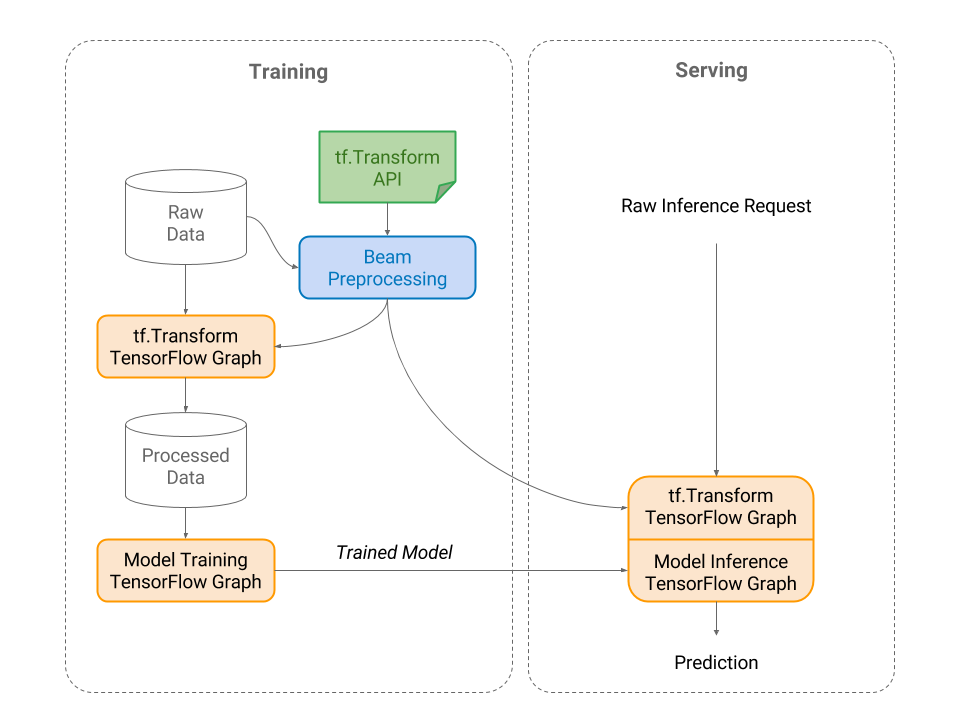
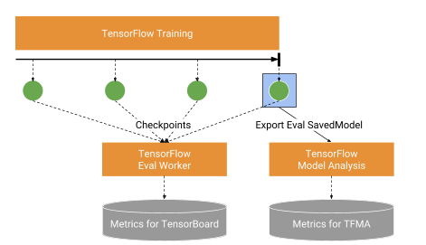

TFX: A TensorFlow-Based Production-Scale Machine Learning Platform
===

KDD 2017

Baylor, Denis and Breck, Eric and Cheng, Heng-Tze and Fiedel, Noah and Foo, Chuan Yu and Haque, Zakaria and Haykal, Salem and Ispir, Mustafa and Jain, Vihan and Koc, Levent and Koo, Chiu Yuen and Lew, Lukasz and Mewald, Clemens and Modi, Akshay Naresh and Polyzotis, Neoklis and Ramesh, Sukriti and Roy, Sudip and Whang, Steven Euijong and Wicke, Martin and Wilkiewicz, Jarek and Zhang, Xin and Zinkevich, Martin

Google Inc.

- http://www.kdd.org/kdd2017/papers/view/tfx-a-tensorflow-based-production-scale-machine-learning-platform
- https://www.tensorflow.org/tfx/

[@kencyke](https://github.com/kencyke)

---

## どんなもの？

- Google が開発している機械学習プラットフォーム
- scales to large data and runs continuously
- 現時点(2018/08/23)では機械学習ワークフローにおける Data Transform -> Trainer -> Model Analysis -> Serving 部分にフォーカスしている
- Google Play, [Google Duplex](https://ai.googleblog.com/2018/05/duplex-ai-system-for-natural-conversation.html) などの実装で利用されている

---

## どうやって有効だと検証した？

Google Play に関して

- Android アプリのレコメンドシステムの改善
- オンラインA/Bテストではメインページからのアプリインストール率を2%向上する結果が出た

---

## 技術や手法の肝は？

### 1. [Tensorflow Transform](https://www.tensorflow.org/tfx/transform/)

**Tensorflow と Apache Beam の能力を組み合わせてデータの前処理をするライブラリ**

- データの前処理パイプラインを定義する (i.e., 正則化, string-to-int, etc)
- 前処理も Tensorflow Graph として Trained model と一緒にエクスポートすることで training-serving でのデータの一貫性を保つ

---

### 2. [Tensorflow Estimators](https://www.tensorflow.org/guide/estimators)

**機械学習（訓練・評価・予測）のための Tensorflow API**

- warm-start
- model 定義の簡素化
- コンピューティング環境（standalone/distributed) に依存せずに model が定義できる
- tf.keras.layers を利用してカスタマイズ

---

### 3. [Tensorflow Model Analysis](https://www.tensorflow.org/tfx/model_analysis/)

**TensorFlow と Apache Beam の能力を組み合わせて評価指標を計算し Jupyter Notebook で視覚化するライブラリ**

- Tensorflow Estimator から Eval Graph (Saved Model + Metadata) をエクスポート
- metrics の計算や可視化
- データスライス機能などを利用して他の model と metrics を比較

---

### 4. [Tensorflow Serving](https://github.com/tensorflow/serving)

**構築した機械学習モデルをサービングするライブラリ**

- プロダクション環境に耐えられるように設計 (e.g. low latency and high efficiency)
- soft model isolation
- specialized protocol buffer parser

---

## 次に読むべき論文は？

### 参考資料

- [TensorFlow Extended (TFX) (TensorFlow Dev Summit 2018)](https://www.youtube.com/watch?v=vdG7uKQ2eKk)
- [Preprocessing for Machine Learning with tf.Transform](https://ai.googleblog.com/2017/02/preprocessing-for-machine-learning-with.html)
- [Introducing TensorFlow Model Analysis: Scaleable, Sliced, and Full-Pass Metrics](https://medium.com/tensorflow/introducing-tensorflow-model-analysis-scaleable-sliced-and-full-pass-metrics-5cde7baf0b7b)
- [Serving a TensorFlow Model](https://github.com/tensorflow/serving/blob/master/tensorflow_serving/g3doc/serving_basic.md)

### その他の機械学習プラットフォーム

[ML Kit](https://developers.google.com/ml-kit/)

- モバイル向けに機械学習モデルを提供

[Kubeflow](https://www.kubeflow.org/)

- Kubernetes native なオープンソースの機械学習プラットフォーム
- https://twitter.com/kubeflow
- https://www.slideshare.net/Oshima0x3fd/2018-0719dist

[MLflow](https://mlflow.org/)

- API first なオープンソースの機械学習プラットフォーム
- https://databricks.com/blog/category/engineering/machine-learning
- https://www.slideshare.net/databricks/introduction-fo-mlflow