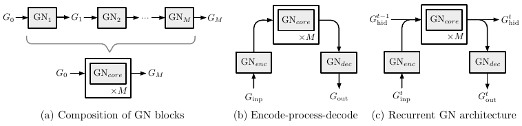

# タイトル
[Relational inductive biases, deep learning, and graph networks](https://arxiv.org/abs/1806.01261)

(まとめ @n-kats)

著者
* Peter W. Battaglia
* Jessica B. Hamrick
* Victor Bapst
* Alvaro Sanchez-Gonzalez
* Vinicius Zambaldi
* Mateusz Malinowski
* Andrea Tacchetti
* David Raposo
* Adam Santoro
* Ryan Faulkner
* Caglar Gulcehre
* Francis Song
* Andrew Ballard
* Justin Gilmer
* George Dahl
* Ashish Vaswani
* Kelsey Allen
* Charles Nash
* Victoria Langston
* Chris Dyer
* Nicolas Heess
* Daan Wierstra
* Pushmeet Kohli
* Matt Botvinick
* Oriol Vinyals
* Yujia Li
* Razvan Pascanu

DeepMind(22人)、Google Brain(3人)、MIT、Edinburgh大学

# どんなもの？
関係を扱う方法について考えた。graph networkを提案。類似手法を統一的にまとめる。

CNNは平行移動不変な局所的な特徴量を取るネットワークで、そういう正則化が入る。
graphでも同じような正則化をしたい。そんなものを統一的に扱う。

# 先行研究と比べてどこがすごい？
類似手法を統一
* Message-passing neural network
* Non-local neural networks
  SAGANで使われている手法

# 技術や手法の肝は？
## 計算方法
対象と関係は特徴ベクトルとして表現される。特別な対象として「全体」というものも考える。なのでグラフと言ってもおまけがついている。その内容は、

* \(G, V, E\)は通常の意味での有向グラフ（ループとか許す）
* 各頂点・辺と「全体」はベクトルが対応している。
  それぞれ同じベクトル空間に値をもつ。

特徴ベクトルつきのグラフに対して、次の層の特徴ベクトルを計算する。

計算方法は次の式（分かりづらい数式）

* 辺の計算。その辺とその辺の端点と全体の特徴ベクトルから計算。
* 頂点の計算。その頂点への辺の新しい特徴ベクトルを集計（平均を取るとか和を取るとか）。集計したベクトルと全体の特徴ベクトルから、その頂点の特徴ベクトルを計算。
* 全体の計算。全辺と全頂点の新しい特徴ベクトルを集計する。集計したベクトルともとの全体のベクトルから、新しい全体の特徴ベクトルを計算。

多分こっちの図の方が分かりやすい。

## 機械学習要素は？
集計したベクトルとかから次の層のベクトルを計算するときの重みにパラメータを仕込むなど。

DNNのように層を重ねたり、リカレントっぽくしたり、色々考えられる。汎用性高い。

## 比較
似たような「関係」を表す手法は、これの部分的なものだったり特別な場合だったり。

画像の各ピクセルが頂点、2点間の注目具合って関係を考えるとself attentionに相当するグラフになる。

# どうやって有効だと検証した？
これを使って何かしたというわけではない。今後の発展に期待。

2018年中にライブラリとして提供するらしい。

# 議論はある？
グラフについての任意の問題が解けるわけではない。graphが同型かの判定。

## 私見
グラフに限らず、複数の要素からなる層を扱うのに、扱う要素の優先順位を決めて（辺→頂点→全体）計算するって方法があるかも。

# 次に読むべき論文は？
* [Graph networks as learnable physics engines for inference and control](https://arxiv.org/abs/1806.01242)
  ほぼ同時に投稿された論文
