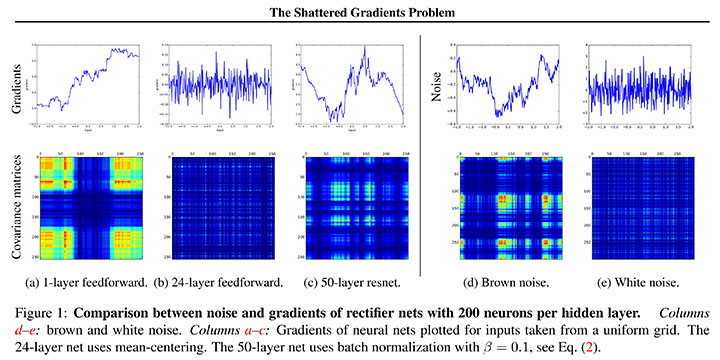
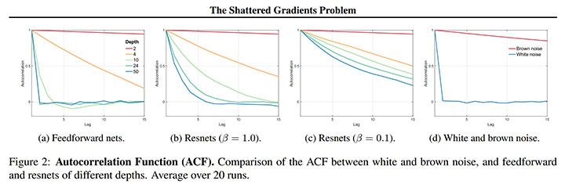
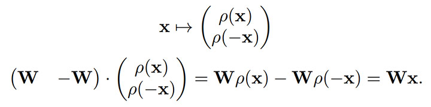
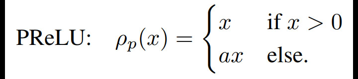
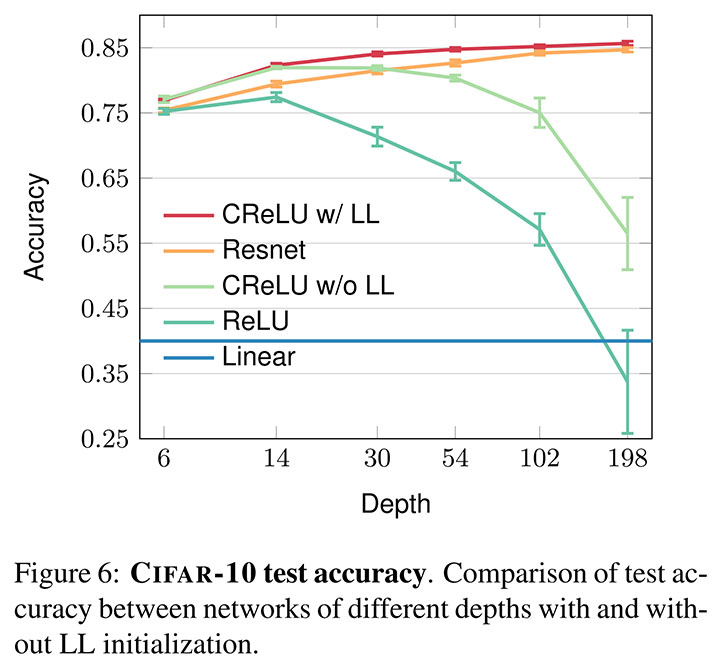

# The Shattered Gradients Problem: If resnets are the answer, then what is the question? [arxiv](https://arxiv.org/abs/1702.08591)

- 著者
    - David Balduzzi *1
    - Marcus Frean *1
    - Lennox Leary *1
    - JP Lewis *1 *2
    - Kurt Wan-Duo Ma *1
    - Brian McWilliams *3
- 所属
    - 1: Victoria University of Wellington, New Zealand
    - 2: SEED, Electronic Arts
    - 3: Disney Research, Zurich, Switzerland

## どんなもの？
- LL-init (looks linear initialization)
    - CReLU や PReLU で構築されたニューラルネットを線形関数に見せかけるパラメータ初期化手法

## 先行研究と比べてどこがすごい？
- 性能的側面
    - LL-init を使うことで（パラメータ初期化の工夫だけで）、skip connection に頼らず非常に深いニューラルネット (ResNet など) を訓練できることを示した。
- 理論的側面
    - FeedfowardNet と ResNet を比較することで、非常に深いニューラルネットの学習が難しい原因が Shattered Gradients Problem にあることを示した。
        - Shattered Gradients Problem（ニューラルネットの層が深くなるごとに勾配の空間構造が徐々に消失してホワイトノイズのようになってしまう現象）の程度を、勾配間の相関として定量化した。
        - FeedfowardNet では、ニューラルネットの深くなるごとに勾配間の相関が指数関数的に小さくなること 1 / power(2, L）を示した。
        - ResNet では、ニューラルネットの深くなるごとに勾配間の相関が緩やかに小さくなること 1 / sqrt(L) を示した。

## 技術や手法の肝は？
- LL-init: ニューラルネット全体を線形関数のように見せかけるようにパラメータを初期化する方法
- Orthogonal Convolution: 直行化された重みで初期化された畳み込み

## どうやって有効だと検証した？

### 勾配の観察
ニューラルネットに対する256 個の入力の勾配とそれらの相関を求めて観察すると次の傾向があった。

- 1-layer FeedfowardNet（浅いニューラルネット）の勾配はブラウンノイズに似ている。
- 24-layer FeedfowardNet（深いニューラルネット）の勾配はホワイトノイズに似ている。
- 50-layer ResNet（skip connection と batch normalization を組み込んだ深いニューラルネット）の勾配はブラウンノイズに似ている。

訓練が上手くいきやすいかは、勾配がブラウンノイズ的かホワイトノイズ的かで決まるように見える。それは、勾配間の相関を見ても分かる。
ニューラルネットの層数を変えながら、勾配間の相関の変化を観察すると次の傾向があったい。

- FeedfowardNet の勾配間の相関は急激に減衰する。ブラウンノイズに似ている。
- ResNet の勾配間の相関はβを小さくすれば減衰しづらい（線形に減衰するようにできる）。ブラウンノイズとホワイトノイズの中間に見える。

### 提案手法
勾配間の相関が減衰しないニューラルネットを設計できれば、skip connection に頼らずとも深いニューラルネットを訓練できる。
パラメータの初期化だけで頑張ってみよう（最初だけだけど勾配間の相関が強い状態を作れるし）。

- LL-init: パラメータの初期値を工夫すれば線形関数に見せかけることができる
- Orthogonal Convolution: パラメータの初期値を工夫すれば線形関数に見せかけることができる

### CReLU の場合

### PReLU の場合

## 議論はある？
- LL-init と skip connection のハイブリッドを研究していきたい。
- 山口の感想: もう少し難しいタスクで有効性を確認してほしかった。

## 次に読むべきタイトルは？

### Orthogonal Convolution
- [arxiv](https://arxiv.org/abs/1312.6120) Saxe, Andrew M, McClelland, James L, and Ganguli, Surya, "Exact solutions to the nonlinear dynamics of learning in deep linear neural networks", ICLR, 2014
