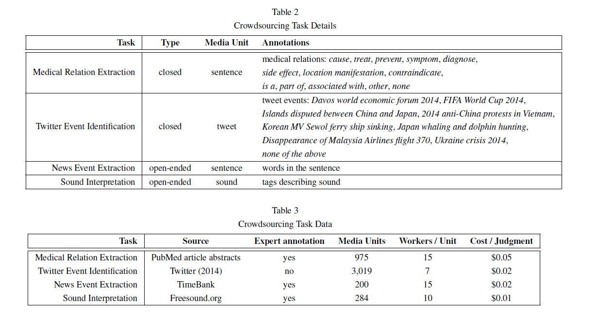
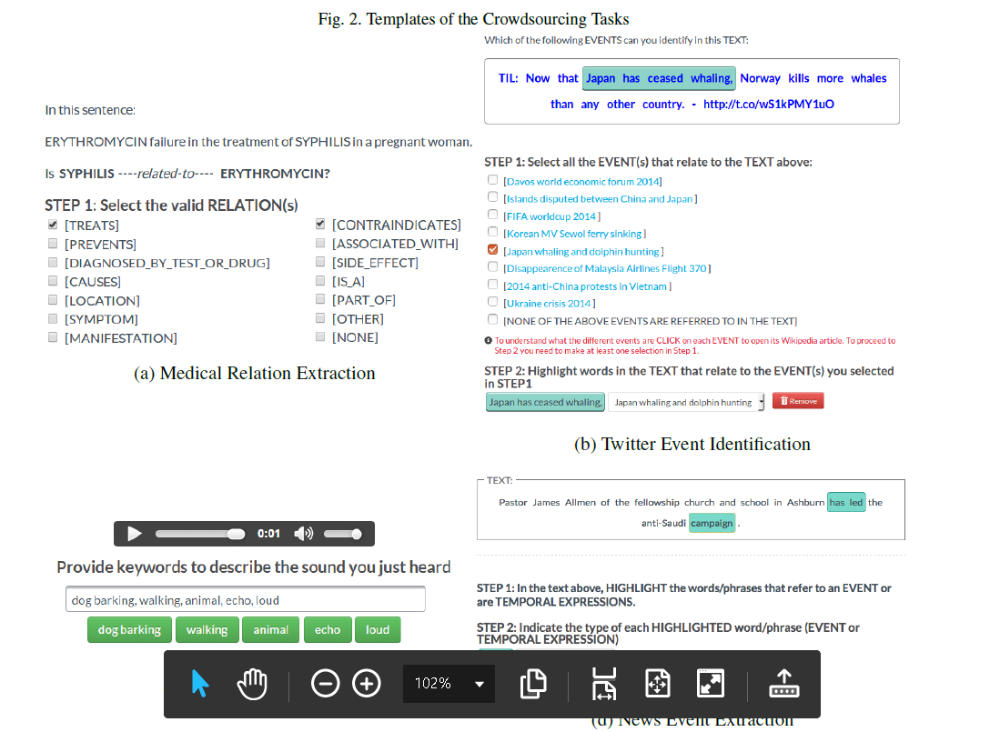
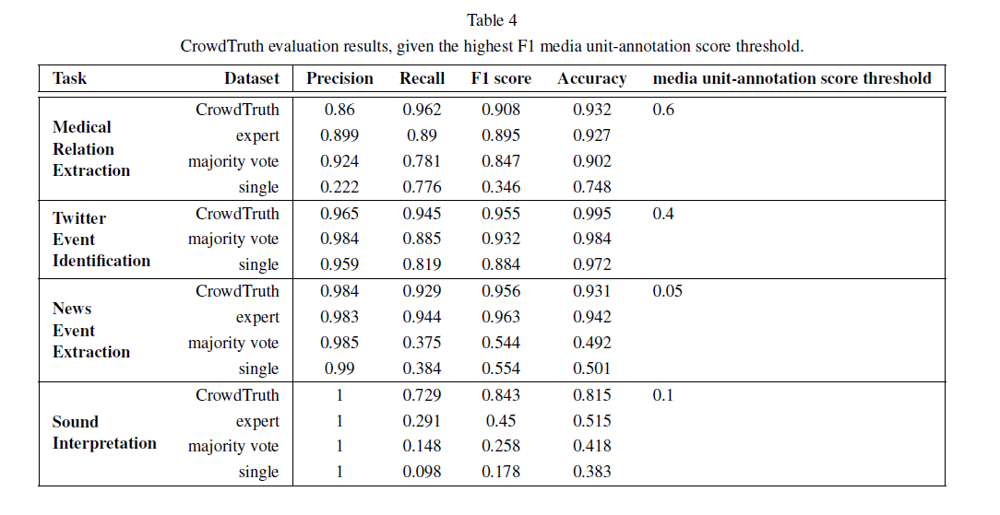

Empirical Methodology for Crowdsourcing Ground Truth
===

2018/09/24 Anca Dumitrache, Oana Inel, Benjamin Timmermans, Carlos Ortiz, Robert-Jan Sips, Lora Aroyo, Chris Welty

https://arxiv.org/abs/1809.08888
https://www.arxiv-vanity.com/papers/1809.08888/

まとめた人: yuji38kwmt

---

## どんなもの？

* クラウドソーシングで品質を測る方法
    * アノテータ同士の多数決
    * アノテータの専門家⇒コストと時間を消費する
* アノテータ同士の意見の不一致を防ぐため、厳密なルールを作った
    * ルールを作るのが長くて退屈
    * アノテーションタスクが、頑固で他のドメインで再現性がない
* アノテータの意見の不一致を利用した、CrowdTruthという方法で、品質を測った

---

## 技術や手法の肝は？
* CrowdTrutheは、
    * 不一致の三角形
    * 品質は、media unit, アノテーション、クラウドワーカで決まる
    * 質の低いアノテータを識別することができる
* crowdsourceの品質は、アノテーションのベクトル空間で表現する

ｰｰｰ

## どうやって有効だと検証した？
* Sound Interpretationでは、専門家より品質が高かった
* 以下のタスクを作業して、多数決、専門家、CrowdTruthの評価を行った。
    * two closed tasks, i.e. [Medical Relation Extraction](https://arxiv-sanity-sanity-production.s3.amazonaws.com/render-output/402493/x1.png), [Twitter Event Identification](https://arxiv-sanity-sanity-production.s3.amazonaws.com/render-output/402493/img/tweets.png),

    * two open-ended tasks, i.e. [News Event Extraction](https://arxiv-sanity-sanity-production.s3.amazonaws.com/render-output/402493/img/news_event_extraction.png) and [Sound Interpretation](https://arxiv-sanity-sanity-production.s3.amazonaws.com/render-output/402493/img/sound-task.png).

* CrowdTruthはF1が高かった

---

## 議論はある？
* CrowdTruthの品質は、専門家と同程度だった。
* Medical Relation ExtractionのCrowdTruthのコストは、専門家の2/3
* CrowdTruthでは、workerが増えるほど、F値が増加する

---

## 先行研究と比べて何がすごい？
不明

---

## 次に読むべき論文は？

* [CrowdTruth: Machine-Human Computation Framework for Harnessing Disagreement in Gathering Annotated Data](https://loraaroyo.files.wordpress.com/2014/05/iswc2014-rdb-submitted.pdf)
    - CrowdTruthの元の論文
* [Early Gains Matter: A Case for Preferring Generative over Discriminative Crowdsourcing Models](http://www.aclweb.org/anthology/N15-1089)

