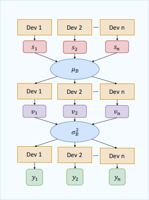
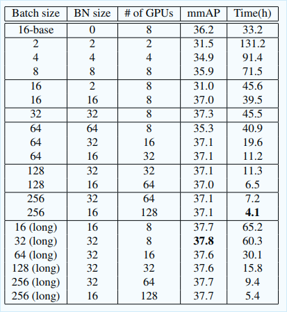

# タイトル
[MegDet: A Large Mini-Batch Object Detector](https://arxiv.org/abs/1711.07240)

(まとめ @n-kats)

著者
* Chao Peng
* Tete Xiao
* Zeming Li
* Yuning Jiang
* Xiangyu Zhang
* Kai Jia
* Gang Yu
* Jian Sun

# どんなもの？
多数のGPUを使って大きなbatch sizeで物体検出モデルを訓練してCOCO2017に優勝。
この論文のせいで物体検出が一日で大金を溶かす分野に。

# 先行研究と比べてどこがすごい？
COCOのmmAP52.5%を実現。  
画像分類で大きなbatch size(8192や16000)で訓練するのが流行っている。それを物体検出に取り入れた。
128GPU使って4時間訓練。(batch sizeを2から256へ)

# 技術や手法の肝は？
## Large mini-batch 
batch sizeが小さいと
* 訓練時間が長くなる
* batch normalization(以下BN)が正しく計算できない

BNは、訓練時に、複数の訓練画像に対するある層の値について、平均・分散を計算して、それ引いたり割ったりして正規化する処理を行う層をいう。推論時には、この移動平均を用いる。本来はデータセットの中での平均・分散を計算したいが、それが困難なため、バッチの中で計算を行う。

とりあえずBNは訓練済みモデルの固定値をそのまま使う。

しかし、単純にbatch sizeを上げたら良いわけではない。

## Linear Scaling Rule(equivalent learning rate rule)
batchサイズに比例して学習率を上げる必要がある。
学習率×勾配の分散がbatch sizeを上げても変化しないようにするために行う。

しかし、訓練初期は勾配が大きすぎて失敗する。

## warmup(Linear Gradual Warmup)
訓練の初期は勾配が暴れるので、訓練開始時は学習率を下げ、一定値まで線形に増やしていく。
ただし、これだけではそこまで性能が上がらなかった。

## CGBN(Cross-GPU Batch Normalization)
batch sizeを上げたから、BNができる。

multi-GPUで計算する際は
* 各マシンの平均を集めて平均計算
* 平均を各マシンに渡す
* 各マシンで2乗誤差を計算
* 各マシンから2乗誤差を集めて分散計算
* 各マシンでBN結果を計算

# どうやって有効だと検証した？
COCO2017優勝。

batch size 128, BN size 16のものを見ると4,5時間で収束していて、実験が大量にできる。

最終的な結果は、他のテクが入っている
* OHEM
* atrous conv
* SENet
* large kernel
* segmentation supervision
* diverse network structure
* contextual modules
* ROIAlign
* multi-scale training

# 議論はある？
再現しようと思うとお金が・・・いい方法は・・・

# 次に読むべき論文は？
* [https://arxiv.org/abs/1809.00778](https://arxiv.org/abs/1809.00778)  
  PFDet。PFNの人たちが512GPUで訓練したときの手法。
* [https://arxiv.org/abs/1706.02677](https://arxiv.org/abs/1706.02677])  
  画像分類でバッチサイズを大きくする話。
