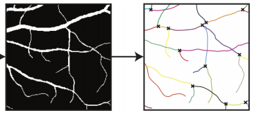
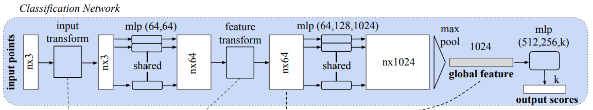
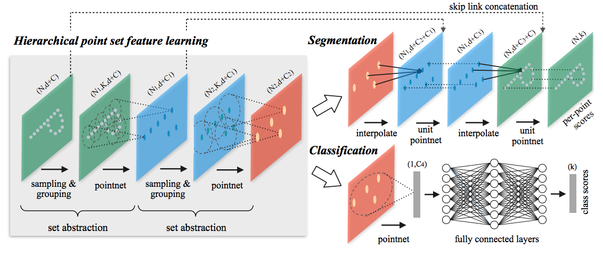
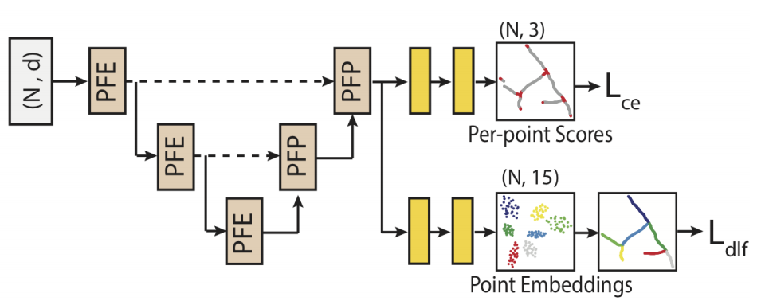
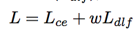
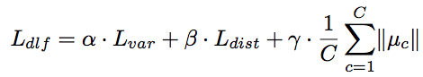
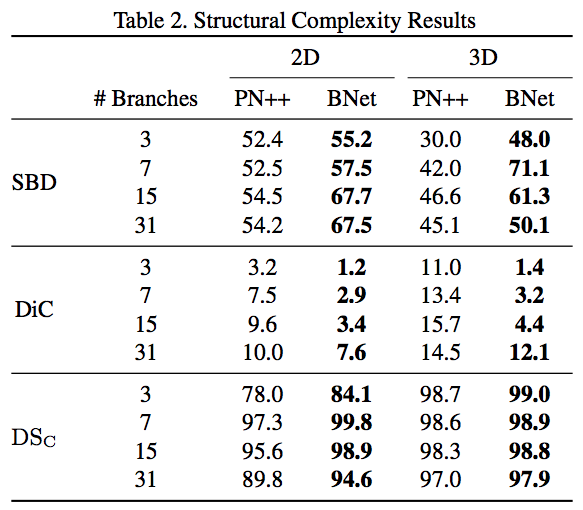

# Deep Semantic Instance Segmentation of Tree-like Structures Using Synthetic Data

##### まとめ：　陸　衛強 (ろく　わいけん) 
##### https://github.com/wkluk-hk

+ Kerry Halupka, Rahil Garnavi, Stephen Moore
	+ IBM Research Australia
+ Submitted on 8 Nov 2018
+ <https://arxiv.org/abs/1811.03208>

## どんなもの？
+ 対象問題： 
	+ データ: 順序なし3D Point Cloud で表した "branching structure"
		+ 例：「3D scanした血管」
	+ モデル出力：
		+ 枝ごとの色塗り分け
		+ 分岐点

## 先行研究と比べてどこがすごい？

+ 先行研究その１: PointNET

	+ maxpoolで全点からglobal featureを作る => 位置関係は直接使わず
	+ こういう構造が N stage繰り返す
+ 先行研究その２: PointNET++

	+ 近傍点でgroupを作ってその中でlocal featureを作る
	+ それを繰り返して重要な点だけ残す
	+ segmentationは、逆に少ない点から周り点の点へ特徴を伝搬させる(k nearest neighbour）
+ 本研究は、基本PointNET++の応用系で、segmentation対象を可変長化した

	
## 技術や手法の肝は？

+ 本研究

	+ 基本は、PointNET++の応用（Backbone）
		+ PFE (Point Feature Embedding) Layer と PFP (Point Feature Propagation)で点ごとの特徴抽出
	+ その後、「枝 segmentation」をするための2つのnetworkが続く(「分岐点探し」、「枝色分け」)
+ loss関数も「分岐点探し」・「枝色分け」に分かれる:

	

+ 「枝の色分け」は、
	+ 特徴ベクトルを出す
	+ そのベクトルたちをclustering
	+ 違うcluster = 違う枝
+ 「枝の色分け」のLossも、それに合わせて、以下のように構成される
	+ 「variance force」： 同じ枝の点をcluster centerに寄せる
	+ 「distance force」： 違う枝のcluster centerから離す
	+  一番右の「μ_c」は、cluster centerが遠くなりすぎないための正規化?項 (と想像）
		

## どうやって有効だと検証した？
+ 人工データと実データ(血管)を使って、PointNET++と比較
+ いずれも上回る精度となった(評価用のmetricsは割愛)

## 議論はある？
+ スキップ

## 次に読むべきタイトルは？
+ まずは、前述のPointNETとPointNET++論文

+ 結局、点群(sparseで点数可変)上「畳み込み」をやるためのネットワーク構造…こういったことに興味がある方なら:

	+ 点群叩き込み研究まとめ
<https://www.slideshare.net/takmin/cvpr2018pointcloudcnnsplatnet>
		 

