# Dynamical Isometry and a Mean Field Theory of CNNs: How to Train 10,000-Layer Vanilla Convolutional Neural Networks [arxiv](https://arxiv.org/abs/1806.05393v2)

- 著者
    - Lechao Xiao *1 *2
    - Yasaman Bahri *1 *2
    - Jascha Sohl-Dickstein *1
    - Samuel S. Schoenholz *1
    - Jeffrey Pennington *1
- 所属
    - 1: Google Brain
    - 2: Work done as part of the Google AI Residency program

## どんなもの？

### Orthogonal Initialization for CNNs / Delta-Orthogonal Initialization
- めちゃくちゃ深いバニラ（batch normalization や skip connection を使わない）CNN を訓練可能にする初期化方法を提案した。
- 既に TensorFlow に実装されていて簡単に使える。

### Orthogonal Initialization for CNNs

### Delta-Orthogonal Initialization

## 先行研究と比べてどこがすごい？

### 性能面
10000層でも訓練できることを示した。

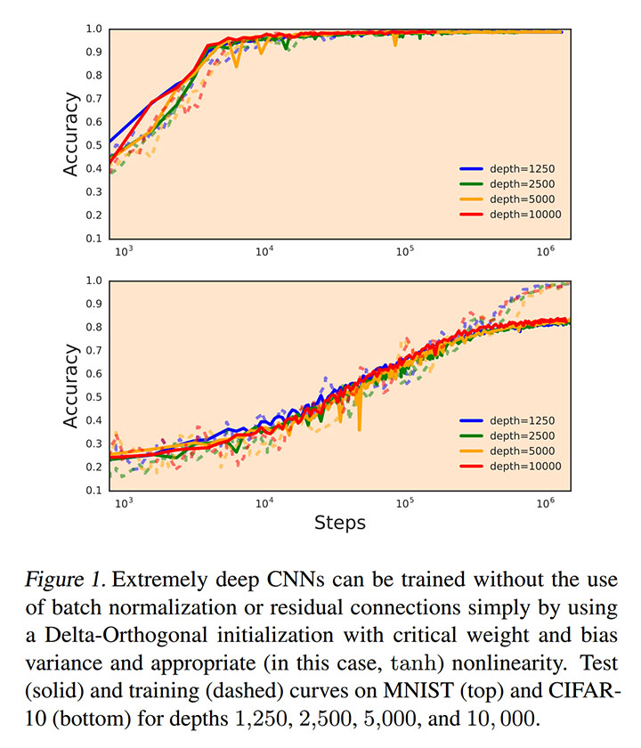

### 理論面
正規分布に従って初期化された重みやバイアスの分散から訓練可能な層数を予測できるようにした。理論と実験がよく整合する。

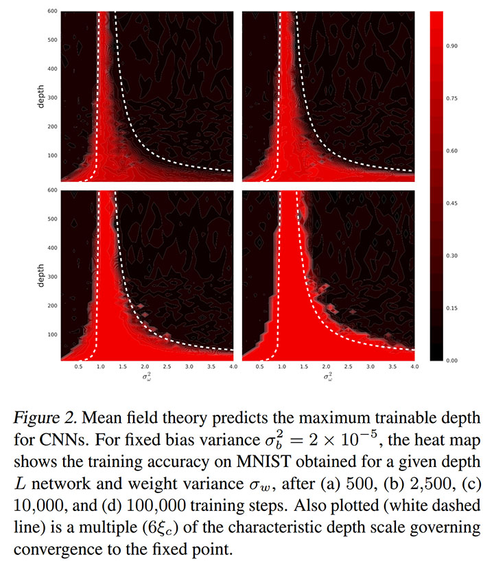

## 技術や手法の肝は？
深くなっても入力の空間相関が失われないように初期化するとよい。

## どうやって有効だと検証した？

### 理論
平均場理論を用いて空間相関（フィーチャーマップの各位置の共分散）の期待値の漸化式？を導出した。正規分布に従う初期化をしてチャネル数が凄く多い状況（中心極限定理）を仮定している。

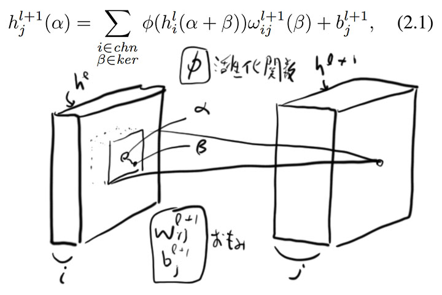
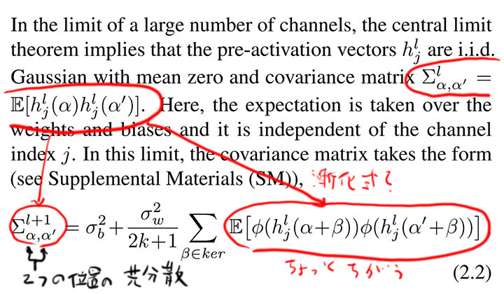
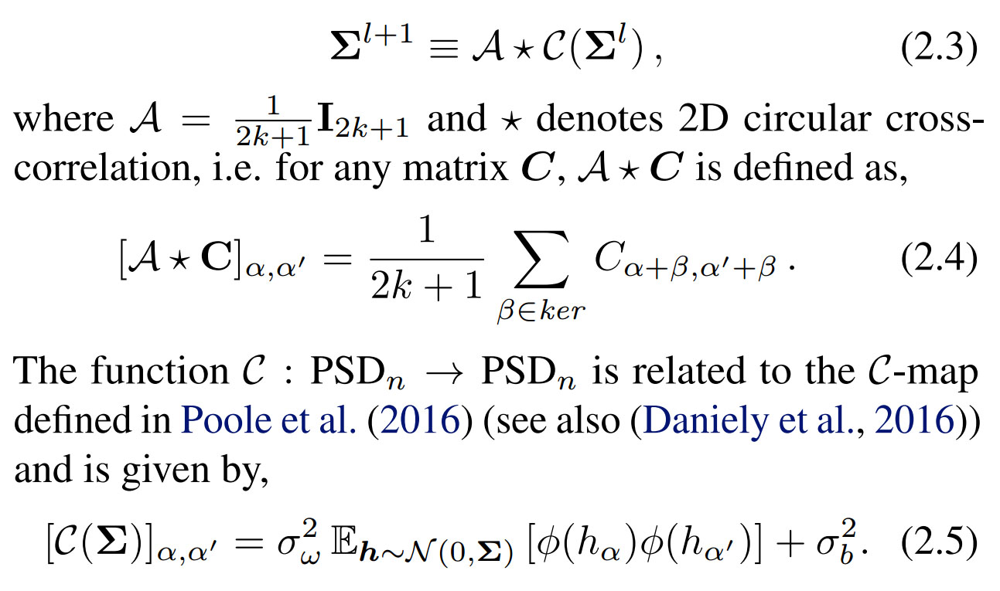

漸化式が収束した状況について考えるために、対角成分q*とその他の成分c*に分解する。q*とc*は重みの分散とバイアスの分散の関数となっているので、q*とc*の収束点を求めれば、安定性と収束させられる層数が求まる。

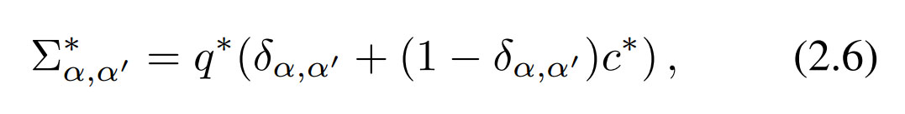

L 層目になると空間相関がどのくらい失われているか？（「収束点の空間相関の期待値」と「L 層目の空間相関の期待値」の差、ちょっと分からない）を定義して、L 層目に伝わる空間相関の解析に使う。

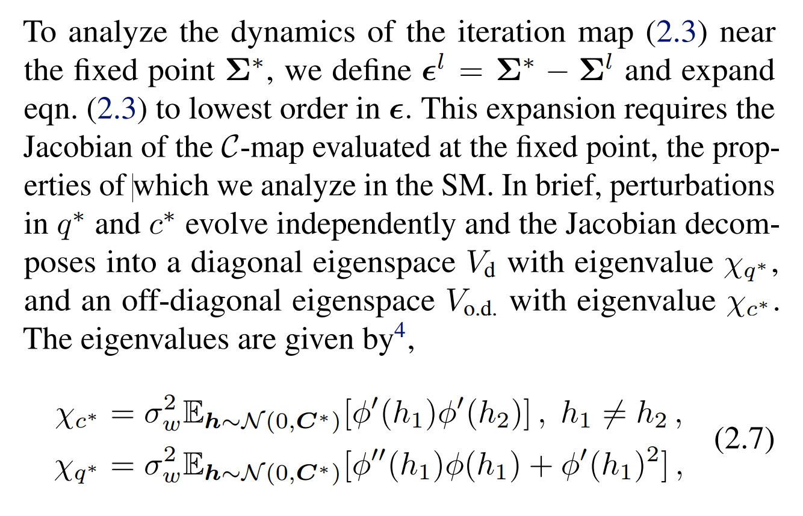

テーラー展開とかフーリエ変換をすると、次のように近似式を求めることができる。

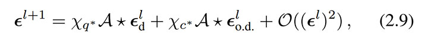
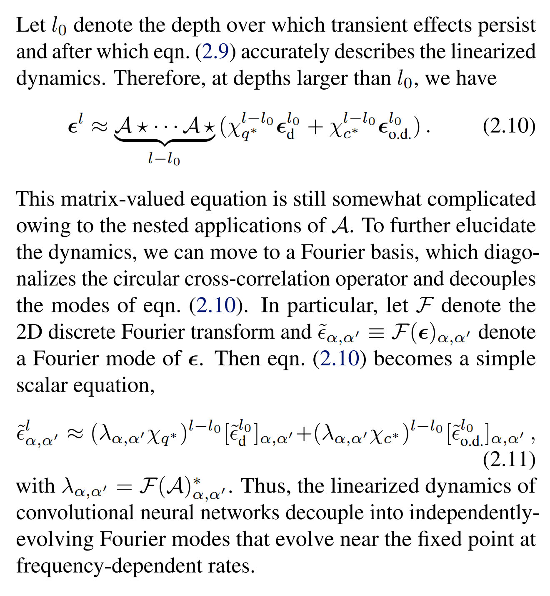

バックプロパゲーションについても同様の解析ができる。

### 実験

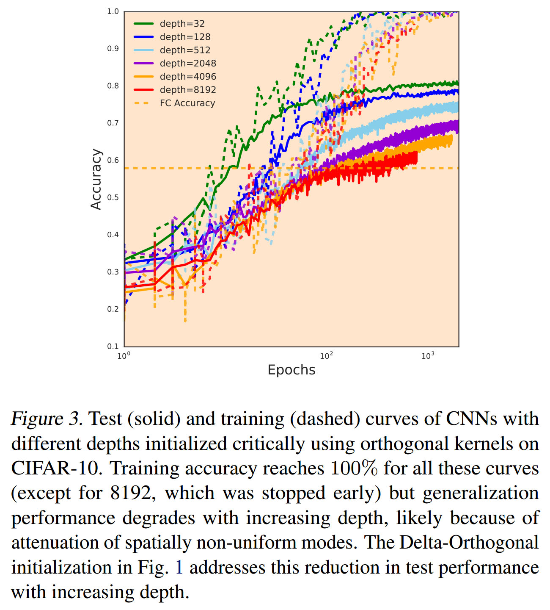
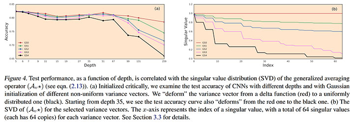
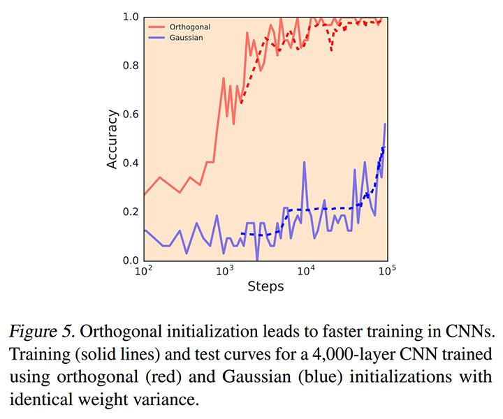

## 議論はある？
- めちゃくちゃ深くても勾配が消失／発散しないだけで、resnet に匹敵する汎化性能がある訳ではない。
- 今後は汎化性能がどこからくるかを研究しないといけない。

## 次に読むべきタイトルは？

### Orthogonal Convolution
- [arxiv](https://arxiv.org/abs/1312.6120) Saxe, Andrew M, McClelland, James L, and Ganguli, Surya, "Exact solutions to the nonlinear dynamics of learning in deep linear neural networks", ICLR, 2014
