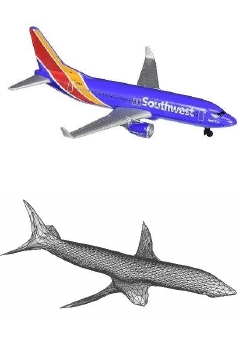
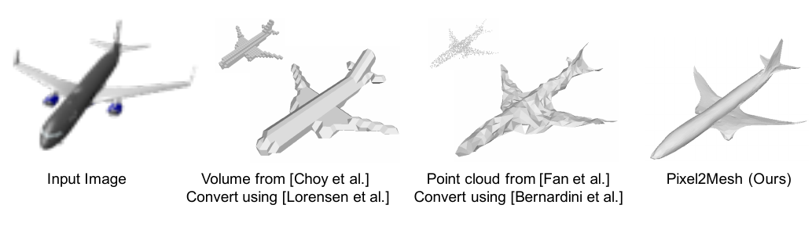
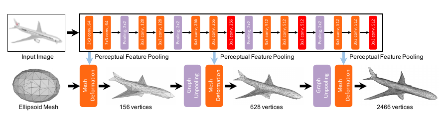
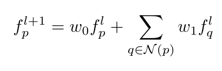
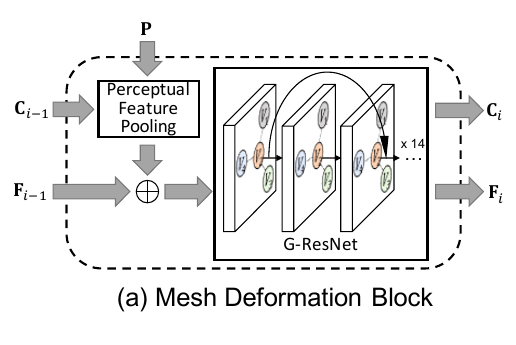
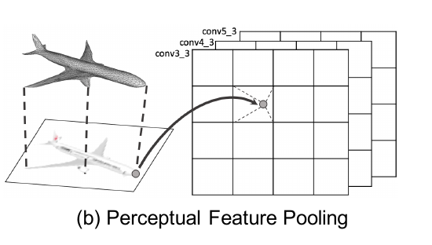
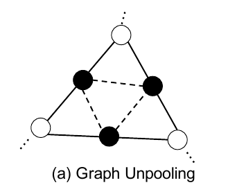

# Pixel2Mesh: Generating 3D Mesh Models from Single RGB Images
[https://arxiv.org/abs/1804.01654](https://arxiv.org/abs/1804.01654)
(まとめ @n-kats)

著者
* Nanyang Wang
* Yinda Zhang 
* Zhuwen Li
* Yanwei Fu
* Wei Liu
* Yu-Gang Jiang

# どんなもの？
単眼のRGB画像から3Dメッシュモデルを再構築

# 先行研究と比べてどこがすごい？
先行研究では、
* ブロック形式
* point cloud形式

の出力だった。

DNNが構造的な推論よりも連続的な推論に向くと考え、メッシュで表現された球を変形させて目的の形状に近づける方法を提案。

# 技術や手法の肝は？

基本構造は
* VGGみたいなネットワークで特徴ベクトルを出す
* 3Dメッシュの各頂点に対応する点にその特徴ベクトルを教える
* 特徴ベクトルをもとに変形を行う
* 特徴ベクトルの取得は複数回行う

損失関数は
* Chamfer loss（出力と教師の頂点が近い位置にあるか）
* Normal loss (面が近い方向をもいているか)
* Laplacian regularization（膨らみ具合が出力と教師で近いか）
* Edge length regularization（辺の長さについての正規化）

## GCN(graph-based convolution network)
各頂点にベクトルが対応してるような層があり、そのベクトルを更新していく。

1つ隣の頂点の値を見て畳み込む構造。空間内の座標などを各点のベクトルとして出す。

## perceptual_feature_pooling

画像内の特徴ベクトルを、GCNへ反映する方法。頂点の位置から画像内の座標を出し、その位置の特徴ベクトルを引っ張ってくる。

## graph unpooling

少しずつメッシュの頂点を増やしながら推論を行う。頂点を増やす場合は辺の中心を図のように取って行う。

# どうやって有効だと検証した？
ShapeNetの3DCADデータを利用して訓練。いくつかの指標で、大きな改善が見られた。

# 議論はある？
著者らは、頂点数を減らして効率的になるような工夫に取り組みたいと書いている。

自分の感想は、
* 球面状のものでないと穴が再現できない問題がある
* かなり理想的なデータを扱っている（背景白で教師に3DCADデータがある）
* 現実で使うにはまだ先なのかな
* そもそもこんなリッチな認識をして何ができるか

# 次に読むべき論文は？
* [3D-R2N2: A Unified Approach for Single and Multi-view 3D Object Reconstruction](https://arxiv.org/abs/1604.00449)  
  ボックス形状の出力を出すもの
