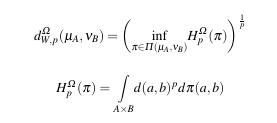
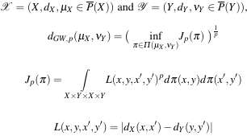
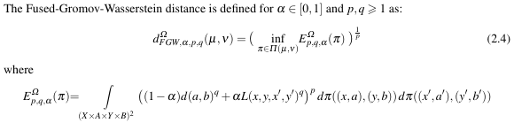

# Fused Gromov-Wasserstein distance for structured objects: theoretical foundations and mathematical properties
[https://arxiv.org/abs/1811.02834](https://arxiv.org/abs/1811.02834)
(まとめ @n-kats)

著者
* Titouan Vayer
* Laetita Chapel
* Rémi Flamary
* Romain Tavenard
* Nicolas Courty

# どんなもの？
Fused Gromov-Wasserstein距離を定義（以下FGW）

FGWの幾何学的性質が調べられている(収束とか測地線とか)

# 先行研究と比べてどこがすごい？
* Wasserstein距離（以下W）だと確率分布内の他の構造を評価できない
* Gromov-Wasserstein距離（以下GW）だと、構造だけが評価される
これを混ぜた距離を定義

## W
Wは同じ距離空間上の確率の間の距離

## GW
GWはmm-space（確率つき距離空間）同士の距離。つまり異なる空間の確率を比較。

（X, Yはコンパクト、確率はfully supportedなボレル測度）

Gromov-Hausdorff距離の確率有り版。GHとかでは空間の列の収束や距離空間の空間の議論が行われる。

2点間の距離関係をあまり損なわれないようにしながらどれだけ輸送できるかを意味する

## FGW
"structued objects"の間の距離を扱う

# 技術や手法の肝は？
## structured objects
距離空間(Ω, d)上のstructured objectsとは、3つ組(X×A, dx, μ)で次を満たすものをいう
* (X, dx)はコンパクト距離空間
* AはΩのコンパクト部分空間
* μはX×Aのfully supportedな確率

Ωは、feature spaceと呼び、Xはstructure informationと呼ぶ。

Xの形状をしていて、その各点にΩの値を属性に持つ、そのような何かを意味している。
形状部分は距離をだいたい保ったまま変形して近いかどうかを議論したいが、属性部分は値が重要で、形状側で対応がつくなら近い属性であってほしい

## FGWの定義

α→ 1のときΩ内のW距離に近づく
α→ 0のときGW距離に近づく

# どうやって有効だと検証した？
長い計算を追いかければ・・・(諦めました)

# 議論はある？
今回内容はとりあえず定義して、基本性質を見てって内容。
単純でないGANでやっていることとかはFGWで見ると違って見えるかもしれないが・・・

# 次に読むべき論文は？
* W距離を関数族の積分の差の最大値で表したような方法をこれに展開するための論文
* [Pitfalls of Graph Neural Network Evaluation](https://arxiv.org/abs/1811.05868v1)  
  graph系のネットワークを比較した論文
