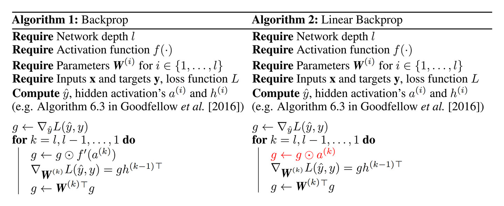

# Linear Backprop in non-linear networks [openreview](https://openreview.net/forum?id=ByfPDyrYim)

- 著者
    - Mehrdad Yazdani *1
- 所属
    - 1: Qualcomm Institute University of California San Diego La Jolla, CA 92093

## どんなもの？
### Linear Backprop
- バックプロパゲーション時に、活性化関数を無視して（線形関数とみなして）誤差を伝播する手法（アルゴリズム２）
- 活性化関数を無視せずに誤差を伝播する手法（アルゴリズム１）に対して正則化項を加えた手法と考えることが可能

## 先行研究と比べてどこがすごい？

## 技術や手法の肝は？

## どうやって有効だと検証した？

## 議論はある？

## 次に読むべきタイトルは？
- [arxiv](https://arxiv.org/abs/1312.6120) Saxe, Andrew M, McClelland, James L, and Ganguli, Surya, "Exact solutions to the nonlinear dynamics of learning in deep linear neural networks", ICLR, 2014
