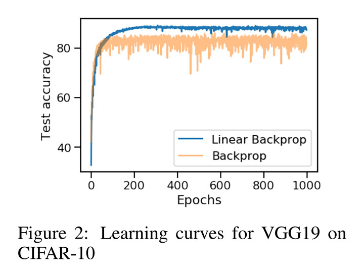
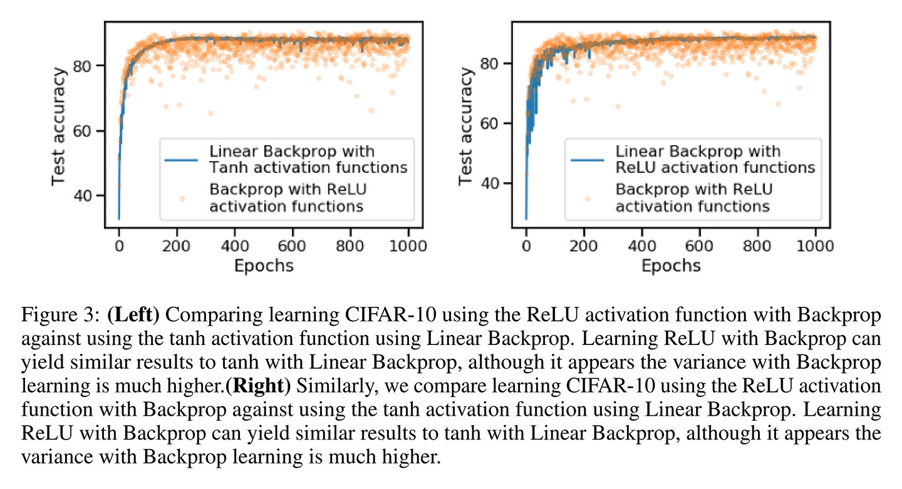

# Linear Backprop in non-linear networks [openreview](https://openreview.net/forum?id=ByfPDyrYim)

- 著者
    - Mehrdad Yazdani *1
- 所属
    - 1: Qualcomm Institute University of California San Diego La Jolla, CA 92093

## どんなもの？
### Linear Backprop
- バックプロパゲーション時に、活性化関数を無視して（線形関数とみなして）誤差を伝播する手法（アルゴリズム2）である。
- 活性化関数を無視せずに誤差を伝播する手法（アルゴリズム1）に対して正則化項を加えた手法と考えることができる。
- 活性化関数を計算しない分だけ計算量が少ない。

## 先行研究と比べてどこがすごい？
勾配消失問題を解決する（ニューロンへの入力活動が線形領域にあることを確実にする）ために様々な努力が行われてきた。

- L2 regularization (weight decay) [Krogh and Hertz, 1992] [Srivastava et al., 2014]
- batch nromalization [Ioffe and Szegedy, 2015]
- 慎重な初期化スキーム [Glorot and Bengio, 2010] [Mishkin and Matas, 2015]
- 勾配消失しない活性化関数 [Nair and Hinton、2010] [Gulcehre et al., 2016] [Klambauer et al.,2017]

これらに対して、バックプロパゲーション時に活性化関数を無視して誤差を伝播する手法を考案した。そのような思い切った手法であっても学習できることを示した。

### 個人的な意見
量子化手法ではバックプロパゲーション時に活性化関数を区分線形関数とみなす例もあるので提案手法の下地は整っていた。これらを少し一般化した手法だとみなせる。

- [arxiv](https://arxiv.org/abs/1602.02505) Binarized Neural Networks
- [arxiv](https://arxiv.org/abs/1602.02830) Binarized Neural Networks: Training Deep Neural Networks with Weights and Activations Constrained to +1 or -1

## 技術や手法の肝は？
バックプロパゲーション時に活性化関数を無視する勇気が素晴らしい。

## どうやって有効だと検証した？
人工データと CIFAR-10 を用いて実験的に有効性を示した。

### Synthetic data example
省略。

### VGG and ResNet Binarized Neural Networks on CIFAR-10
どちらのアーキテクチャも Linear Backprop の方が精度が高い。
※ResNet Binarized Neural Networks については数値だけでグラフは省略されていた。

### Comparing Linear Backprop on ReLU activation functions on CIFAR-10 with VGG19
ReLU とはほぼ同じ精度になった。

### Sweeping different learning rates and weight decays for VGG19 on CIFAR-10
学習率と重み減衰率を探索して図2の結果を得た。明るい色の線が Backprop、暗い色の線が Linear Backpro の結果である。

## 議論はある？
なかった。

### 個人的な意見
Lenear Backprop は正則化として悪くなさそうなので試してみるのはよいかもしれない。

- ReLU だとパラメータ更新をしない負の入力に対しても学習が進む
- いずれバイアスがずれて負の入力だった部分が正にシフトしたときに最初からよい値を出力することになりそう。

計算量が少ないことはあまり重要ではない（ほぼ変わらない）と思われる。

## 次に読むべきタイトルは？
- [citeseerx](http://citeseerx.ist.psu.edu/viewdoc/summary?doi=10.1.1.165.6419&rank=1) Vinod Nair and Geoffrey E Hinton, "Rectified linear units improve restricted boltzmann machines", ICML, 2010.
