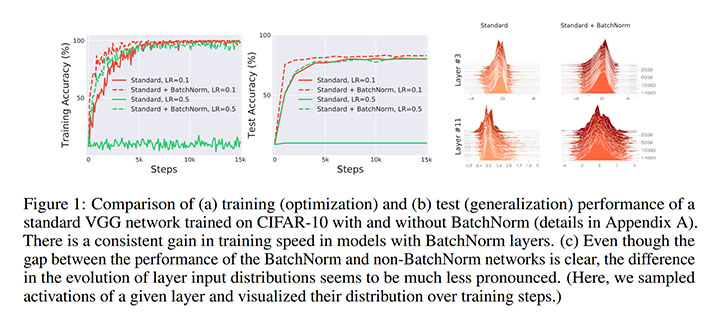
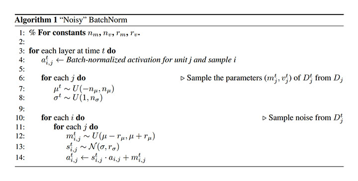
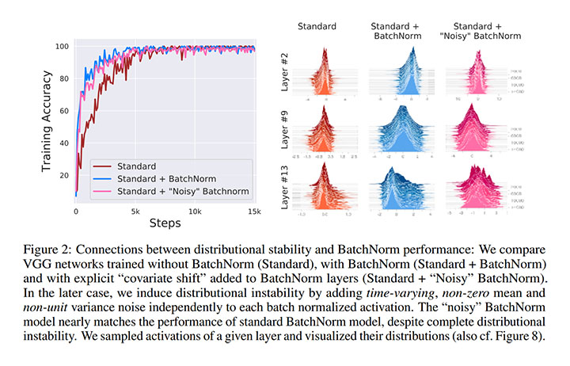
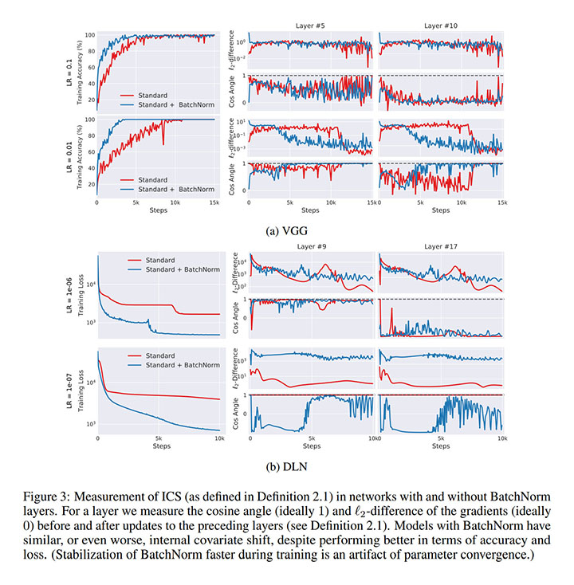
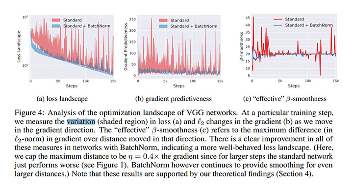
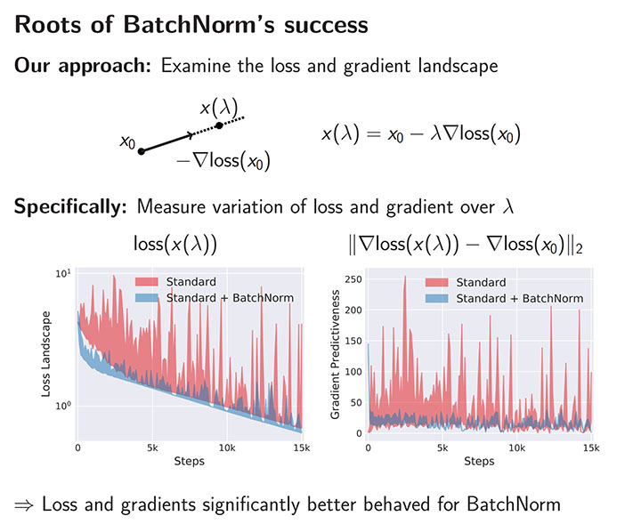
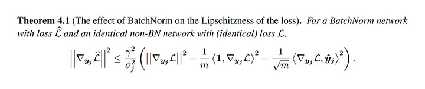

# How Does Batch Normalization Help Optimization? [arxiv](https://arxiv.org/abs/1805.11604v3)

- 著者
    - Shibani Santurkar ∗1
    - Dimitris Tsipras ∗1
    - Andrew Ilyas ∗1
    - Aleksander Madry *1
- 所属
    - 1: MIT

## どんなもの？
Batch Normalization の効果が何に由来するものかを明らかにした。

### Batch Normalization
各チャネルをそのチャネルのバッチ内の平均と標準偏差で正規化する手法である。この手法には次の効果があり、デメリットが少ないため、ほとんどのモデルに組み込まれている。

- 効果
    - 高速な収束
    - ハイパーパラメータの選択に対して頑健

この効果は「正規化による ICS の削減」に由来すると広く信じられている（Batch Normalization の論文の著者がそのように主張している）。

- '''ICS (Internal Covariate Shift)'''
    - 深いモデルを訓練するとき、各層の入力分布が時間とともに変化する現象。この現象が発生すると、各層が新しい分布に絶えず適応する必要があるので、訓練の妨げになる。

本論文の著者は「この説明が正しくない」ことを実験により明らかにし、解析により正しい説明を導出した。

## 先行研究と比べてどこがすごい？
Batch Normalization の効果の由来を特定し、実験的・理論的に説明したこと

## 技術や手法の肝は？
損失と勾配のランドスケープを用いた分析

## どうやって有効だと検証した？
次の２つの観察により、Batch Normalization が ICS を制御／削減していないにも関わらず、効果を発揮していることを示した。
つまり、Batch Normalization の効果は「正規化による ICS の削減」とは関係がないことが明らかになった。

### (1) Noisy Batch Normalization の観察
「Batch Normalization が ICS を制御しているなら、ICS が制御できない（Batch Normalization の出力にノイズが混入した）状況では学習ができなくなるはず」と期待したが、学習ができてしまった。

### (2) 勾配の観察
「Batch Normalization が ICS を減らす（入力の分布の変化が少ない）なら、勾配の変化が少なくなるはず」と期待したが、そのような振る舞いは見られなかった。むしろ、Batch Normalization が ICS を増やしているように見えた。

ランドスケープの分析により「Batch Normalization がランドスケープを大幅に滑らかにする（損失関数の Lipschitzness を改善する）」ことを特定した。

### (3) ランドスケープの分析
Batch Normalization の有無でランドスケープ（更新後の損失 loss(x0 - λ∇loss(x0))）の滑らかさが大きく変化している。
更新前の勾配 ∇loss(x0) と更新後の勾配 ∇loss(x0 - λ∇loss(x0)) を比べるとその差が小さいことから、勾配の信頼性と予測性が向上していると考えられる。
勾配の信頼性と予測性の向上が大きなパラメータ更新を可能にし、結果として収束が速くなると考えられる。

さらに、ランドスケープの分析を理論的に裏付けるために、次を証明した。

## 議論はある？
- よりよい正規化スキーム
- Batch Normalization の汎化性能に関する理解

## 次に読むべきタイトルは？
- [arxiv](https://arxiv.org/abs/1502.03167) Sergey Ioffe and Christian Szegedy, "Batch normalization: Accelerating deep network training by reducing internal covariate shift", arXiv preprint, 2015.
- [arxiv](https://arxiv.org/abs/1609.04836) Nitish Shirish Keskar, Dheevatsa Mudigere, Jorge Nocedal, Mikhail Smelyanskiy, and Ping Tak Peter Tang, "On large-batch training for deep learning: Generalization gap and sharp minima",  arXiv preprint, 2016.
- [arxiv](https://arxiv.org/abs/1803.08494) Yuxin Wu and Kaiming He, "Group normalization", arXiv preprint, 2018.
