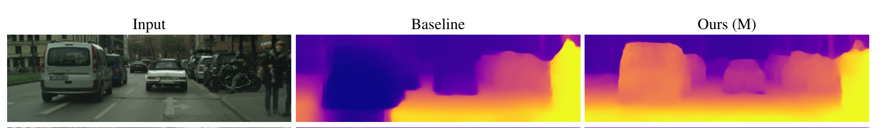
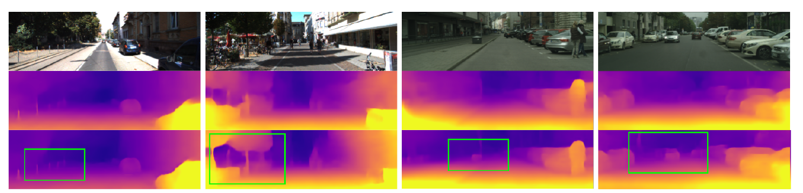
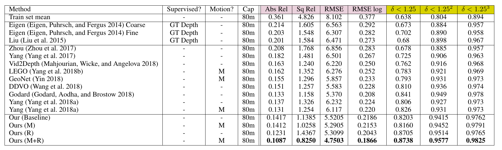

# Depth Prediction Without the Sensors: Leveraging Structure for Unsupervised Learning from Monocular Videos,
[https://arxiv.org/abs/1811.06152](https://arxiv.org/abs/1811.06152)
(まとめ @n-kats)

著者
* Vincent Casser
* Soeren Pirk
* Reza Mahjourian
* Anelia Angelova

# どんなもの？
動画を入力して訓練させると depth 推定をしてくれるモデル。

とりあえずありものの手法を組み合わせてベースラインのモデルを作成。
さらに"Motion Model"と"Refinement Model"を追加し、性能改善。

# 先行研究と比べてどこがすごい？

# 技術や手法の肝は？
## Baseline
複数の画像とその内部パラメータから、その過程の車（カメラ）の移動を認識する。つまり、どれだけ動いて回転しているかを表すパラメータを回帰する。

## Motion Model
背景（移動しないもの）と車などの移動体を分離し、背景及びそれぞれの移動体毎に移動方向を割り出す。

## Object Size Constraints
サイズ制約

## Refinement Model
教師なしだから、評価実行時にも訓練ができる。別データセットで訓練後、評価用データでそれをやると良くなる。

（左はKITTI, 右はcityscape, これらはKITTIで訓練）小さいものが取れているように見える

# どうやって有効だと検証した？

KITTI, Cityscapes, Fetch Indoor Navigation (最後は屋内)のデータセットで分析。

KITTI の Odometry の評価もやや改善
# 議論はある？

# 次に読むべき論文は？
* 
* 

