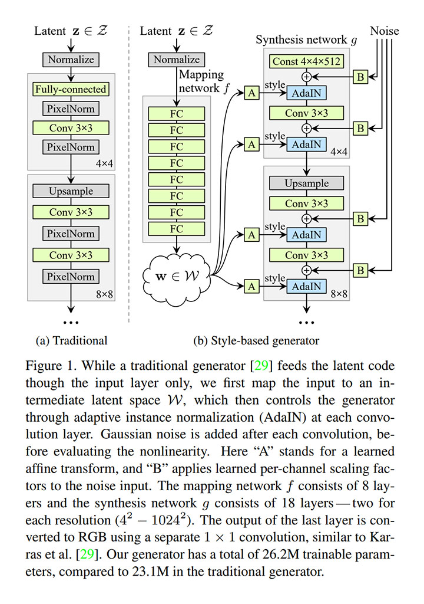
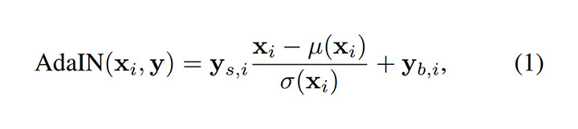
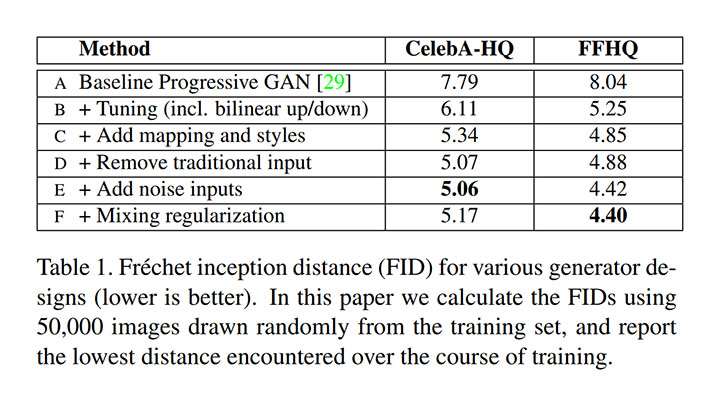
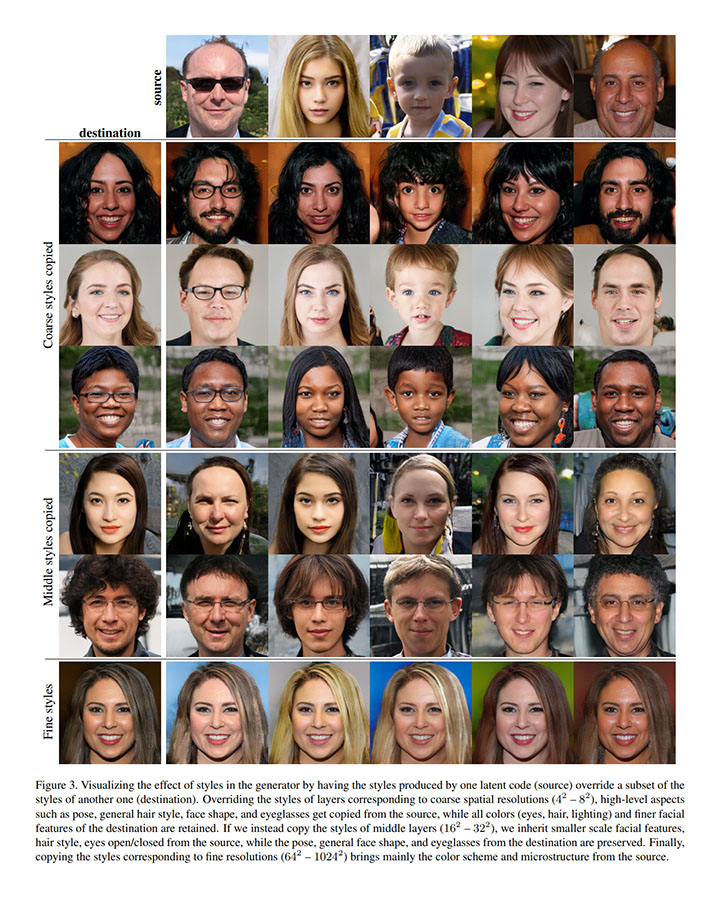
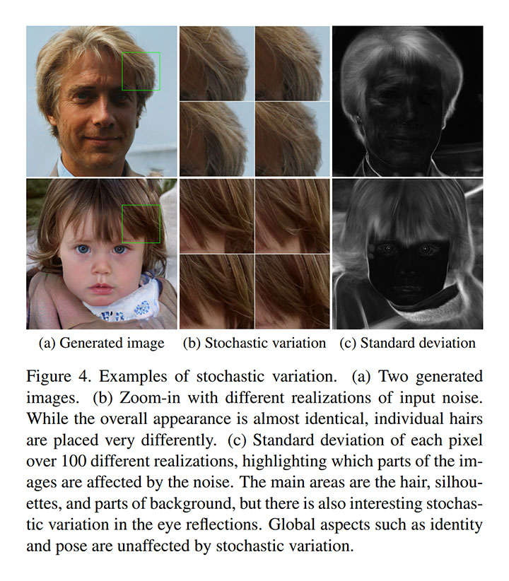
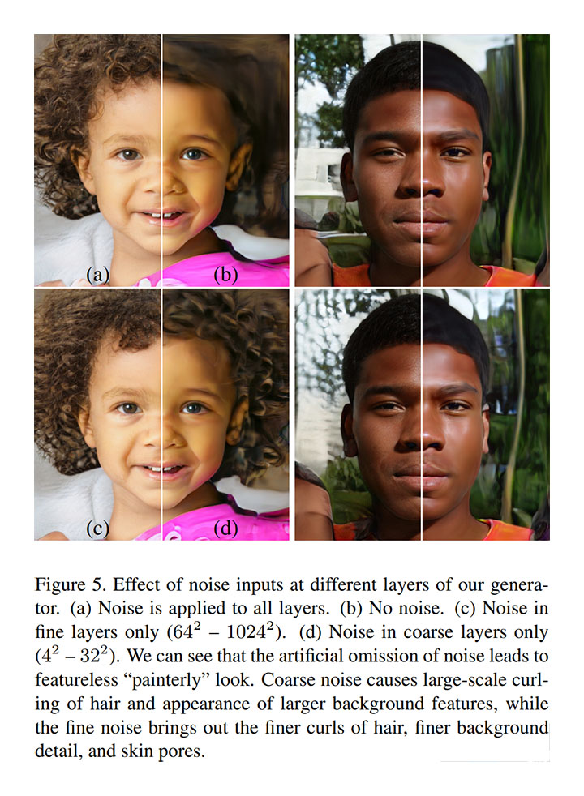
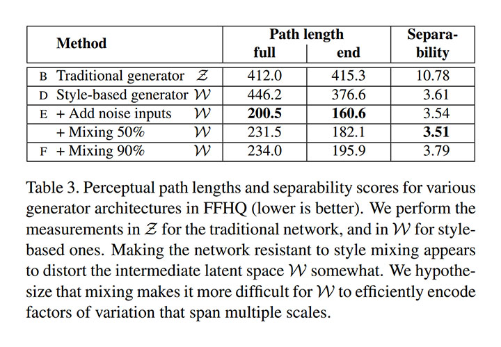
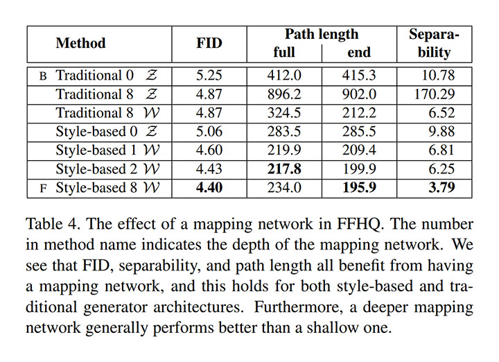

# A Style-Based Generator Architecture for Generative Adversarial Networks [arxiv](https://arxiv.org/abs/1812.04948)

- 著者
    - Tero Karras *1
    - Samuli Laine *1
    - Timo Aila *1
- 所属
    - 1: NVIDIA

## どんなもの？

### StyleGAN
次の工夫をした StyleGAN を考案した。

- Mapping network: 訓練データの分布に縛られない中間的な潜在空間
- Style-based generartor: 高レベル属性（姿勢，固有性，…）と確率的バリエーション（そばかす，髪の毛，…）の明示的に分離した生成アーキテクチャ
- Style mixing: 異なるスタイルを混ぜて生成する正則化

これにより次を達成した。

- 教師なし学習による優れた潜在空間の獲得（高レベル属性と確率的バリエーションがちゃんと分離可能）
- 優れた潜在空間を用いた直感的な生成の制御（高レベル属性と確率的バリエーションを部分的に入れ替えた生成が可能）
- 生成の質の改善（生成画像が写真と区別がつかないレベル）

### 潜在空間の線形性を測る尺度
次の尺度を考案することで潜在空間の線形性を測れるようにした。

- Perceptual path length: 潜在空間内のある点から別の点まで連続的に変化させた場合に生成データ（実際には VGG の中間層の特徴量）がどのくらい連続的に変化するかを表す尺度
- Linear separabilit: 潜在空間の各属性がデータに付与されたラベルをどのくらい線形分離できるかを表す尺度

これらの尺度を用いて、StyleGAN の工夫が潜在空間の線形性を大きく改善することを明らかにした。

### FFHQ dataset
本論文の実験のために、人の顔画像のデータセット FFHQ dataset (Flickr-Faces-HQ dataset) を構築した。

- 画像数: 70,000 枚
- 解像度: 1024 x 1024
- 多様性: Celeb-HQ よりも様々な観点（年齢，民族，背景，眼鏡，サングラス，帽子，…）で多様
- 配布サイト: https://github.com/NVlabs/ffhq-dataset

## 先行研究と比べてどこがすごい？
- データセットに関する背景知識を使えば教師なし学習であっても優れた潜在空間を獲得できることを示したこと
- StyleGAN が潜在空間の線形性を改善することを定量的に示したこと

## 技術や手法の肝は？
- Mapping network: 訓練データの分布に縛られない潜在空間が重要だと言うことを発見し、それを生成アーキテクチャに反映したこと
- Style-based generartor: データセットに関する背景知識（高レベル属性と確率的バリエーションが顔画像の中でどのように表れるか）を直接的にアーキテクチャに反映したこと

## どうやって有効だと検証した？
### 生成画像の質の測定
Celeb-HQ と FFHQ を用いて、ProgressiveGAN と StyleGAN の生成画像の質 (FID: Frechet inception distance) を測定し、各工夫の効果を確認した。

### 潜在空間上の２つのベクトルを混ぜて生成した画像の可視化
次は destination 画像のベクトルの特定のスケールの属性（確率的バリエーション）を source 画像のベクトルへコピーして作ったベクトルから生成した画像を可視化し、それぞれの画像の指定の属性がよく反映されていることを確認した。

### 確率的バリエーションを変化させて生成した画像の可視化
確率的バリエーションを変化させても高レベル属性は変化しない（いずれの画像も自然である）ことを確認した。

確率的バリエーションの影響をなくすと絵画のような見た目になることを確認した。

### 潜在空間の線形性の測定
Perceptual path length と Linear separabilit という尺度（計算方法は省略）で、各工夫の効果を確認した。

中間的な潜在空間の変換を深くすることで、潜在空間の線形性が改善されることを確認した。

中間的な潜在空間を導入することで、訓練データに含まれないデータのために、潜在空間がゆがんでしまうのを阻止していると言うことらしい。

## 議論はある？
著者は GAN による生成の制御に関する理解の進展は「高レベル属性と確率的バリエーションの分離」と「中間的な潜在空間の線形性」によってもたらされると主張している。

## 次に読むべきタイトルは？
- [arxiv](https://arxiv.org/abs/1710.10196) T. Karras, T. Aila, S. Laine, and J. Lehtinen, "Progressive growing of GANs for improved quality, stability, and variation". arxiv, 2017
