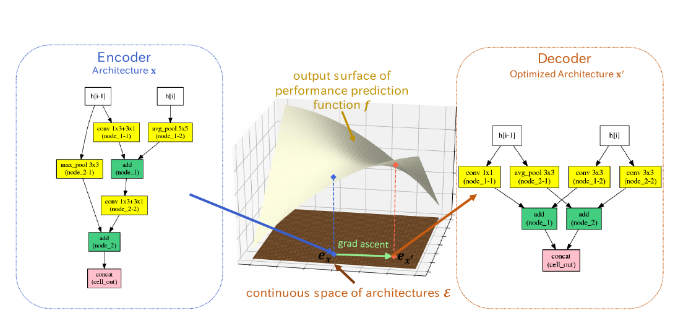

# Neural Architecture Optimization
[https://arxiv.org/abs/1808.07233](https://arxiv.org/abs/1808.07233)
(まとめ @n-kats)

著者
* Renqian Luo
* Fei Tian
* Tao Qin
* Enhong Chen
* Tie-Yan Liu

# どんなもの？
ネットワーク探索(NAS)の一種。
強化学習や遺伝的アルゴリズムをベースにした離散的な手法が多い。
しかし、離散的な手法は組み合わせが増えると指数的に必要な処理時間が大きくなる。
ネットワークをベクトルにエンコードし、そのベクトルの中で探索して、見つけたベクトルをネットワークにデコードする方法を提案。

# 先行研究と比べてどこがすごい？
* Performance Predictorの訓練方法の改善
* ネットワークをベクトル空間に埋め込む
* その他これまでの手法をいいとこどり

# 技術や手法の肝は？
## 探索空間
CNNの場合、大抵、同じ構造の繰り返し。繰り返すパーツの構造を探索する。RNNの場合、その時刻の入力と状態が計算グラフの入力になる。
計算グラフをトークンの列で表現する。

## エンコーダ(E)・デコーダ(D)
LSTMを使ってトークンの列をベクトル化、及び逆操作を行う

## performance predictor(P)
ベクトル化したものから、性能を予測(2乗誤差を損失関数とする)。

## 訓練方法
* ネットワークの候補を評価
* 候補と評価値を使って訓練
* 訓練後のEとPを使って既出のネットワークを良いパフォーマンスが出そうな方向へ摂動し、新しいネットワーク候補を作成・追加
* 最初に戻る

## Weight sharing
ENASで導入された手法。NAOnetと独立して機能するため有効。

## data augmentation
同値な計算グラフを作って訓練する。（足し算の順序を入れ替えるようなことなど）

# どうやって有効だと検証した？
CIFAR10, PTBで1GPU10時間で訓練。
CIFAR10でerror 2.11%。現状（[CIFAR10のSOTA](https://paperswithcode.com/sota/image-classification-cifar-10-image-reco)）をみるとGPIPEの次点相当。
PTBでtest perplexity 56.0%。[PTBのSOTA](https://paperswithcode.com/sota/word-level-models-penn-treebank)を見ると、言うほど良くない。
# 議論はある？
性能改善や応用以外にも、"teaching and learning to teach"のような観点からも研究したいらしい。

## 私見
最近、グラフ系の手法に興味があって調べていて、今回の論文を読んだが、単なるLSTMで対処されていて、その点では期待はずれ。

# 次に読むべき論文は？
* [https://arxiv.org/abs/1806.09055](https://arxiv.org/abs/1806.09055)  
  DARTSという、同じようなアイデアの論文
* [https://arxiv.org/abs/1901.00596](https://arxiv.org/abs/1901.00596)  
  今回の方法だとLSTMだけど、グラフ系の手法を使うなら・・・と考えたときにグラフ関係の評判のいいサーベイ論文
