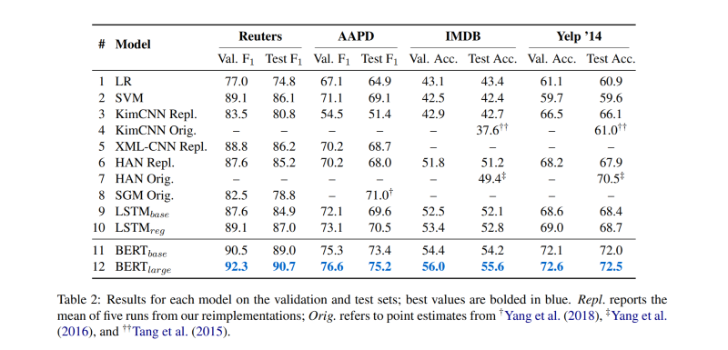
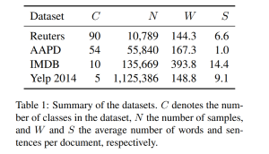
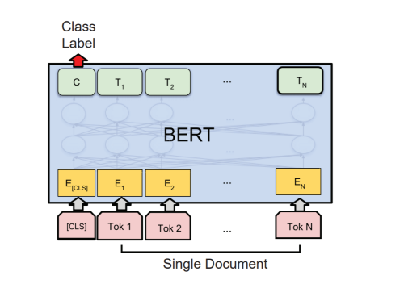

DocBERT: BERT for Document Classification
===

2019/04/17 Ashutosh Adhikari, Achyudh Ram, Raphael Tang, Jimmy Lin(David R. Cheriton School of Computer Science University of Waterloo)
[https://arxiv.org/abs/arxiv_1904.08398](https://arxiv.org/abs/arxiv_1904.08398)

（まとめ：@nharu1san）

---

## どんなもの？
- BERTでドキュメント分類を行った

---

## 先行研究と比べて何がすごい？
- 検証した4つのデータセットでstate of the art

---

## どうやって有効だと検証した？
- Reutar-21578, [AAPD(arXiv Academic Paper dataset)](https://arxiv.org/abs/1806.04822), IMDBレビュー, [Yelp 2014](https://www.yelp.com/dataset/challenge)の4つのデータセットでSVMやLSTM, CNNを用いた手法(HAN, KimCNN, XMLCNN, SGM)と比較した

---

## 技術や手法の肝は？
- BERTのSingle Sentenceと同様にoutput layer付きのモデルを用いてドキュメント分類を行った

---

## 議論はある？

---

## 次に読むべき論文は？
- Hierarchical Attention Networks for Document Classification
  - 今回の比較対象の一つ, GRU+Attention
