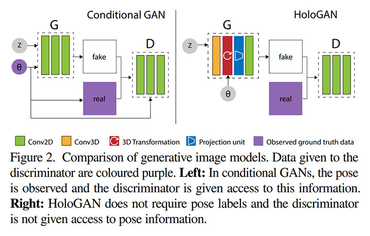
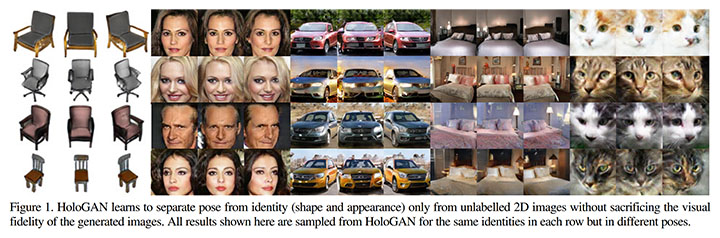
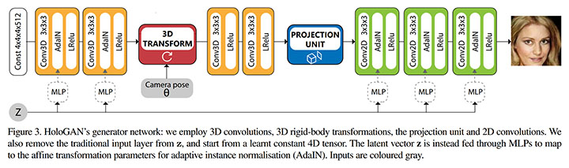
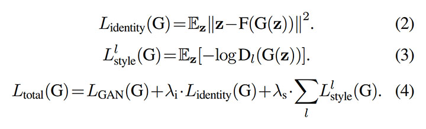
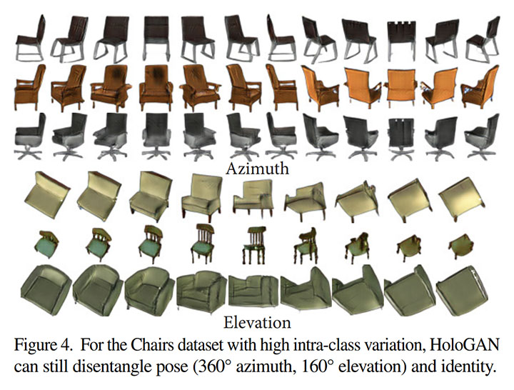
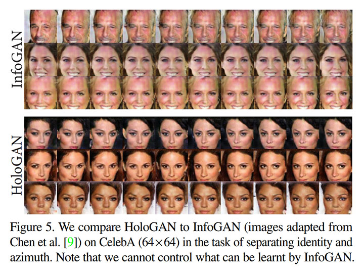
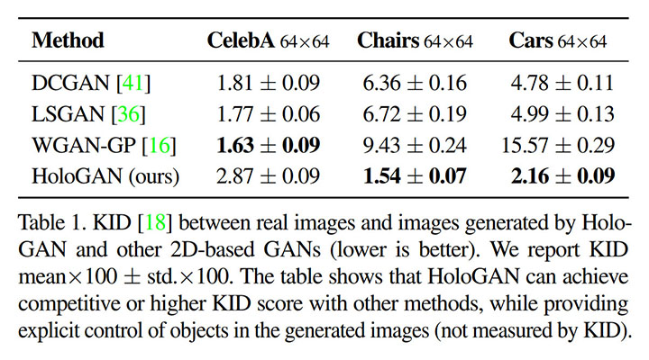
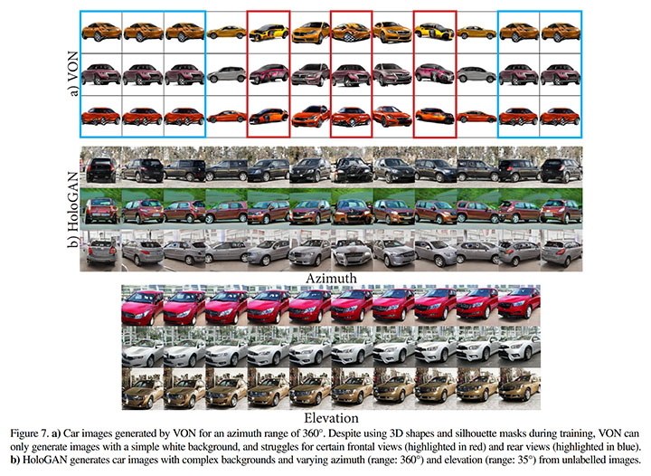
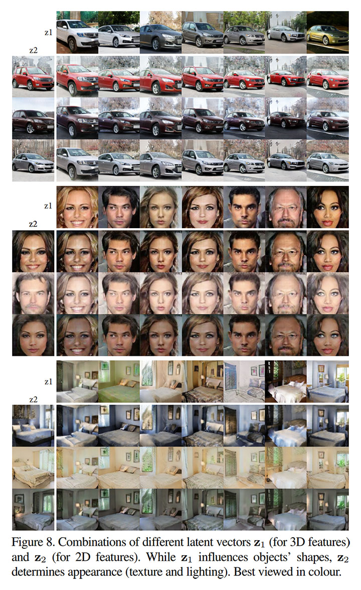
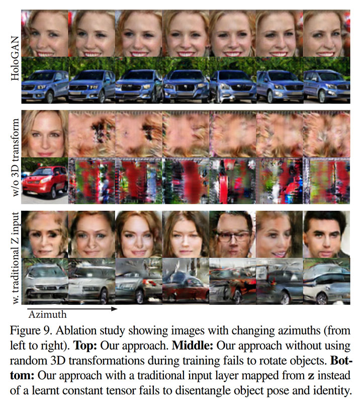

# HoloGAN: Unsupervised learning of 3D representations from natural images [\[arxiv\]](https://arxiv.org/abs/1812.04948)

- 著者
    - Thu Nguyen-Phuoc *1
    - Chuan Li *2
    - Lucas Theis *3
    - Christian Richardt *1
    - Yong-Liang Yang *1
- 所属
    - 1: University of Bath
    - 2: Lambda Labs
    - 3: Twitter

## どんなもの？
- ３次元世界に関する強い帰納バイアスが組み込まれた教師なし深層生成モデル (HoloGAN)

## 先行研究と比べてどこがすごい？
- 画像から３次元物体に関するもつれのない表現（姿勢・形状・見た目）を獲得可能
- 視覚的な忠実さを犠牲にすることなく視点を操作可能（"unconditional" な GAN としては初）

## 技術や手法の肝は？
### Generator の工夫
StyleGAN の Generator Network を踏襲し、定数（ボクセル: [4, 4, 4, 512]）から出発し、次の観点ごとに順に変換を加え、出力（画像: [128, 128, 3]）を得る生成器を設計した。それぞれの観点で用いられるパラメータは乱数（潜在ベクトル）を非線形変換（MLP）したものを用いた。

+ ３次元形状変換（スタイル適用）: 3D Convolution + Adaptive Instance Normalization + Leaky ReLU
+ カメラ姿勢変換: 3D Rotation + Trilinear Resampling
+ レンズ歪み変換: 3D Convolution + Leaky ReLU
+ 透視投影変換: 3D to 2D Reshape ([W, H, D, C] ⇒ [W, H, D×C]) + MLP with Leaky ReLU
+ ２次元形状変換（スタイル適用）: 2D Convolution + Adaptive Instance Normalization + Leaky ReLU

### Loss Function の工夫
通常の GAN の損失関数に加えて、次の２つの損失関数を用いている。

- Identity Regulariser: Generator（順変換）と同時に Encoder（逆変換）も学習することで、順変換して逆変換した結果が元に戻るか（潜在ベクトルが復元できるか）を測定する。写っているものの本質が失われないようにするための正則化となる。
- Style Discriminator: スタイル適用前の特徴量の統計値（平均・標準偏差）が本物かどうかを、３次元と２次元のそれぞれでスケールごとに判定する。

### その他の工夫
Generator 側では Adaptive Instance Normalization を用いたが、Discriminator 側では Instance Normalization と Spectral Normalization を組み合わせたものを用いた。

- Adaptive Instance Normalization: スタイル適用のための活性正規化
- Instance Normalization: チャネルごとに独立して行われる空間方向の活性正規化
- Spectral Normalization: 非線形関数の Lipschitz 定数を 1 以下に抑えるためのパラメータ正規化（深いネットワークの学習を安定させる効果があり GAN ではよく用いられる手法で PFN 宮戸さんたちの成果）

## どうやって有効だと検証した？
次のデータセットを使って実験し、その結果を定性的・定量的に分析・比較することで HoloGAN の有効性を確認した。

- Basel Face
- CelebA
- Cats
- Chairs
- Cars
- LSUN bedroom

### Qualitative evaluation
HoloGAN で生成した画像を観察した。姿勢と本質的な内容を分離できている。

HoloGAN と InfoGAN で生成した画像を比較した。HoloGAN では姿勢を制御できているが、InfoGAN ではできていない。

### Quantitative results
各手法（HoloGAN, DCGAN, LSGAN, WGAN-GP）で生成した 20000 枚の画像の  KID (Kernel Inception Distance) Score を求めて比較した。

### Deep 3D representation vs. 3D geometry
VON と HoloGAN で生成した画像を比較した。VON では背景を含めた生成ができないが、HoloGAN ではできる。VON では車両の前後が混ざった画像が生成されるが、HoloGAN では正しく生成される。

- VON (Visual Object Networks): 画像から３次元物体に関するもつれのない表現（姿勢・形状・見た目）を獲得できる教師有り深層生成モデル（２次元画像・シルエットマスク・３次元形状が必要）

### Disentangling shape and appearance
HoloGAN で生成した画像を観察した。３次元形状と見た目を分離できている。

### Ablation studies
次の２通りの変更を加えた HoloGAN で生成した画像を観察した。

- カメラ姿勢変換を取り除いた Generator に変更した場合: 異なる姿勢の画像を上手く生成できない。
- 伝統的な GAN と同じように潜在ベクトルを起点とする Generator に変更した場合: 姿勢と本質的な内容が正しく分離されていない。

## 議論はある？
- 不均一な分布からでも訓練できるようにする方向性: CelebA と Cats のように標高と方位が偏りすぎているデータセットでは上手く訓練できない。偏りが大きいデータセットでも上手く訓練できるようにする。
- 質感や照明などの外観も分離できるようにする方向性: より多くの観点に関するもつれを解消できるようにする（※書いてはないが、新しい観点に対応する帰納バイアスを Generator に実装する必要がある）。
- 高解像度の画像を生成する方向性: HoloGAN と ProgressiveGAN を組み合わせることで、高解像度画像の生成を制御できるようにする。

## 次に読むべきタイトルは？
- [\[arxiv\]](https://arxiv.org/abs/1812.04948) T. Karras, S. Laine, and T. Aila, "A Style-Based Generator Architecture for Generative Adversarial Networks". arxiv, 2018
- [\[arxiv\]](https://arxiv.org/abs/1806.06575) T. Nguyen-Phuoc, C. Li, S. Balaban, Y. Yang, "RenderNet: A deep convolutional network for differentiable rendering from 3D shapes". NeurIPS, 2018
- [\[arxiv\]](https://arxiv.org/abs/1802.05957) T. Miyato, T. Kataoka, M. Koyama, and Y. Yoshida, "Spectral normalization for generative adversarial networks", ICLR, 2018
