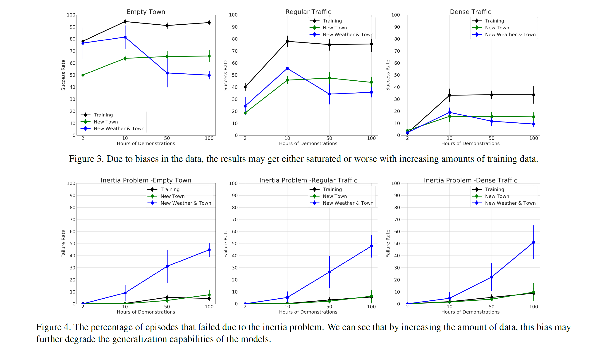
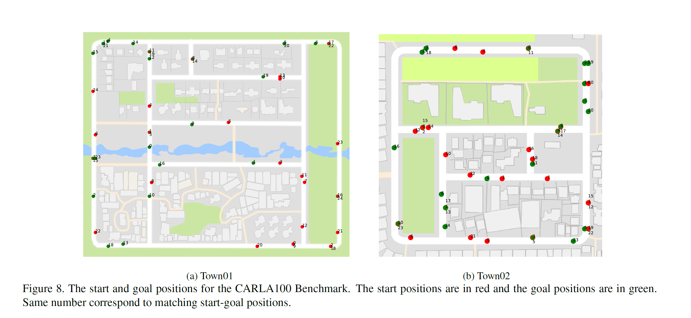

Exploring the Limitations of Behavior Cloning for Autonomous Driving
===

2019/04/18 Felipe Codevilla, Eder Santana, Antonio M. López, Adrien Gaidon

https://arxiv.org/abs/1904.08980
（まとめ：@yuji38kwmt）

---
## どんなもの？

* NoCrashというベンチマークを提案
* CARLAというシミュレータを使って訓練して、80時間以上の異なる条件での運転を評価した
* behavior cloningは良いが、まだ現実世界では使えない

---
## 先行研究と比べて何がすごい？
???

---
## 技術や手法の肝は？
* L1をloss functionに使った

### Befavior cloning
* データセットの偏りと分散が、一般化の害

### Conditional Imitation Learning(CIL)

### CILRS
* ResNet34を使っている

### NoCrash
* エージェントが制限時間内にゴールに着けば、成功とみなす
* 交通規則に従う能力（信号機違反の数など）も考慮する
* 3つのtask
    1. Empty Town
    2. Regular Traffic
    3. Dense Traffic 
* 6つの天気

---
## どうやって有効だと検証した？

* 2, 5, 10, 100 hoursで確認
* 10hoursがよかった。over fitting

---
## 議論はある？
なし

---

## 次に読むべき論文は？
* [Causal Confusion in Imitation Learning
](https://people.eecs.berkeley.edu/~dineshjayaraman/projects/causal_confusion_nips18.pdf)

------
### 参考サイト
* https://github.com/arXivTimes/arXivTimes/issues/1193
* https://github.com/carla-simulator/carla

### 用語
* imitation learning : https://qiita.com/decchi/items/e2300f8a9dacf6ac4ccd
* Behavior cloning：https://image.slidesharecdn.com/irlgans-171128063119/95/dlgans-6-638.jpg?cb=1511853870
* on-policy / off-policy
* spurious correlations
* backbone: Faster RCNNの用語？
> 正に「Backbone」になるネットワークであり、入力画像の特徴を抽出する役割を担います。

### 英語
* investigate: 調査する
* diminishing: 減る
* a lot of room for improvement: 改善の余地がある
* harm : 害
* phenomenon: 現象
* Causal: 因果関係
* confusion: 混乱
* suffer: 苦しむ
* inertia : 惰性
* aforementioned : 前述
* residual: 残差
* leverage: 利用する(最大化)
* induce: 誘発する
* obey: ～に従う
* violation: 違反
* crucial: きわめて重要

