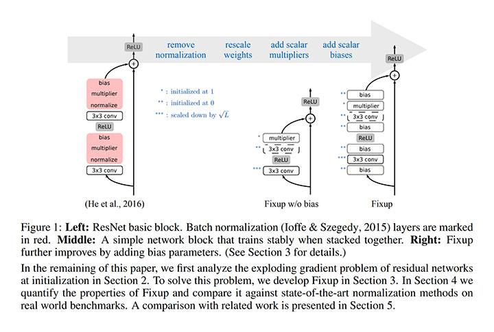
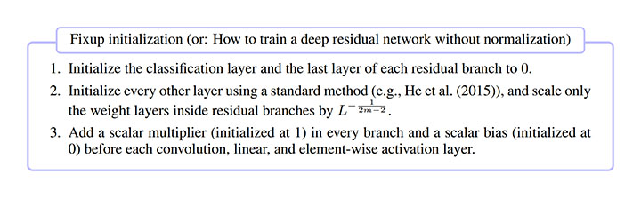
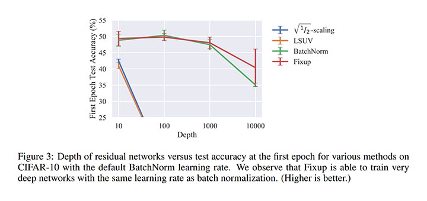
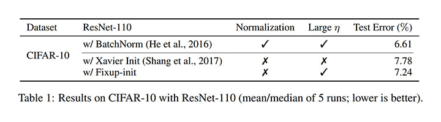
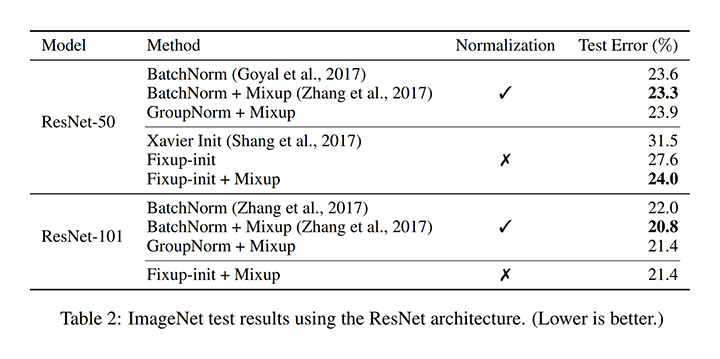
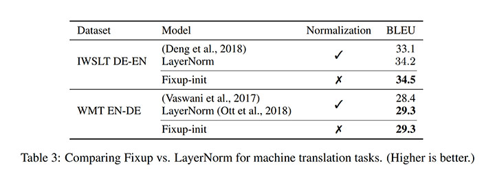

# Fixup Initialization: Residual Learning Without Normalization [\[arxiv\]](https://arxiv.org/abs/1901.09321)

- 著者
    - Hongyi Zhang *1
    - Yann N. Dauphin *2
    - Tengyu Ma *3
- 所属
    - 1: MIT
    - 2: Google Brain
    - 3: Stanford University

## どんなもの？
# Fixup Initialization
- Batch Normalization を用いない ResNet のアーキテクチャと初期化方法
- 次の図と手順に示す通りに ResBlock のアーキテクチャに変更し、手順に従って初期化L は ResBlock の個数、m は ResBlock 内の convolution の個数とする。

## 先行研究と比べてどこがすごい？
- Batch Normalization を用いることなく、深い ResNet を性能劣化なしに訓練可能

## 技術や手法の肝は？
- パラメータの初期化: ResBlock の支流（convolution がある側）の分散が 1/L にになるように初期化すると安定して訓練できるようになる。
- 最後の convolution のパラメータ: 0 にすると性能が向上する。
- scalar bias: batch normalization の代わりになる。convolution と ReLU の前後に挿入すると性能が向上する。
- scalar multiplier: ResBlock の最後に挿入するだけで正規化したときと同じようなダイナミズム（勾配ノルムの変化）を生み出す。

## どうやって有効だと検証した？
### 証明
ResNet の勾配ノルムの下限を導出することで標準的な初期化方法では正規化が必要となってしまうことを示した。

### 予備実験 / 深さを変えて訓練
深くしても Batch Normalization と同等の性能になった。短絡的に分散を抑え込む sqrt(1/2)-scaling では性能がでない。

### 画像分類実験
CIFER-10 で Batch Normalization に匹敵する性能になった。

ImageNet でも同等の性能を発揮した。ただし Fixup Initialization だけでは同等にはならなかったが、mixup を組み合わせたもの同士だと同等になった。

### 機械翻訳実験
IWSLT と WMT でベースラインを凌駕する性能になった。

## 議論はある？
- Fixup Initialization にすれば、Batch Normalization を使わないのでダイナミクスの解析が容易になる。
- 様々な正規化手法を理解し、Fixup Initialization の性能を高める手法を作ることも興味深い。

## 次に読むべきタイトルは？
- [\[arxiv\]](https://arxiv.org/abs/1710.09412) Hongyi Zhang, Moustapha Cisse, Yann N Dauphin, and David Lopez-Paz, "mixup: Beyond empirical risk minimization", arXiv preprint, 2017.
