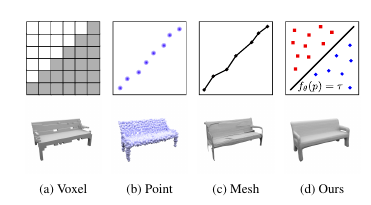
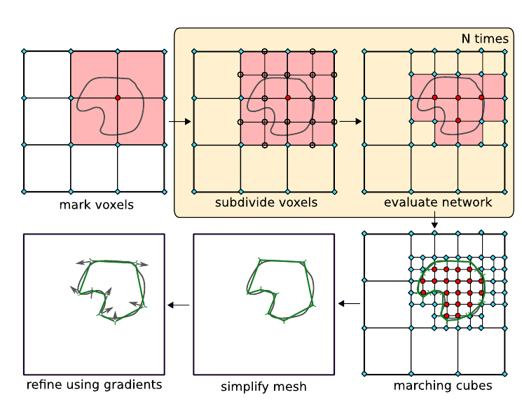

# Occupancy Networks: Learning 3D Reconstruction in Function Space
[https://arxiv.org/abs/1812.03828](https://arxiv.org/abs/1812.03828)
(まとめ @n-kats)

著者
Lars Mescheder
* Michael Oechsle
* Michael Niemeyer
* Sebastian Nowozin
* Andreas Geiger

# どんなもの？
新しい3次元物体の表現方法 Occupancy Networks を提案。

物体内の境界を点や面の集まりで表現するのではなく、特性関数の近似（座標に対してそこが物体に含まれるかを表す関数）で表現。

3次元物体の生成モデルを目標に作成され、

のように、座標と観測（Χ、画像など）の対に対して、0から1の値を返す関数（これがOccupancy Network）を訓練で獲得する。

# 先行研究と比べてどこがすごい？
これまでは、
* Voxel
* 点群
* メッシュ

のような方法が主流だったが、表現の限界があった。特に高解像度な3次元物体の生成が困難だった。

# 技術や手法の肝は？
## 損失関数
単純な方法だと、座標と画像などを与えて、2値分類問題を解かせる（ただのcross entropy）

確率的潜在変数モデルと組み合わせることも可能。

## MISE
関数ができたとして、それを使って効率的に表示など出来てほしい。

単純なところは一回の計算で判断して、細かい部分は何度も座標をサンプリングするということを実現。

具体的には、
* 空間をvoxel状に分割
* occupancyを計算
* 隣接するboxと2個以上結果が合致しないboxは、そのboxの範囲をさらに細かく分割
* 再度、評価・分割を繰り返す

## マーチングキューブ法
voxelデータをポリゴンデータに変換するアルゴリズム。最後まで分割・評価が終われば、これを使ってポリゴン化する。

Fast-Quadric-Mesh-Simplificationアルゴリズムで省力化できる。

## ネットワーク
入力（観測）の形式毎にネットワークは様々。

座標の情報を混ぜるためにconditional batch normalizationを利用。

### conditional batch normalization
HoloGANで使われていたAdaINに近い方法。BNの後に座標から出した重みやバイアスを追加する。

重みやバイアスは、ResBlock5個ぐらいの全結合からなるネットワークを利用。

# どうやって有効だと検証した？
## データ
ShapeNet、KITTI

## 表現力の評価
ShapeNetでオートエンコーダを作ってみて、訓練データでどれくらいIoUがあるかを見る。

大域的にはIoU約0.9で良さげ。

4746事例を6Mパラメータに削減(ネットワーク分と潜在変数分？)。

## 比較相手
* 3D-R2N2
* PSGN
* Pix2Mesh
* AtlasNet

## お題
* 画像から3次元復元
* 点群の補完
* voxelの超解像
* メッシュ生成

3次元復元の結果例

## 指標
* IoU
* Chamfer-L1
* Normal COnsistency
で比較。

AtlasNetはChamfer-L1の値が良い

## その他
[youtubeのデモ動画](https://www.youtube.com/watch?v=w1Qo3bOiPaE)あり
データによるが、実験で扱っているものでは、1つあたり3秒。

# 議論はある？
occupancy network は高解像度の色んな3次元タスクに役に立つはず。

# 次に読むべき論文は？
* 
* 
