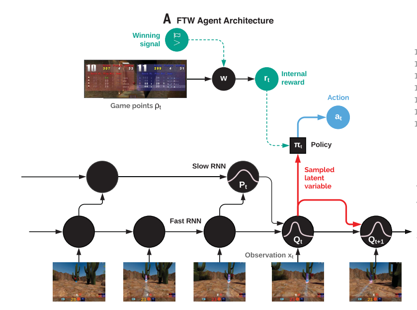

# Human-level performance in 3D multiplayer games with populationbased reinforcement learning

[https://deepmind.com/blog/capture-the-flag-science/](https://deepmind.com/blog/capture-the-flag-science/?utm_source=Deep+Learning+Weekly&utm_campaign=cf75ae36f6-EMAIL_CAMPAIGN_2019_04_24_03_18_COPY_01&utm_medium=email&utm_term=0_384567b42d-cf75ae36f6-73708453)
[https://science.sciencemag.org/content/364/6443/859](https://science.sciencemag.org/content/364/6443/859)

著者

* Max Jaderberg
* Wojciech M. Czarnecki
* Iain Dunning
* 他

DeepMind

# どんなもの？
Quake III Arenaという3Dゲームのチームプレイモードに対して、強化学習Agentを学習させた。
RGBのピクセルイメージから学習を行う
一対一のマッチプレイではなく、複数エージェントでプレイさせて学習を行う。

# 先行研究と比べてどこがすごい？
チームプレイの3Dゲームで、人より好成績

# 技術や手法の肝は？

* 多数のエージェントによる学習
* 各エージェントはそれぞれの内部報酬によりアクションする。
* 最適化を2層で行った。
* 高速と低速の2つのサンプリングにより省メモリで長い時間の関係性をとらえられる。

# どうやって有効だと検証した？
対人プレイで勝率を比較　(人の勝率 25%)
タグ付けの正確さ

# 議論はある？

* マルチプレイ環境で学習させることで、より強い(ELOの高い)のAgentが得られる。

* マルチプレイ環境で学習させることで、より多様な内部表現を獲得できた。

# 次に読むべき論文は？

強化学習つながりで別の論文を探す。
