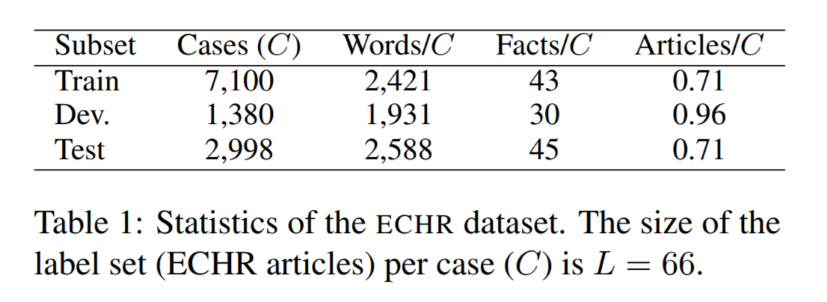
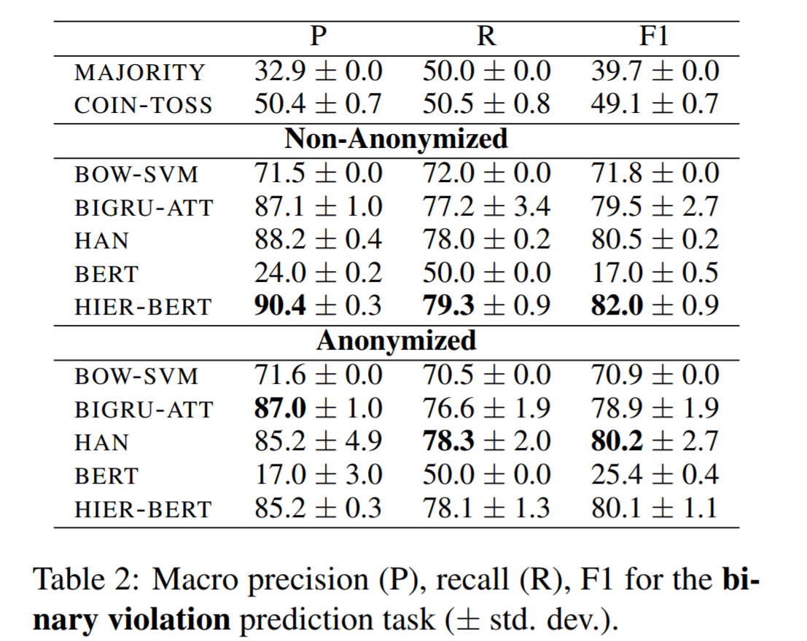
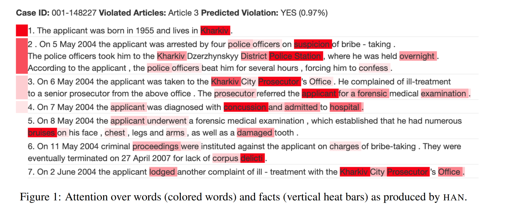

Neural Legal Judgment Prediction in English
===

2019/06/05 Ilias Chalkidis, Ion Androutsopoulos, Nikolaos Aletras
[https://arxiv.org/abs/1906.02059](https://arxiv.org/abs/1906.02059)

（まとめ：@nharu1san）

---

## どんなもの？
- [ヨーロッパ人権条約](https://www.echr.coe.int/Documents/Convention_JPN.pdf)に関する裁判記録のデータセットを作成し、いくつかの手法で比較を行った
  - [https://archive.org/details/ECHR-ACL2019](https://archive.org/details/ECHR-ACL2019)
- 匿名化データを使用して事実情報に偏りがあるか調査した
- BERTを拡張したモデルを提案

---

## 先行研究と比べて何がすごい？

- ECHRの約11500件あるパブリックデータベースから作成

---

## 技術や手法の肝は？
- HIER-BERT
  - 2600語まで入力できるように階層化した拡張モデル

---

## どうやって有効だと検証した？
- 以下の三種のタスクで評価した
  - 人権違反の二値分類
    - 匿名化についても調査
      - [spacy.io](https://spacy.io/)を使用
  - 違反種類のマルチラベル分類
  - ケース重要度検出

---

## 議論はある？
- 匿名化するとHIER-BERTの性能が落ちるのは過学習しているからかも
  - BERT自体がWordEmbedが可能な為？

- 二項分類の例で、Kharkiv(ハリコフ), District Police Station(地区警察署), City Prosecutor’s office(市検察官事務所)などもハイライトされている
  - バイアスの兆候らしい

---

## 次に読むべき論文は？
- [Attention is not explanation](https://arxiv.org/abs/1902.10186)
  - Attentionの重みについて
- [Learning to predict charges for criminal cases with legal basis.](https://arxiv.org/abs/1707.09168)
  - 中国語での事例