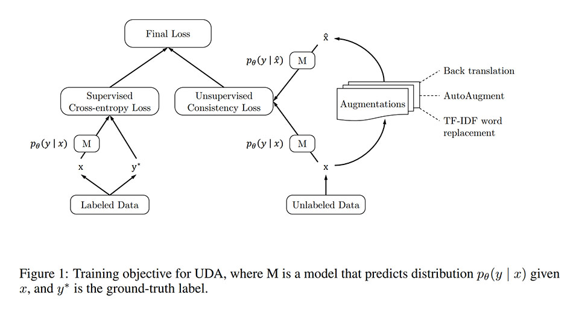
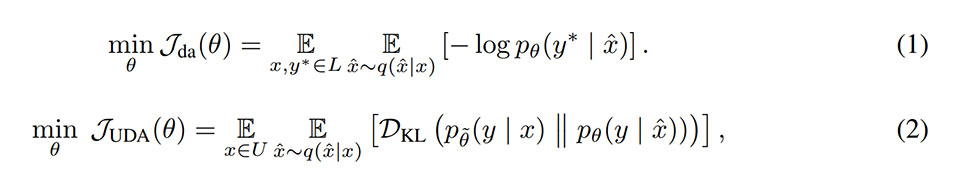
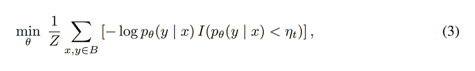
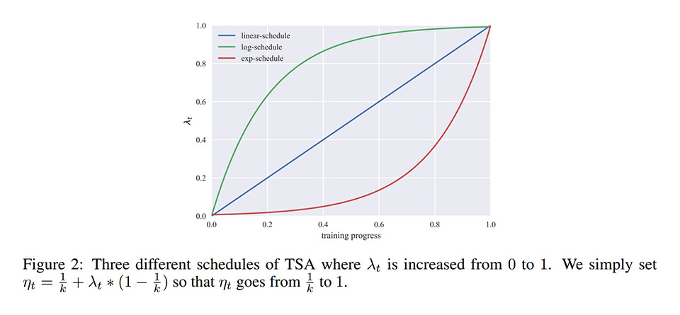
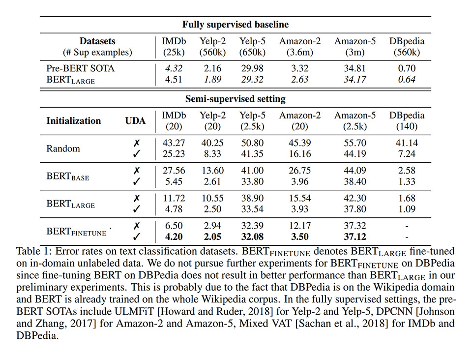
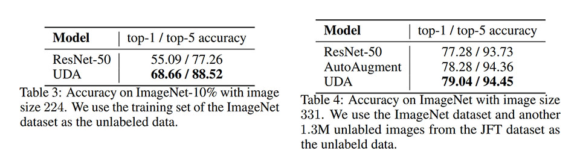
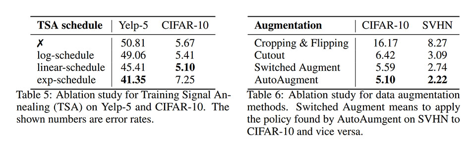

# Unsupervised Data Augmentation [\[arxiv\]](https://arxiv.org/abs/1904.12848v1)

- 著者
    - Qizhe Xie1 *2
    - Zihang Dai1 *2
    - Eduard Hovy *2
    - Minh-Thang Luong *1
    - Quoc V. Le *1
- 所属
    - 1: Google Brain
    - 2: Carnegie Mellon University

## どんなもの？
### UDA (Unsupervised Data Augmentation)
- データオーグメントしてもラベルが変化しないという一貫性を活用した半教師有り学習手法

### TSA (Training Signal Annealing)
- 訓練の初期には確信度が低い事例に注目し、更新回数が進むにつれて確信度が高い事例にも注目するようにする訓練手法

## 先行研究と比べてどこがすごい？
### UDA & TSA
- 既存手法を大幅に上回る性能を達成

## 技術や手法の肝は？
### UDA
- データオーグメントしてもラベルが変化しないという一貫性を背景知識として活用している点

### TSA
- モデルが教師から学ぶ速度をゆっくりにすることで過学習を抑える点
- 私見: 式 3 は実質的に hard example mining をやっているので、学ぶ速度をはやくしているように見える。難しい事例から順番に学習することでパラメータ空間の広さあたりに学習可能な事例数を高めていることが性能向上につながった可能性がある。もしくは、教師から学ぶ速度と一貫性から学ぶ速度の調整が重要な可能性がある。

## どうやって有効だと検証した？

### テキスト分類に関する実験
次のデータセットと初期化方法の組み合わせに対して、教師有りデータの量を十分に減らして半教師有り学習したモデルの性能が、減らして教師有り学習したモデルより良いか、減らさずに教師有り学習したモデルに匹敵するか、を確認した。

- データセット: IMDb, Yelp-2, Yelp-5, Amazon-2, Amazon-5, DBpedia
- 初期化方法: random, BERT base, BERT large, BERT finetune

### 画像分類に関する実験
次のデータセットとアルゴリズムの組み合わせに対して、教師有りデータの量を十分に減らして半教師有り学習したモデルの性能が、減らして教師有り学習したモデルより良いか、を確認した。

- データセット: CIFAR-10, SVHN
- アルゴリズム: データオーグメントなし, AutoAugment, Pseudo-Label, Π-Model, Mean teacher, VAT, VAT + EntMin, LGA + VAT, minmixup, ICT, UDA

### ドメイン外のデータを用いた実験
ドメイン外の教師無しデータを用いた学習が性能を低下させないかを確認するために、次のデータセットとアルゴリズムの組み合わせに対して、半教師有り学習したモデルの性能を比較した。

- 表3
    - データセット: 教師有りデータ（ImageNet の 10% の事例）、教師なしデータ（ImageNet の残りの事例）
    - アルゴリズム: ResNet-50, UDA
- 表4
    - データセット: 教師有りデータ（ImageNet の事例）、教師なしデータ（JFT の事例）
    - アルゴリズム: ResNet-50, AutoAugment, UDA

ドメイン外の教師無しデータの信号が教師有りデータと比べて弱すぎて、単に教師有り学習と同じ結果になってしまってはつまらないため、次の訓練テクニックを追加で適用した。

- Entropy minimization
- Softmax temperature control
- Confidence-based masking

### 提案手法構成アルゴリズムの選定に関する実験
提案手法を構成する２つのアルゴリズム（TSA 閾値スケジューリングアルゴリズム, データオーグメントアルゴリズム）について

- 表5
    - データセット: Yelp-5, CIFAR-10
    - TSA 閾値スケジューリングアルゴリズム: log-schedule, linear-schedule, exp-schedule
- 表6
    - データセット: CIFAR-10, SVHN
    - データオーグメントアルゴリズム: Cropping & Flipping, Cutout, Switched Augment, AutoAugment

## 議論はある？
- 本論文では行っていないが、PyramidNet + ShakeDrop のようなアーキテクチャを組み合わせれば更に性能を上げることができる可能性がある。

## 次に読むべきタイトルは？
- [\[arxiv\]](https://arxiv.org/abs/1805.09501) Ekin D Cubuk, Barret Zoph, Dandelion Mane, Vijay Vasudevan, and Quoc V Le. "Autoaugment: Learning augmentation policies from data", arXiv preprint, 2018.
