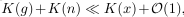
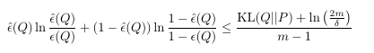
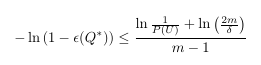
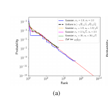
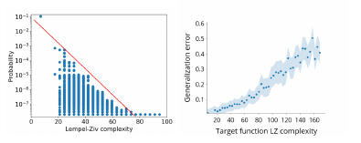

# Deep learning generalizes because the parameter-function map is biased towards simple functions
[https://arxiv.org/abs/1805.08522](https://arxiv.org/abs/1805.08522)
(まとめ @n-kats)

著者
* Guillermo Valle-Pérez
* Chico Q. Camargo
* Ard A. Louis

Oxford大学のメンバー

# どんなもの？
DNNの理論。汎化性能についての情報理論的な論文。

パラメータが多いが、それで表現する関数の分布が簡単なものに偏っていて、これが汎化性能に効いていると主張。

# 先行研究と比べてどこがすごい？
古典的な情報理論では、パラメータが多いと過学習しやすいということが主張されていた（パラメータが少ないと汎化性能がそれなりに出るというような不等式があって、この不等式で評価しきれなかったというのがより正確な状況）。

# 技術や手法の肝は？
* AIT（algorithmic information theory）
* DNNモデルを、パラメータに対して関数を返すparameter-function mapとみなしてその複雑さを分析
* Kolmogorov complexity, Lempei-Ziv complexity といった複雑さの指標
* PAC-Bayes theorem で汎化性能を評価する式を得る
* 検証のために、入力を固定してランダムにパラメータを変化させてどんな変化をするか分析  
  * 入力を7ビット、出力1ビットの関数をDNNでランダムに作ってその分布を見るとZipf lawに従うような挙動を観測
  * 上と同じ実験で複雑になると汎化性能が落ちることを観測
  * DNNのチャンネル数を無限にしたらガウス過程になるって結果がチャンネル数が少ない場合でも観測

## AIT で parameter-funciton mapとしての複雑さを評価

* K: Kolmogorov complexity
* g: network
* x: inputs
* n: 入力の空間の大きさ

関数の複雑さよりも入力の複雑さが大きすぎる！

## PAC-Bayes
PAC-Bayes theoremの式が次

* P: 真の分布
* Q: データセットの分布
* ε: エラー率, ハット付きはm個サンプルした事例のエラー率

という設定で不等式が1-δ以上の確率（サンプリングに対して）で成立する。

エラー率の差はデータの差とサンプル数で抑えられるという式。

特に、完全に訓練が済んだ状態は、ハット付きのεがゼロになるケースで、次の式に変形出来る。

（Uはサンプリングと合致するような集合）

## 入力を7ビット、出力1ビットの関数の実験

Zipf lawは、N番目に頻出のものが出現する確率が1/Nに比例するような分布の様子を指す。

より稀な関数のときに複雑さが上がり、複雑さが高いと汎化性能が落ちている。

# どうやって有効だと検証した？
入力を7ビット、出力1ビットの関数をDNNでランダムに作る実験など

# 議論はある？
自然界の事象を解釈するには、複雑な関数を使う必要が無く、それがフィットしているのでは？

2値問題についてしか扱ってないが、multi classや回帰に今回の結果を展開したいとのこと

# 次に読むべき論文は？
* AIT  
  https://www.nature.com/articles/s41467-018-03101-6  
  など？
* https://arxiv.org/abs/1711.00165  
  Deep Neural Networks as Gaussian Processes

この論文の引用リストがDNNの理論的解析系の論文を探すのに良いかも
