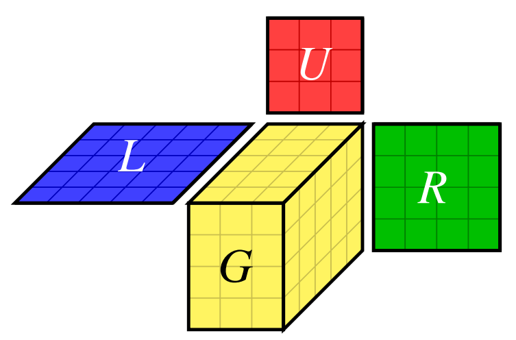
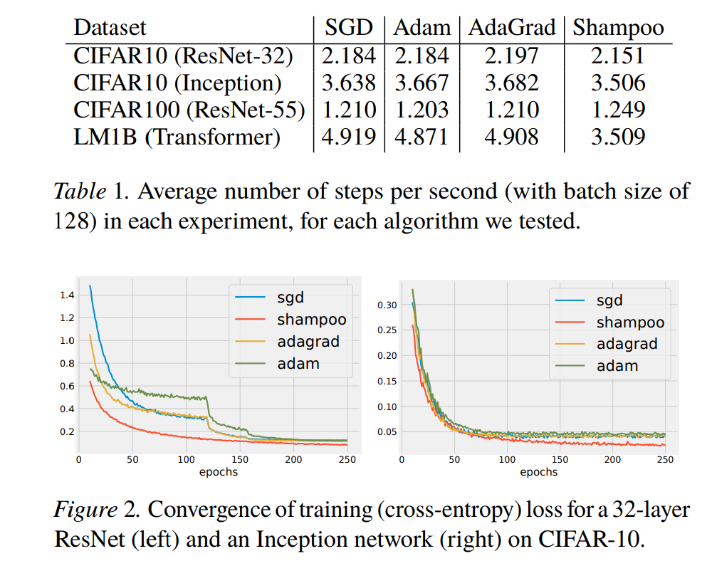

# Shampoo: Preconditioned Stochastic Tensor Optimization

- 著者: V. Gupta, T. Koren, Y. Singer
- タイトル: Shampoo: Preconditioned Stochastic Tensor Optimization.
- 論文のページ: [http://proceedings.mlr.press/v80/gupta18a.html](http://proceedings.mlr.press/v80/gupta18a.html)
- arXiv: [1802.09568](https://arxiv.org/abs/1802.09568)
- [TensorFlowでの実装](https://github.com/tensorflow/tensorflow/blob/master/tensorflow/contrib/opt/python/training/shampoo.py)

まとめた人: @Kgm1500

## どんなもの？

テンソルを入力とする損失関数のための確率的勾配降下法の改良．

- AdaGradをテンソルの最適化問題に特化

## 先行研究と比べて何がすごい？

- AdaGradのFull版よりも少ない演算量・メモリで，AdaGradの対角版よりも修正の幅をうまく調節できる．
- いろいろな最適化問題に適用できる

## 技術や手法の肝は？

- 勾配をベクトルに直さず，テンソルのまま調節すること．

Gが勾配のテンソルで，周りから行列を掛けて修正幅を調節する．L,R,Uはそれぞれ更新する．

## どうやって有効だと検証した？

1. リグレットを反復回数Tで割ったものがとなることを理論的に示した．

2. ResNet上でのCIFAR10を用いた学習などで，実験を行って他の手法より少ない計算時間で損失関数が小さくなることを示した．

## 議論はある？

- テンソルのサイズによっては調節を行うための行列が大きくなりすぎることがある．そのため，論文に載っているアルゴリズム以外に，（調節の精度は落ちるが）省メモリに行列を更新できるアルゴリズムがフルペーパーで提案されている．
- 実験では，計算時間を速くするために，アルゴリズムの一部を省略している．

## 次に読むべき論文は？

- [Memory-Efficient Adaptive Optimization for Large-Scale Learning](https://arxiv.org/abs/1901.11150)
- [Efficient Full-Matrix Adaptive Regularization](http://proceedings.mlr.press/v97/agarwal19b.html)
