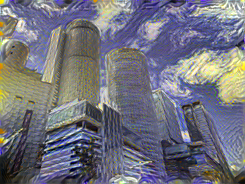
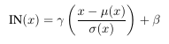
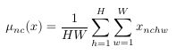
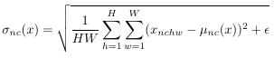
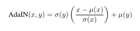
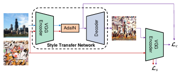
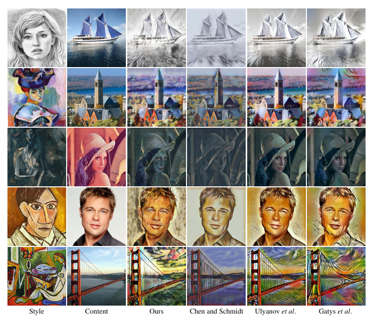
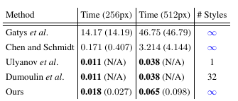

# Arbitrary Style Transfer in Real-time with Adaptive Instance Normalization
[https://arxiv.org/abs/1703.06868](https://arxiv.org/abs/1703.06868)
(まとめ @n-kats)

著者
* Xun Huang
* Serge Belongie

# どんなもの？
AdaIN（Adaptive Instance Normalization）を導入した論文。

AdaINはStyleGANやHoloGANに使われている手法。
この原論文では、AdaINをstyle transfer（画風変換）に利用している。

画風に合わせて専用に訓練する必要ない

# 先行研究と比べてどこがすごい？
## style transfer
所謂、画風変換

これは、名古屋駅をゴッホの星月夜風に2年前くらいに変換したもの。
当時の方法は、
[Image Style Transfer Using Convolutional Neural Networks](https://www.cv-foundation.org/openaccess/content_cvpr_2016/html/Gatys_Image_Style_Transfer_CVPR_2016_paper.html)
ベース。

数千ステップ訓練する必要があって、GPUを使って30分ほどかかった。

これの進化系で、
[A Learned Representation For Artistic Style](https://arxiv.org/abs/1610.07629)
では、画像とスタイルを指定すると目的の変換後の画像を生成するネットワークを提案。
ただし、訓練で使う有限の決まったスタイルにしか変換できない。

cycleGAN系でも似たことができるが、GANの訓練が難しい、大量にデータがいるという問題がある。

## AdaINがstyle transferに貢献したこと
元画像とスタイル画像を与えると、変換後の画像を出力するネットワークを実現。

自由にスタイルを選べるうえ、訓練が済めば1回の実行で済むから新しい画像を作るのに30分待つ必要がない。

（この分野は実質的にこれで終わったのでは？）

# 技術や手法の肝は？
## スタイル
適当なネットワーク（VGG19）の途中の層のfeature mapの分布（平均・分散）がスタイルとして認知されている。
この分布をいじるとスタイルが変化することが知られている。

## AdaIN
### Instance Normalization
Batch Normalizationの進化系。画像ごとのfeature mapの分布で正規化する手法。

### AdaIN
Instance Normalizationの重み・バイアスを定数ではなく関数の出力に置き換えたもの

平均・分散を置き換えるような操作。

## AdaINを使ったstyle transfer
* 元画像・スタイル画像両方をVGG19に適用して途中の層まで計算する
* 元画像のfeature mapの平均・分散をスタイル画像のfeatureの平均・分散にAdaINで置き換える
* feature mapから画像を生成するネットワーク（要訓練）に適用して画像を出力

のような方法で画像を生成する

訓練すべきところは、feature mapから画像を出す部分。
* L_c: 元画像のfeature mapから元画像が生成されるようにするロス（各ピクセルの2乗誤差）
* L_s: 出力した画像とスタイル画像のfeature mapの平均・分散が揃うようなロス（2乗誤差、複数の層を利用）

単純にAdaINするのではなくて、平均・分散を元画像とスタイル画像のものの中間を使うなどの実験もしている

# どうやって有効だと検証した？
## 生成した画像

## 処理速度
Titan Xでの速度

# 議論はある？
* 単純な方法だから、改善の余地がありそう
* ResnetなどのBN/skip connectionがあるネットワークで使えるか？
* 他の統計値を置き換える方法もあるのでは？

## 私見
平均・分散が綺麗に切り出せるから出来ることのように思う。
綺麗に切り出せるものならそれを置き換えるような方法を取れば似たことができそう。

BNが入っているとどこまで有効なのかが気になる

# 次に読むべき論文は？
* [StyleGAN](https://arxiv.org/abs/1812.04948)
