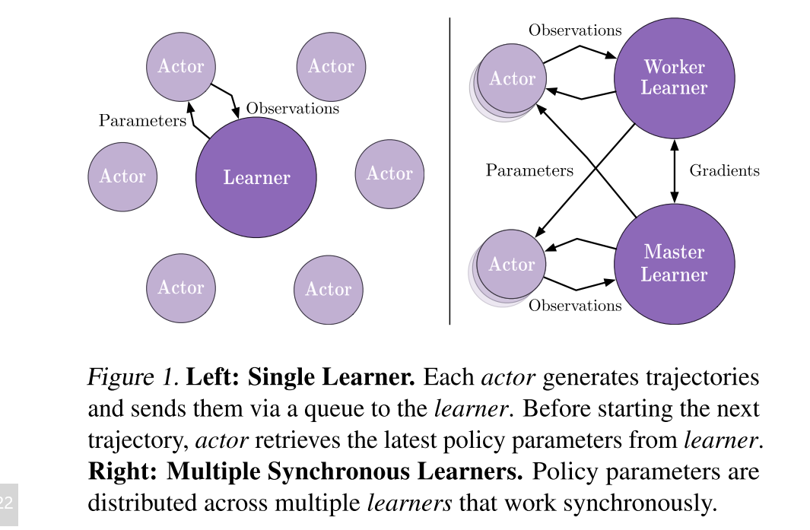
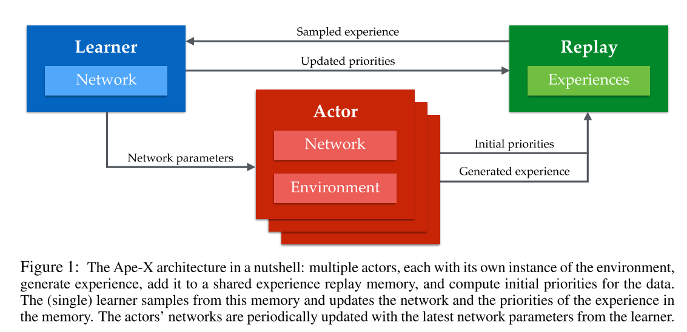
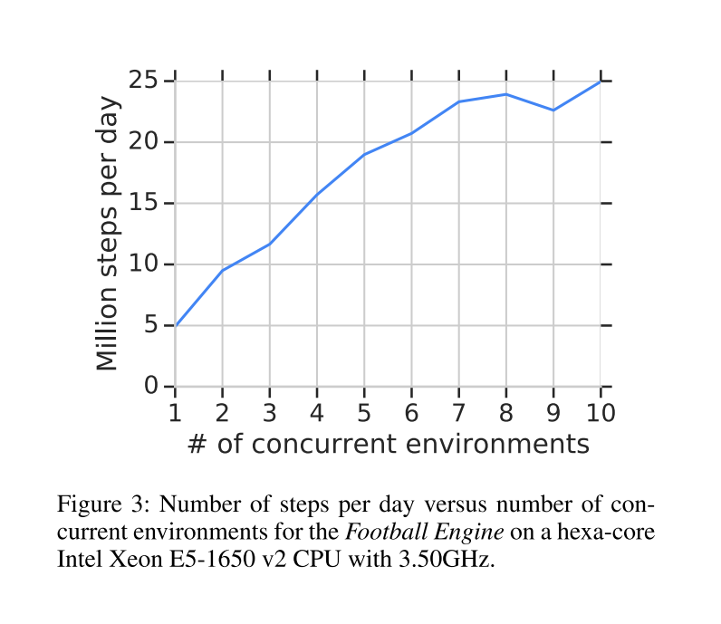
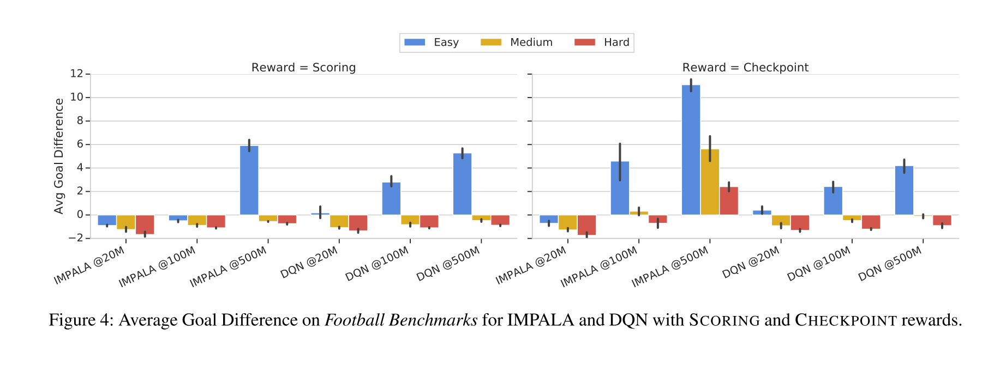
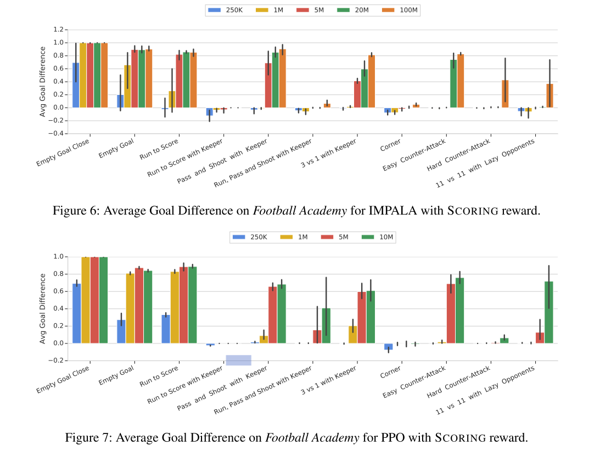

Google Research Football: A Novel Reinforcement Learning Environment
===

Karol Kurach, Research Lead and Olivier Bachem, Research Scientist, Google Research, Zürich

[https://ai.googleblog.com/](https://ai.googleblog.com/2019/06/introducing-google-research-football.html)  
[paper](https://github.com/google-research/football/blob/master/paper.pdf)  

---

## どんなもの？

* サッカーゲームを利用した強化学習の仮想学習環境
* オープンソース  
* Football Academyと呼んでいる10種のプレイシチュエーションによるベンチマーク環境を準備した。  

---

## 先行研究と比べて何がすごい？

サッカーゲームのシミュレータとして以下のようなものが提案されている。  

* the RoboCup Soccer Simulator (Kitano et al. 1995; 1997)

* the DeepMind MuJoCo Multi-Agent Soccer Environment (Liu et al. 2019)

いずれも、物理的な人の動作をシミュレーションすることに主眼を置いている(人の動作モデルを学習するための環境？)。  
本提案では、ゲーム主体でイエローカード、レッドカード、オフサイドなどサッカーのルール等も組み込んだ。

---

## どうやって有効だと検証した？

* IMPALA Importance Weighted Actor-Learner Architecture (Espeholt et al. 2018)  
* Ape-X DQN (Horgan et al. 2018)  
* PPO Proximal Policy Optimization (Schulman et al. 2017)  
の３つの強化学習アルゴリズムで、比較を行った。  
  
  
●  IMPALA イメージ図
    
  
  
● Ape-X DQN イメージ図
    

---

## 技術や手法の肝は？

これまでの学習環境として、一般的に以下のような課題がある。
* Lack of stochasticity(確率的な要素の不足)  
  アーケードゲームなど特定の初期条件などに左右されやすい
* Computationally expensive(計算コストが高い)  
  最近の３Dゲーム等は、高解像度で計算コストが高い
* Lack of open-source license(ライセンス料が必要)  
  オープンソースにした。
* Known model of the environment(対象領域に特化している)
  碁、チェスなどでは、特定問題に特化したモデルになりがち  
* Single-player(プレイヤーは一人)  
  複数エージェントによる相互作用のようなものは、評価できない
* Focused on single RL aspects(特定の強化学習課題に偏っている)  
  
提案環境としては
* サッカーシミュレーションを提案した。 
* 難易度設定で評価。  
* Football Academyとよぶ段階的な難易度の複数シナリオにより評価。
* 最近の３つの手法で評価を行った  
* シンプルなPython APIを準備した。(内部のエンジン自体はC++で高速)

---

## 議論はある？
- 25Mステップの計算時間

  

  
- 難易度別、学習ステップ別の平均得点

    
    
- Football Academyによるシナリオ比較
      
    

---

## 次に読むべき論文は？

以下、参照論文を読んでいきたい。  
IMPALA Importance Weighted Actor-Learner Architecture (Espeholt et al. 2018)   
Ape-X DQN (Horgan et al. 2018)  

