# Stochastic Gradient Methods with Layer-wise Adaptive Moments for Training of Deep Networks [\[arxiv\]](https://arxiv.org/abs/1905.11286)

- 著者
    - Boris Ginsburg ∗1
    - Patrice Castonguay ∗1
    - Oleksii Hrinchuk ∗1
    - Oleksii Kuchaiev ∗1
    - Vitaly Lavrukhin ∗1
    - Ryan Leary ∗1
    - Jason Li ∗1
    - Huyen Nguyen ∗1
    - Jonathan M. Cohen ∗1
- 所属
    - 1: NVIDIA, Santa Clara, USA

## どんなもの？
### NovoGrad

## 先行研究と比べてどこがすごい？
### NovoGrad
- 既存手法（Adam・AdamW）の半分のメモリで下記を実現した。
- 様々なタスク（画像分類・音声認識・機械翻訳・言語モデリング）で既存手法（SGD・Adam・AdamW）と同等以上の性能を達成した。
- 訓練の初期段階において、学習率をウォームアップすることなく安定化する。
- 異なるタスクにおいて、同じ学習率のポリシーが使える。
- 非常に大きなバッチサイズを用いる訓練において、既存手法（SGD の亜種）よりも良い性能を達成した。

## 技術や手法の肝は？
### メモリ使用量の工夫
次のように２次モーメントそのものではなく２次モーメントのノルム（スカラー値）を保持することでメモリ使用量を大幅に削減した。

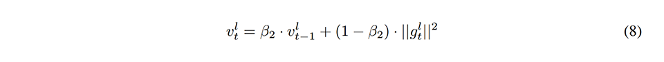

### 分かりやすさの工夫
１次モーメントの段階で正規化するスタイルに変更し、SGD と同様の更新式にした。そうしても性能上は問題ない。

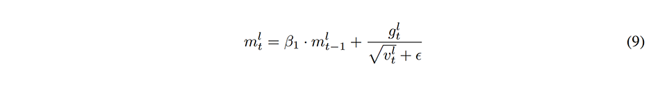

### 性能上の工夫1
Adam などの動的に学習率を変更する手法では正則化の効果が薄れてしまう問題があるので、AdamW と同様の工夫を導入した（正則化項がゆがめられないように正規化しないようにした）。

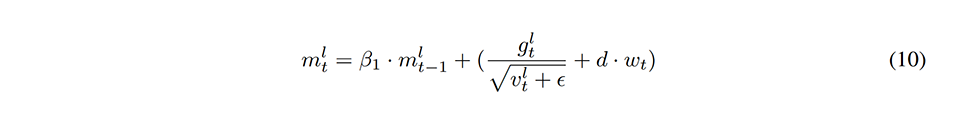

分かりやすさのために次のようにしても良い。

### 初期化の工夫
変なバイアスが入らないように次のように初期化した。

### 性能上の工夫2
大きな学習率を用いる訓練では、次のように各層の学習率をクリップする（実質的には勾配をクリップする）ことで安定性を高める。

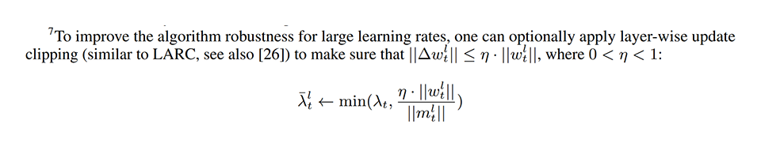

### 性能上の工夫3
Adam などの２次モーメントの移動平均を用いる手法では stochastic convex に関するカウンター事例を作れてしまう。この問題に対応する際には、次のように AMS-Grad と同様の修正を適用する。

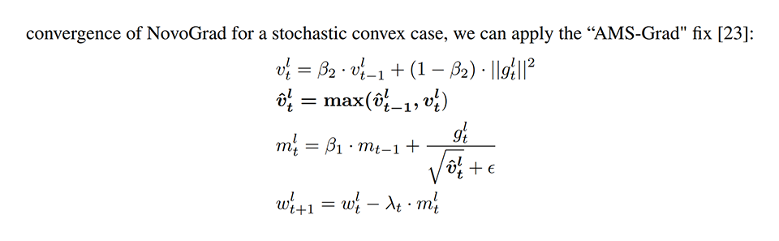

## どうやって有効だと検証した？

### 画像分類タスクにおける性能比較
- モデル: ResNet-50 v2
- タスク: ImageNet classification

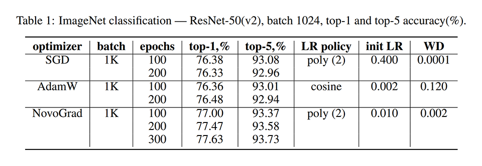

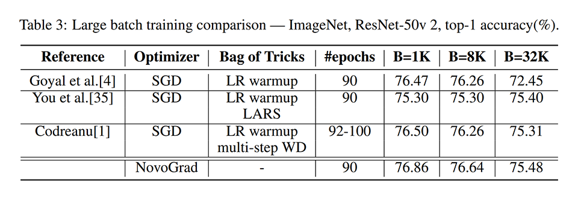

### 機械翻訳タスクにおける性能比較
- モデル: Transformer-big (オリジナルではなく OpenSeq2Seq のもの)
- タスク: WMT 2014 English-to-German translation

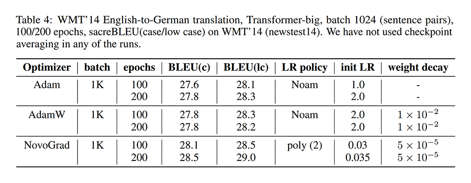

### 音声認識タスクにおける性能比較
- モデル: Jasper-10x5
- タスク: LibriSpeech speech recognition

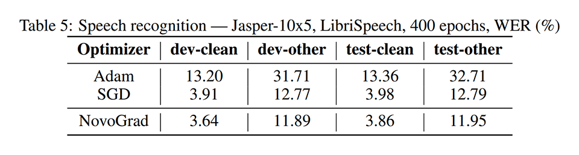

### 言語モデリングタスクにおける性能比較
- モデル: Transformer-XL
- タスク: WikiText-103 word-level language modeling

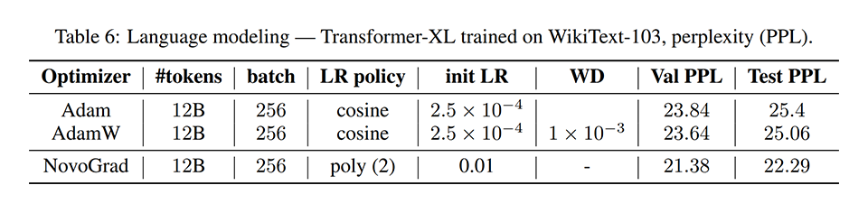

- モデル: large BERT
- タスク: SQuAD v1.1

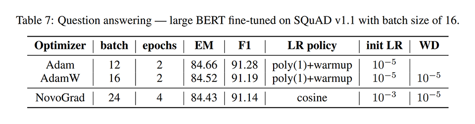

## 議論はある？
- 特になかった。

## 次に読むべきタイトルは？

### 勾配を正規化する勾配法という観点で NovoGrad と関連している手法
- [\[arxiv\]](https://arxiv.org/abs/1510.04609) Bharat Singh, Soham De, Yangmuzi Zhang, Thomas Goldstein, and Gavin Taylor, "Layerspecific adaptive learning rates for deep networks", ICMLA, 2015.
- [\[arxiv\]](https://arxiv.org/abs/1707.04822) Adams Wei Yu, Qihang Lin, Ruslan Salakhutdinov, and Jaime Carbonell, "Block-normalized gradient method: An empirical study for training deep neural network", arXiv e-prints, 2018.

### Adam が SGD with momentum に対して性能が悪い問題への対策という観点で NovoGrad と関連している手法
- [\[arxiv\]](https://arxiv.org/abs/1902.09843) Liangchen Luo, Yuanhao Xiong, Yan Liu, and Xu Sun, "Adaptive gradient methods with dynamic bound of learning rate", ICLR, 2019.
- [\[arxiv\]](https://openreview.net/forum?id=Bkg6RiCqY7) Ilya Loshchilov and Frank Hutter, "Decoupled weight decay regularization", ICLR, 2019.

### メモリ使用量を節約するという観点で NovoGrad と関連している手法
- [\[arxiv\]](https://arxiv.org/abs/1709.04546) Zijun Zhang, Lin Ma, Zongpeng Li, and Chuan Wu, "Normalized direction-preserving adam", arXiv e-prints, 2017.
- [\[arxiv\]](https://arxiv.org/abs/1804.04235) Noam Shazeer and Mitchell Stern, "Adafactor: Adaptive learning rates with sublinear memory cost", arXiv e-prints, 2018.
