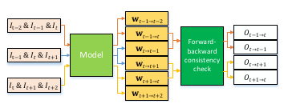
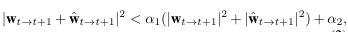
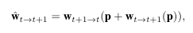
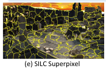
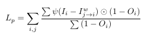
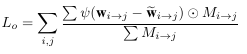

# SelFlow: Self-Supervised Learning of Optical Flow
[https://arxiv.org/abs/1904.09117](https://arxiv.org/abs/1904.09117)
(まとめ @n-kats)

著者
* Pengpeng Liu
* Michael Lyu
* Irwin King
* Jia Xu

# どんなもの？
Self SupervisedでOptical Flowを訓練するモデル。occlusion に工夫が見られるのがポイント。

NOCモデルとOCCモデルを協調させて訓練（NOC: occlusion を考慮しない, OCC: occlusion を考慮する）

# 先行研究と比べてどこがすごい？
Optical FlowのCNNの既存手法では
* 教師有り: シミュレーターで基本モデルを作って、ドメインのデータセットでfinetune（シミュレーターの工程が単純でなく大変）
* 教師無し: 自然なocclusionの対策が出来ず

selflowはoccluson対策を工夫し、ドメインのデータセットでだけ教師データがついているという設定で良い性能が初めて出せた手法

# 技術や手法の肝は？
* PWC-Net
* NOC, OCC
* superpixel

## PWC-Net
連続する画像を3枚入力して、2枚目から1枚目・3枚目の画像へのoptical flowを出力するモデル。

特徴ベクトルの対応を見るような手法

## NOC, OCC
* NOC: occlusion を考えない雑モデル
* OCC: occlusion を考慮した本命のモデル（利用時にはこっちだけ使う）

の2つを学習（NOCを訓練→OCCをそのパラメータで訓練→NOCとOCCを同時に訓練）。

occlusionがあると、時刻Tでは写っているけど、時刻T+1では別の物が前にあるって状態になる。時刻T+1から時刻Tの画像へのoptical flowを考えると、手前側のものの動きにあったflowになるはず。そうすると、optical flowで動きを時刻T→時刻T+1→時刻Tというように辿ると、手前側は元の位置に戻るはずで、奥側は変な位置に移動してしまうはず。これをつかってocclusionかの判定をする。

式にすると、次の条件のときocclusion無しと判定する。

ただし、

左辺がT→T+1→Tの順で移動したときのベクトル。これが十分に小さくないとおかしいという意味の不等式。（α1=0.01, α2=0.05）

## superpixel

人工的にocclusionを作って訓練に使おうとしたが、単純に矩形で一部を塗りつぶす方法は、自然界に存在しない事例で上手く行かない。
代わりにsuperpixelをのランダムな領域を塗りつぶす方法をとった。

## 損失関数
損失関数は2つからなる。

* 前景が正しく移動したかを示す関数（Iは画像、Oはocclusion）

* 人工的に入れたocclusionで、それがなかったときのflowを推測

本来隠れるわけでなかったものをわざと隠して、どこに行ったか答えられるようにする。

# どうやって有効だと検証した？
SintelとKITTIで評価。Sintelで執筆時1位、KITTIでもぼちぼちの順位（KITTIの方はシミュレーターを使った手法などに劣る）。

[https://github.com/ppliuboy/SelFlow](https://github.com/ppliuboy/SelFlow)にコードあり

評価指標は、
* Sintel: EPE(average endpoint error, 誤差の平均は幾つか)
* KITTI: FL(percentage of erroneous pixels, 誤差何ピクセルに入る割合は幾つか)

SintelのEPEが4.26

# 議論はある？
## 私見
性能としては、シミュレーターでガチガチチューニングするのにやや劣るが、そんなことをしなくてもいいようにしたいというモチベーションからすると、お手頃でいい性能。とはいえ、OCCとNOCの訓練のカリキュラムがあるのが気がかり。

KITTIの結果画像を見ると、影の扱いが難しい問題が残っていそう。映像としては移動するけど、物理的には移動していないというのがどうしようもないように見える。そのため、fine tuneは必須では？

# 次に読むべき論文は？
optical flow系の論文として
* [PWC-Net](https://arxiv.org/abs/1709.02371)
* [LiteFlowNet](https://arxiv.org/abs/1805.07036)

