# Ab-Initio Solution of the Many-Electron Schrödinger Equation with Deep Neural Networks[https://arxiv.org/abs/1909.02487](https://arxiv.org/abs/1909.02487)
(まとめ @n-kats)

著者
* David Pfau
* James S. Spencer
* Alexander G. de G. Matthews
* W. M. C. Foulkes

上三人はdeepmind、最後の人はインペリアル・カレッジ・ロンドン所属

# どんなもの？
ニューラルネットを物理学（量子化学）に応用した話。原子核と電子がいくつかある状況のシュレディンガー方程式の近似解を最適化で獲得する。

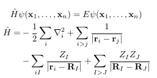

* x_i: {r_i, σ_i}
* r_i: 電子の座標
* σ_i: スピン（↑↓）
* Z_I: 原子核の原子数
* R_I: 原子核の位置（Born-Oppenheiber近似して、固定値とする） 

# 先行研究と比べてどこがすごい？
近似解を出すためによく用いられていた、各成分が一つの電子の情報だけからなる行列を使うスレーター行列式による方法ではなく、その電子への周りからの情報を持つような行列の行列式を使うように関数の範囲を広めるというアイデアで近似精度を上げたFermi Netを提案。

スレーター行列式は次の式。これを拡張。

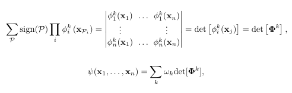

# 技術や手法の肝は？
## フェルミオンの波動関数は反対称性
電子はフェルミオンで、波動関数は次の反対称性を持つ。

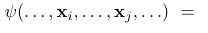
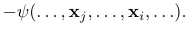

この関係があったからスレーター行列式が用いられていた(順番を入れ替えると符号が変わる行列式の性質)。

## スレーター行列式の拡張
スレーター行列式の行列の各成分がx_iだけに依存する関数を使っているのに対して、次の全部の電子を使う関数に変更した。

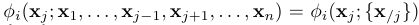

ただし、x_j以外の電子の順序には寄らない関数とする。この関数をニューラルネットで表現する。

## Fermi Net
グラフ系のニューラルネットを使って実現。

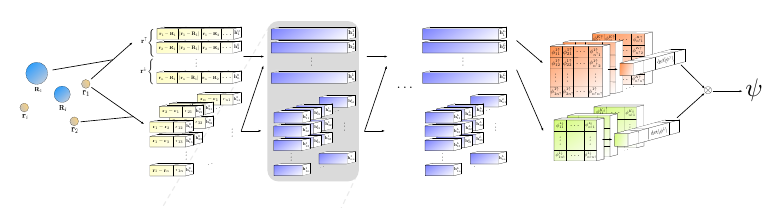

* 頂点の入力: 各電子毎に、それぞれの原子核との相対位置・距離
* 辺の入力: 電子間の、相対位置・距離
* 中間層: それぞれの頂点へ関係する辺から情報を集めるような構造の層(頂点の順序に依存しない演算)。スピンを考慮した統合を行う。

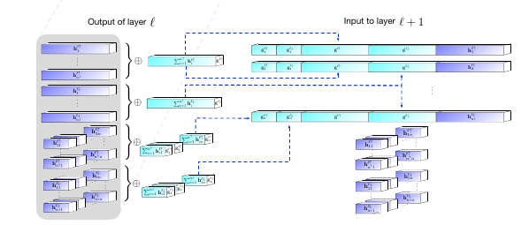

* 最終層: 正方行列がいくつか作れる程度に出力。原子核との距離を反映した重みをつける。

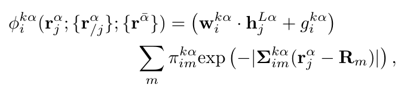

(αはスピン、バーは逆向きの意味)

最終的に、波動関数を次のようにする。

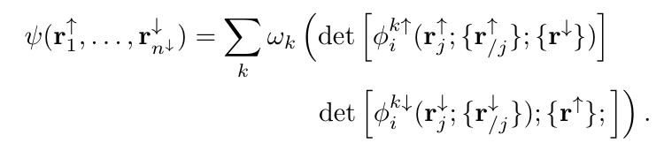

## 損失関数
損失関数は次の式。この値を最小にするようなθを探す。

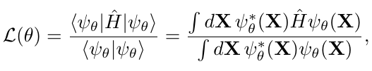

勾配を計算すると

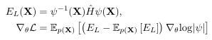

具体的なE_Lの形は

## 最適化
KFACを修正した方法を利用。ADAMに比べ大幅に速く収束している。

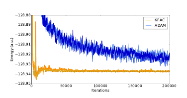

# どうやって有効だと検証した？
スレーター行列式を使ったSlater-Jastrow net と比較している。

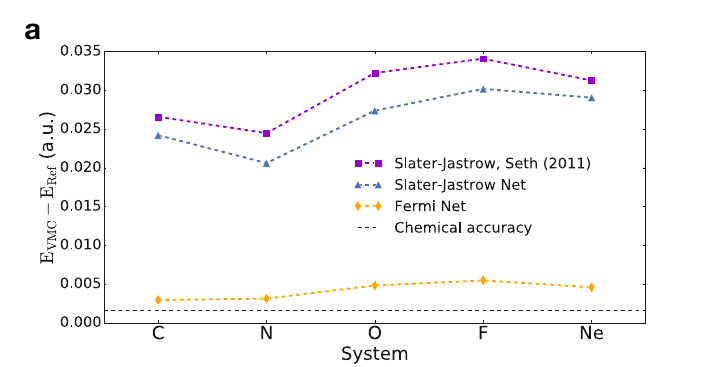

行列式が一つだけで十分精度が出るという成果も出ている。

# 議論はある？
反対称な関数をニューラルネットで近似する方法を示せた。ニューラルネットの表現力がこの手の計算に役立ちそう。

## 疑問
論文にある分子などは小さいものが多いけど、この手のシミュレーションはどれくらいの大きさの分子まで扱うの？

グラフ系ネットワークで去年読んだ、deepmindのgraph_netsの原論文では、頂点のグルーピングみたいなことは扱っていなくて、今回スピンでグルーピングしていて、予想が的中した感じがする。

# 次に読むべき論文は？
* [KFAC](https://arxiv.org/abs/1503.05671)

