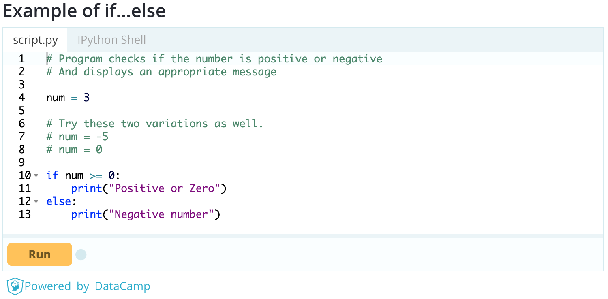
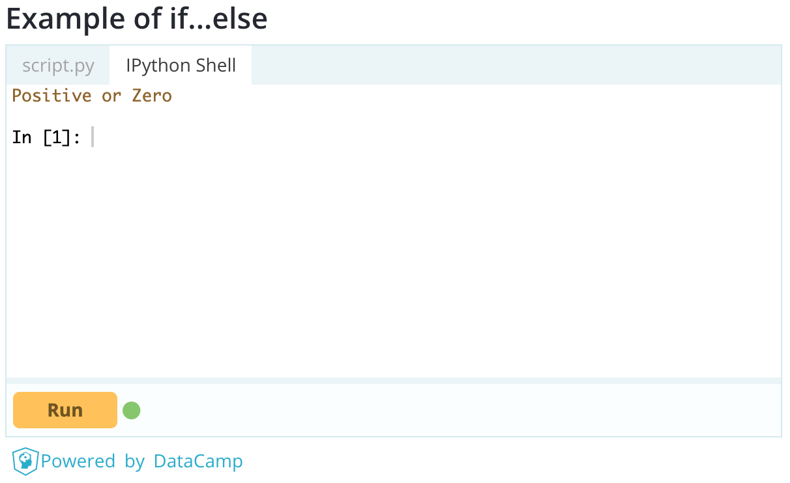

# Learn Python Programming [https://www.programiz.com/python-programming](https://www.programiz.com/python-programming)

Copyright Parewa Labs Pvt. Ltd.

- ネパールにあるソフトウェア会社

## どんなもの？
- とにかくPythonのコードを書いて実行するチュートリアルサイト（英語のみ）


- DataCampで実行できるので、環境構築ができなくてもPythonを書ける。

## 先行研究と比べてどこがすごい？
- 公式ドキュメントと比べると、文章が少なくコードが多いので眠たくならない。
- Pythonをほとんど書いたことが無い人でもすらすらとPythonの言語仕様を学べる。

## 技術や手法の肝は？
- 文法がシンプル、インデントでまとまりを指定するオフサイドルール、で誰が書いても似たようなコードになるため読みやすい。
- 機械学習で使用できるライブラリが豊富。（TensorFlow, Theano, Chainer, Pytorch, ...）
---
#### 以下は主にCとの違いと気になった言語仕様をまとめます。

### 動的型付け言語
- 勝手に適切な型を決めてくれる。
- 便利な反面メモリの状態がわからなかったり、意図しない型になることもある。

### for文 
- for 変数 in データの集まり:
    - 例 : for char in 'Hello World'
    
- for 変数 in 繰り返し回数:
    - 例 : for i in range(1, 11):

### 変数の初期代入
- Python : a, b, c = 5, 3.2, "Hello"
- C      : a = 5, b = 3.2, c = "Hello"

### tuple
- listの定数版のようなもの。(キーとして使える)
    - numbers = (1, 2, 3)
- 要素を追加したい時は新しいtupleに連結する方法や、一度listにして追加してからtupleに戻す方法など。

### 便利な演算子
- // : 商
- ** : べき乗

- 数学関数のライブラリを読み込まずに計算できる。（感動）

### メモリの使い方

- 上記画像のように過去に保存された値を使いまわすことで、メモリの使用量を減らしている。

### 変数に関数を代入する
```python
def printHello():
    print("Hello")
a = printHello()

# Output: Hello
a
```

- print関数を変数aに代入して使うことができる。

## どうやって有効だと検証した？
- 大学の講義の課題をPythonを使って提出した。
    - 課題の内容は47都道府県の情報（県名、県庁所在地、人口、特産品、面積）をまとめたテーブルを作るというもの。
    - 47行手打ちするのは時間がかかるのでPythonでwebスクレイピングをした。
    - [Pythonのコードと実行結果](https://github.com/FunabikiKeisuke/Database_in_practice/tree/master/scraping)

## 議論はある？
- 1ヶ月Pythonを触ってみて、文法のシンプルさや豊富なライブラリからPythonがなぜ人気のある言語なのかわかった。
- webスクレイピングではフロントエンドの知識が役に立ったので、知識はどこで繋がるかわからないと感じた。
- Anacondaのような仮想環境を使った環境構築は仕組みを理解するまでに時間がかかったのでメンターが欲しかった。

### 疑問
- Pythonには2系と3系があるが、両方の書き方を覚える必要はあるのか。
- 画像処理分野における強化学習では大量の画像データを用意する必要があるが、どのように用意するのだろうか。：w

## 次に読むべき論文は？
- 大学の研究では自動運転を研究しようと思っています。
    - 画像処理の基礎でオススメの教材などがあったら教えてください。
- 月一でしか話す機会がないので私と連絡先を交換してくれると嬉しいです。
