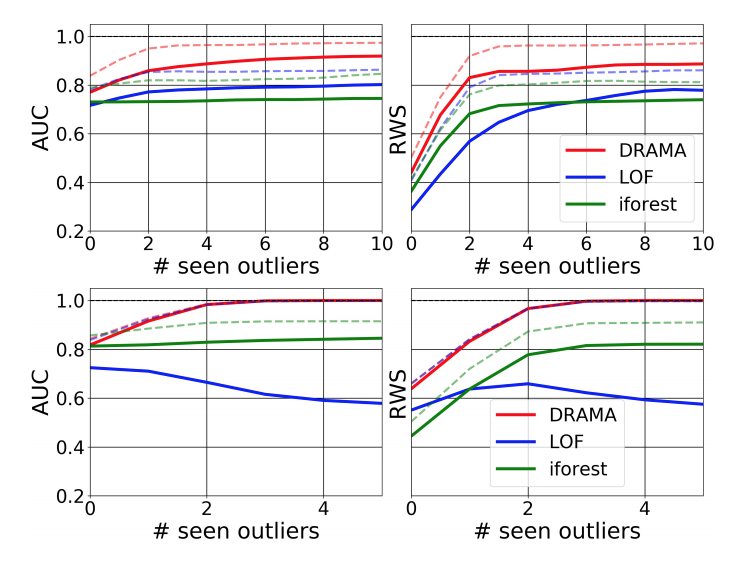

#A Flexible Framework for Anomaly Detection via Dimensionality Reduction
 
### 論文著者
- Alireza Vafaei Sadr @ University of Geneva
- Bruce A. Bassett @ University of Cape Town
- M. Kunz @ University of Geneva

<https://arxiv.org/pdf/1909.04060.pdf>

#### 発表者: 
- 陸 衛強 (ロク　ワイケン)  

## どんなもの？
### 異常値検知の世界
- 応用事例：電波望遠鏡 100PB-10EB rangeデータから新天体を探す
- feature + distanceベースの異常検出... 次元の呪いでdistanceがどんどん無意味に
- supervied learningでやると、教師がない(異常値データが極端少ない）
- 近年は、unsupervised で作ったencoder/decoder + clustering の手法が増えてきた（気がする）

### 本論文のテーマ 
- DRAMA (Dimensionality Reduction Anomaly MetaAlgorithm):  <https://github.com/vafaei-ar/drama>
- a general python package that implements the general framework
- anomaly detection framework based on dimensionality reduction and unsupervised clustering

## 先行研究と比べてどこがすごい？
- encoder/decoder + clustering のメタ手法に対し、複数選択可能アルゴリズムをつけて作ったframework
- 手法の新しさよりは、形式化/普及の意味合い大きいかもしれない

## 技術や手法の肝は？

- 4 steps
	1. dimensionality reduction (encoding)
	2. clustering to find the main prototypes
	3. uplifting to the original space (decoding)
	4. distance measurements between the test data and the prototypes
- dimensionality reduction: DRAMAが以下をサポート
	- Independent Component Analysis
	- Non-negative Matrix factorization
	- Autoencoders 
	- Variational AutoEncoders
	- Principal Component Analysis
- clustering to find the main prototypes
	- agglomerative clusteringで 2^n_s個のclusterを分ける (n_sはハイパーパラメータ)
- distance measurements 
	- ９種類のmetrics

## どうやって有効だと検証した？
### 検証方法
- benchmarkとしてtwo popular general algorithmsを
	- Local Outlier Factor (LOF)
	- Isolation Forest (iForest)
- 検証データセット
	- 人工的に作った10種類の時系列データ（ノイズ入れる+x/y scaleをランダムに変える)
		- 人工異常値その１:compact Gaussian “bump” anomalies with random location
		- 人工異常値その２:9種類を正常扱いにして、残り一種類を異常とする

		
		
	- 異常値検出用のbenchmark dataset ODSS database <http://odds.cs.stonybrook.edu/>
- 評価用metric
	- area under the ROC Curve (AUC) 
	- Rank-Weighted Score (RWS)

### 検証結果
- 元々Frameworkなので、DRT/clustering/metrixで変わる => 組み合わせの中で、必ずbenchmarkに勝つものが存在した
- (n_f = 100)ではbenchmarkとの差がそれほどではないが、高次元(n_f = 3000)ではDRAMAの優位性が際立つ

	
	
		
## 議論はある？

### 自分の感想
- 対象は、もっぱら時系列 
- 画像ならどんな手法があるか知りたい

## 次に読むべきタイトルは？
- Efficient gan-based anomaly detection <https://arxiv.org/pdf/1802.06222.pdf>