# [\[arxiv\]](https://arxiv.org/abs/1911.05722v2) Momentum Contrast for Unsupervised Visual Representation Learning

- 著者
    - Kaiming He *1
    - Haoqi Fan *1
    - Yuxin Wu *1
    - Saining Xie *1
    - Ross Girshick *1
- 所属
    - 1: Facebook AI Research (FAIR)

## どんなもの？
### MoCo (Momentum Contrast)
- データオーグメントに対して頑健な特徴を獲得できる Contrastive Learning（類似事例を近付け非類似事例を遠ざけるような特徴空間への写像を学習する手法）である。
    - 同じデータからのデータオーグメントにより類似事例を生成し、異なるデータからのデータオーグメントにより非類似事例を生成することで、大量の教師なしデータを活用できるようにしている。
    - Contrastive Learning as Dictionary Look-up：類似ペアの一方を質問として辞書へ問い合わせると他方が選択されるように学習する。実質的に K + 1 クラス分類タスクに還元している。
    - Momentum Encoder & Dictinary Queue：辞書用特徴抽出器を質問用特徴抽出器のパラメータの移動平均とすることと辞書をキューとすることによりメモリ使用量のオーダーを大幅に抑えた。結果として大規模データセットに対する Contrastive Learning を可能にした。この課題は Memory Bank によっても解決できるが、精度が犠牲になる。

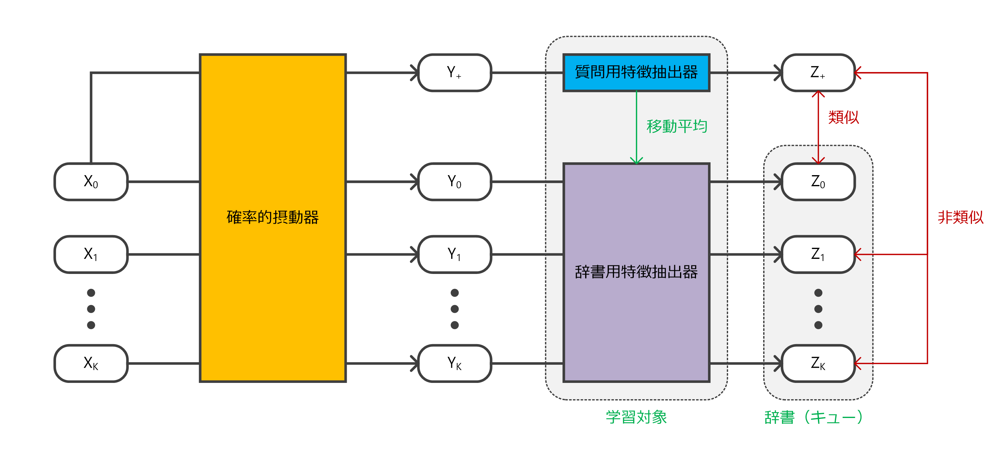
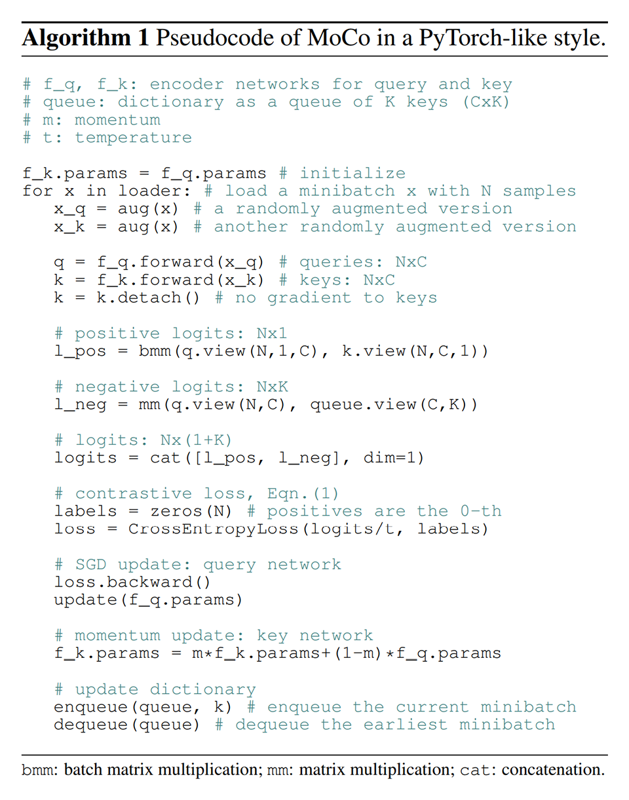

## 先行研究と比べてどこがすごい？
### MoCo (Momentum Contrast)
- MoCo（教師なし学習）で獲得したモデルの方が、教師あり学習で獲得したモデルよりも、多くのタスクで転移元として優れていた（画像分野で教師なし学習による事前学習を超えたのは恐らく初めて）。
- 十分に少ないメモリ容量で大規模データセットに対する Contrastive Learning を可能にした。

## 技術や手法の肝は？
- Dictinary Look-up, Momentum Encoder, Dictionary as Queue

## どうやって有効だと検証した？

### Linear Classification Protocol
IMageNet から 1M 個の画像をサンプリングしたデータセットで学習し、得られた特徴抽出器（パラメータをフリーズ）に分類層を追加したネットワークで教師あり学習を行い、その精度を比較した。

#### Linear Classification Protocol / 切除実験：Contrastive Loss Mechanisms
end-to-end に関しては、精度は良いが、メモリ容量の問題でバッチサイズ 1024 までしか実験できなかった。Memory Bank に関しては、メモリ容量の問題はないが、精度が悪い。MoCo はいいとこどりができている。

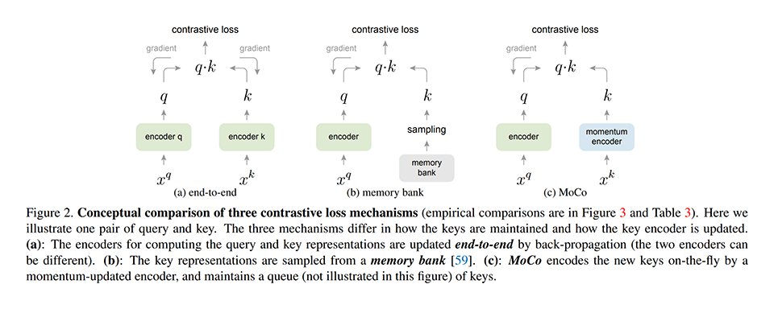
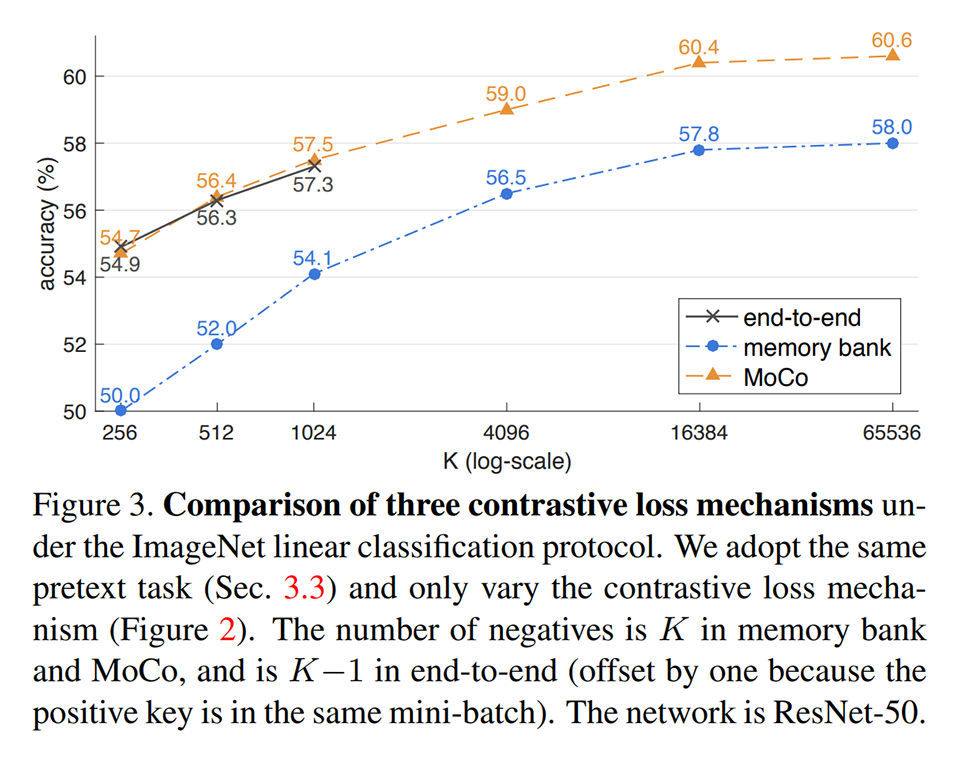

#### Linear Classification Protocol / 切除実験：Momentum
m を小さくすると訓練損失が振動するため収束しない。一部のデータにだけ適合しないように、全体として一貫性があるように、するには m を大きくする必要がある。

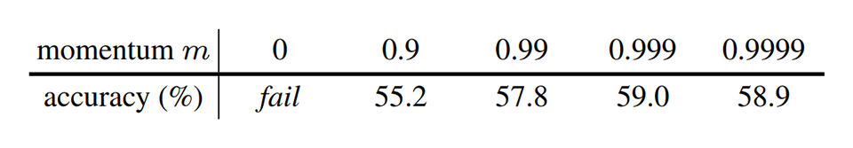

#### Linear Classification Protocol / 既存手法との比較
提案手法以内に特別なこと（ResNet のアーキテクチャの改変，パッチ入力，窓の注意深い設計，他のネットワークとの組み合わせ，…）を一切行わずに、SOTA レベルの性能がでた。

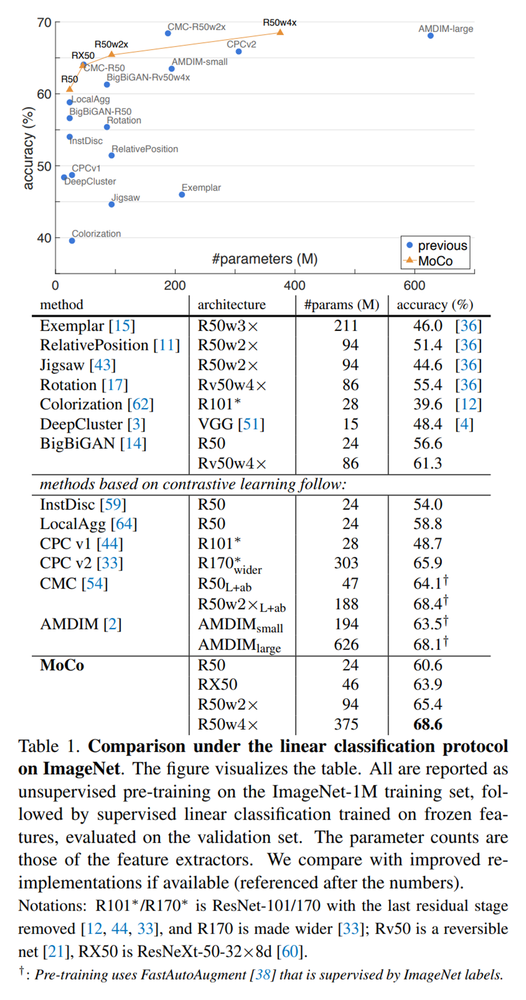

### Transfer Features
データセットの分布の偏りに対処するために、特徴量のノーマライズをファインチューニング中に行う。

#### Transfer Features / PASCAL VOC Object Detection / 切除実験：Backbone
MoCo で獲得したモデル（MoCo）をファインチューンする手法が、教師あり学習で獲得したモデルをファインチューンする手法と同等以上の性能を得られた。

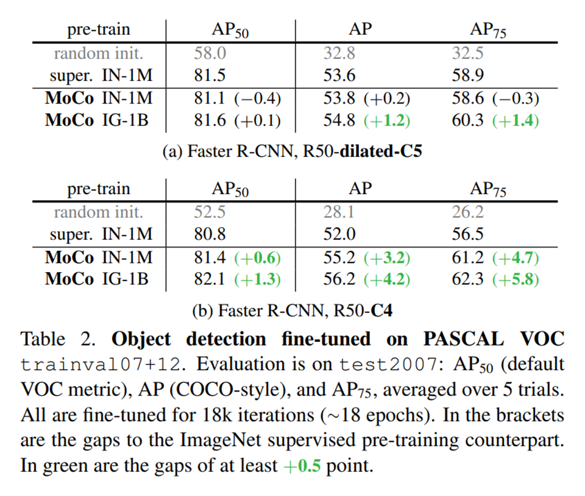

#### Transfer Features / PASCAL VOC Object Detection / 切除実験：Contrastive Loss Mechanisms
end-to-end や Memory Bank よりも MoCo の方が性能が良かった。

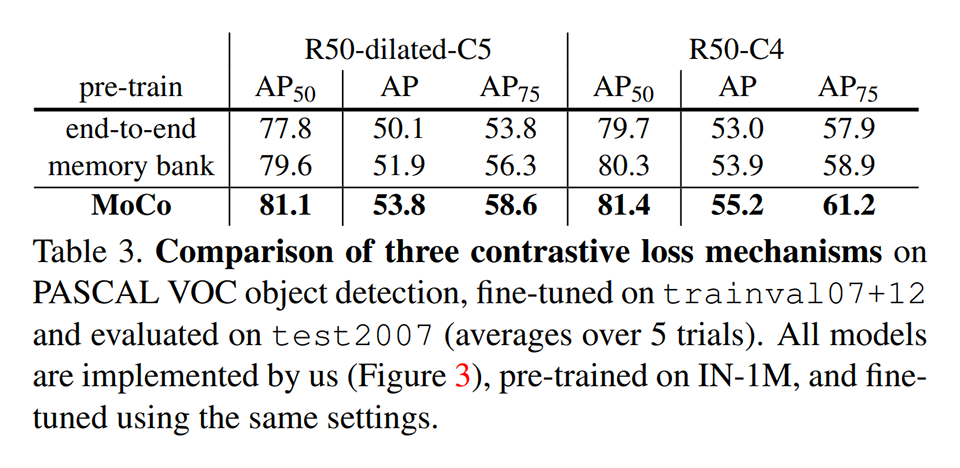

#### Transfer Features / PASCAL VOC Object Detection / 既存手法との比較
様々な事前学習手法よりも MoCo の方が性能が良かった。

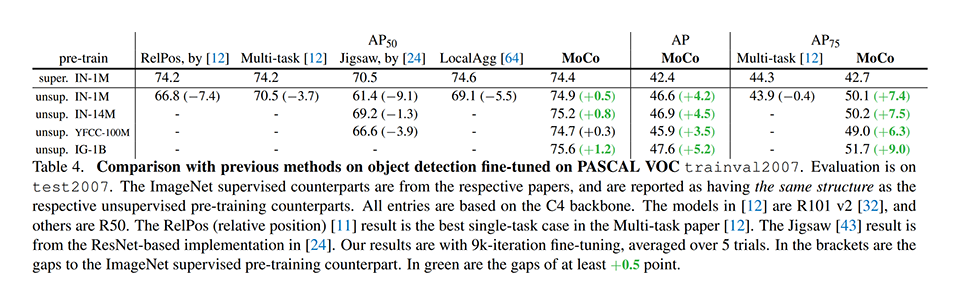

#### Transfer Features / COCO Object Detection and Segmentation
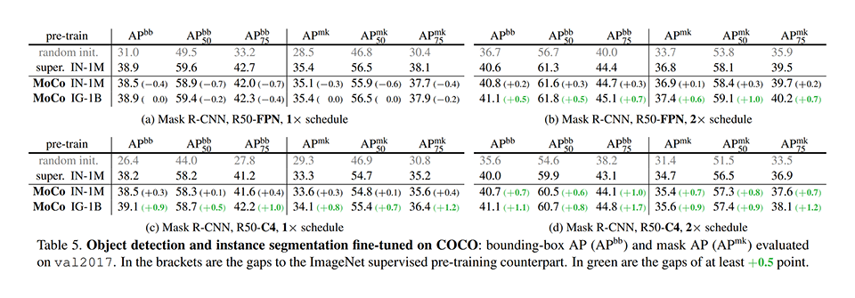

#### Transfer Features / More Downstream Tasks
MoCo で獲得したモデル（MoCo）をファインチューンする手法が、教師あり学習で獲得したモデルをファインチューンする手法と同等以上の性能を得られた。

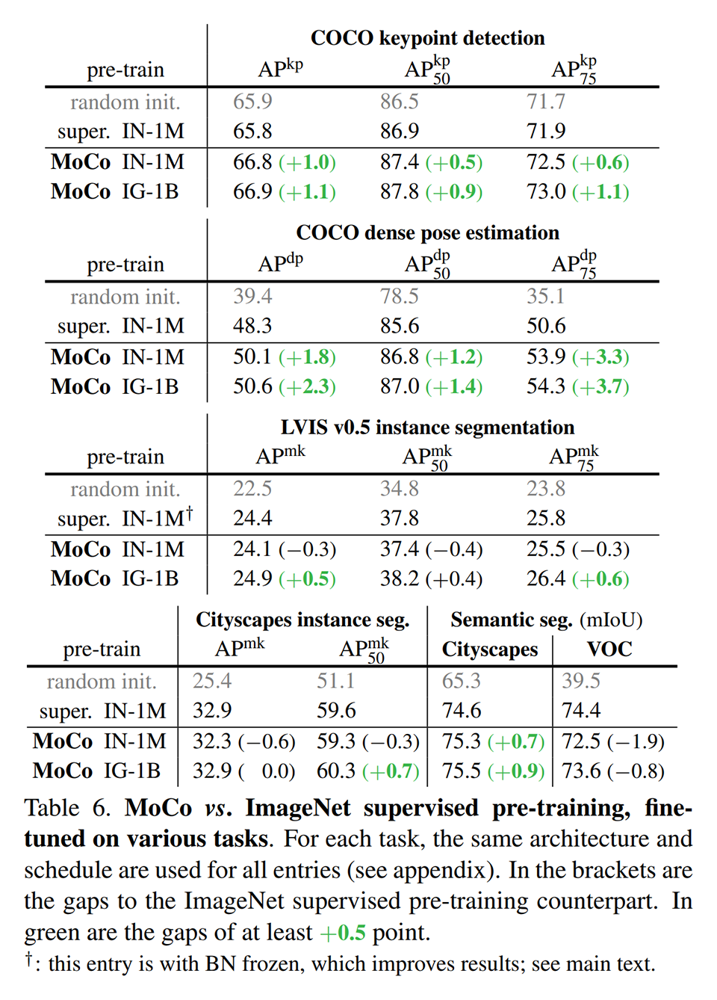

## 議論はある？
- MoCo を instance discrimination task だけでなく masked auto-encoding のようなタスクにも使えるようにできるといい。

## 次に読むべきタイトルは？
- [\[arxiv\]](https://arxiv.org/abs/1805.01978v1) Z. Wu, Y. Xiong, S. Yu, and D. Lin, "Unsupervised feature learning via non-parametric instance discrimination". CVPR, 2018
- [\[arxiv\]](https://arxiv.org/abs/1807.03748) A. van den Oord, Y. Li, and O. Vinyals, "Representation learning with contrastive predictive coding". CVPR, 2018
