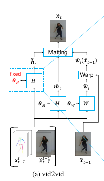
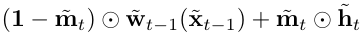
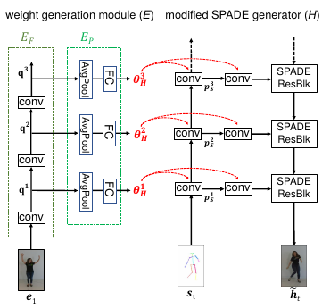
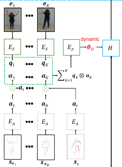

# Few-shot Video-to-Video Synthesis
[https://arxiv.org/abs/1910.12713](https://arxiv.org/abs/1910.12713)
(まとめ @n-kats)

著者
* Ting-Chun Wang
* Ming-Yu Liu
* Andrew Tao
* Guilin Liu
* Jan Kautz
* Bryan Catanzaro

NVIDIAの人たち

# どんなもの？
vid2vidをfew-shot化し、データに無い人物やシーンに適用できるようにするとりくみ。

# 先行研究と比べてどこがすごい？
vid2vid等は、
* 元画像
* 時系列の条件データ（姿勢やセグメンテーションなどの情報）

を元に、動画を生成する手法。

[研究紹介ページの動画を見れば分かりやすい。](https://nvlabs.github.io/few-shot-vid2vid/)

ダビデ像を踊らせる動画がfew-shot化の効果。

似たものに"everbody dance now"があるけど、これは、踊らせたい人物の色んな姿勢が必要。ダビデには無理。

# 技術や手法の肝は？
## vid2vid

入力
* 時刻t-Tから時刻t-1の画像
* 時刻t-Tから時刻tの条件（画像と対応）

出力
* 時刻tの画像

（T=1のときは単に画像の生成モデル。vid2vidの目的は動画として綺麗にしたい意義がある）

vid2vidは、3つのネットワークからなる
* W: 時刻t-1の画像から時刻tの画像までの各画素の移動（warp）を算出
* H: Wだけで分からない部分を補う項目
* M: WとHの混ぜ方を決定

基本は移動で生成できるけど、無理なところは別の方法で補うというやり方

訓練
* 1フレームの画像と条件の組についてのGAN
* 動画としてのGAN（Kフレームの画像とK-1フレームのwarpの組について）
* warpの誤差（教師のwarpの値との差、warp結果と実際の画像の差の和）
* DGX1で10日(解像度が2kの場合)

## few-shot vid2vid
vid2vidのHのネットワークの重みをターゲットの人物・シーン毎に調整する仕組みを入れる

入力1
* ターゲットの画像
* ターゲットの条件

出力1
* Hの重み

入力2
* 時刻t-Tから時刻t-1の画像
* 時刻t-Tから時刻tの条件（画像と対応）
* 出力1

出力2
* 時刻tの画像

## Hの構造

SPADEで画像を生成する。
画像・条件からCNNで解像度毎の分布のmapを生成する。
generatorの入力から得られるBNされたfeature mapにこの分布のmapを各点に適用する（各点・チャンネルで一次変換）。

出力1は分布のmapを生成するネットワークで使う。

## 複数組のターゲット画像・条件があるとき

生成しようとしている画像に対応した条件とターゲットの条件を比較してattentionを出す。
ターゲットの画像毎にfeature mapを出して、attentionを掛けて足して統合する。
以下、1枚の場合と同じ。

## 訓練方法
複数のドメインの教師データで訓練する。
ターゲット画像の代わりに同じドメインからランダムにフレームを選ぶ。
訓練を安定させるため、Tの値を数エポック毎に倍にするようなことをする。

# どうやって有効だと検証した？
ダビデ像が踊っている

# 議論はある？
とはいえ、あまりにもドメインが違う映像は生成できない。

## 私見
これってシーン毎にチューニングした重みを使えるって言っている？

# 次に読むべき論文は？
* vid2vid
* SPADE
