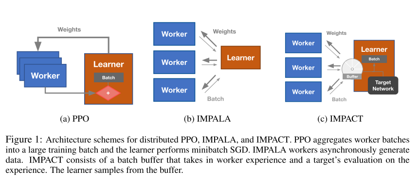
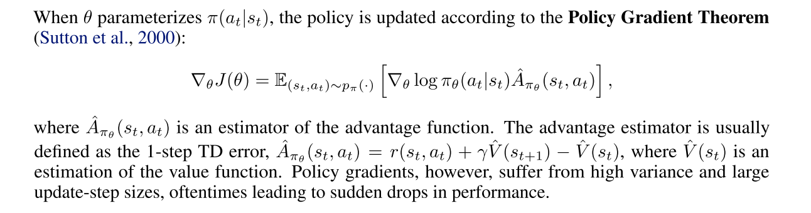
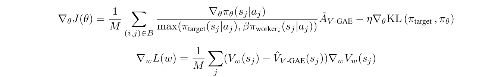
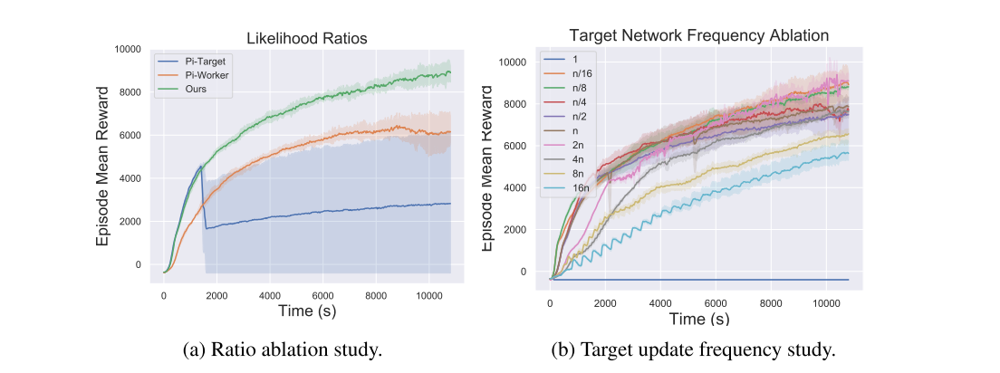
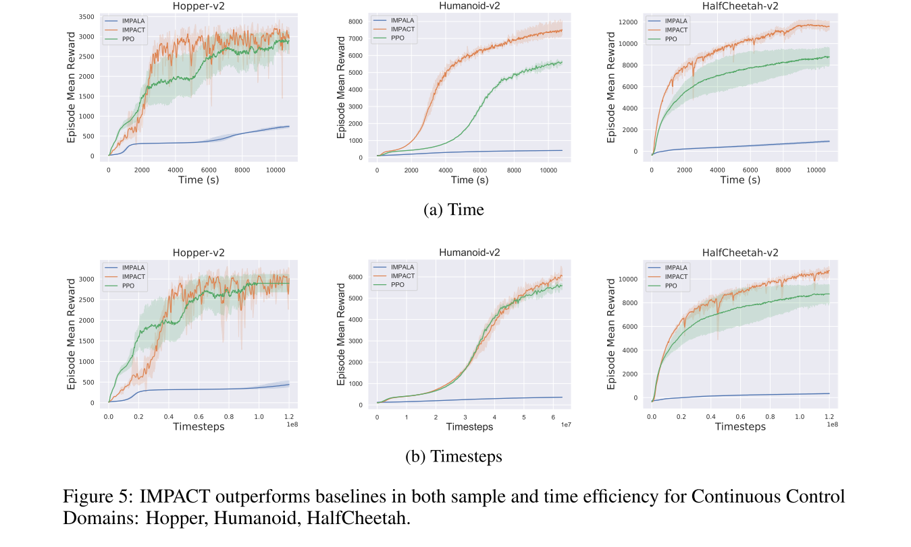
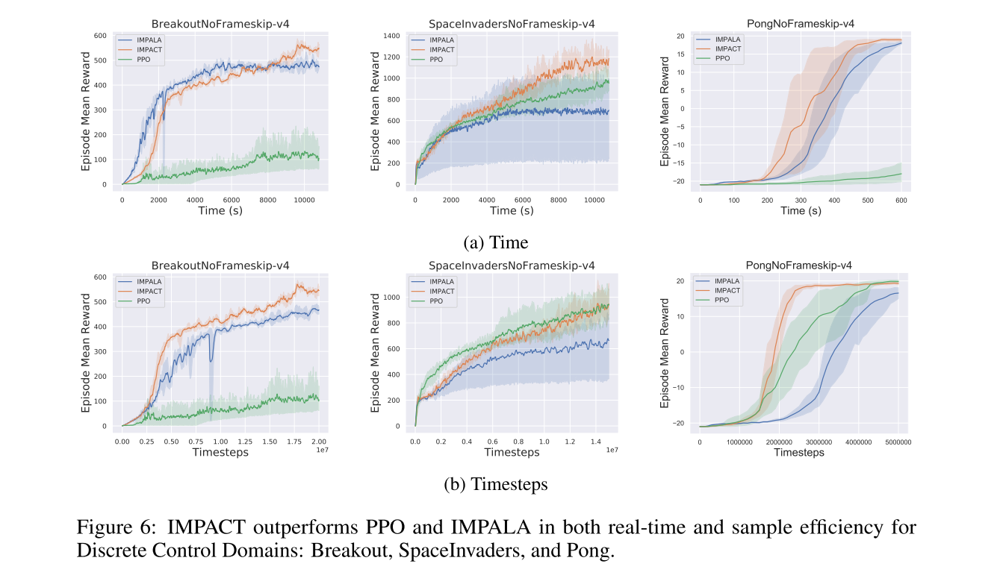
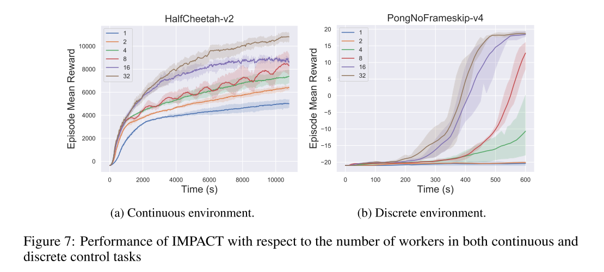

IMPACT: IMPORTANCE WEIGHTED ASYNCHRONOUS ARCHITECTURES WITH CLIPPED TARGET NETWORKS
===

Michael Luo, Jiahao Yao, Eric Liang, Richard Liaw, Ion Stoica  
主に、RISELab UC Berkeleyの方

[https://arxiv.org/abs/1912.00167](https://arxiv.org/abs/1912.00167)

---

## どんなもの？

* PPO:分散処理をさせたとしても、ポリシーの更新で同期するので、並列化の効率が悪い。
* IMPALA：ActorとLeanerで異なるポリシーを用いるので、更新が非同期となり並列化効率が良い。  
  　　　　非同期なために学習が不安定になりやすい。
* IMPACT：Policy Optimizationの手法に、IMPALAの手法をミックスした。

[図1]  
 
 

---

## 先行研究と比べて何がすごい？

* PPOの学習の安定性とIMPALAの並列処理の効率を両立できる方法を提案した。
  
---

## どうやって有効だと検証した？

openaiが提供する以下の3種のタスクと
* [Hopper-v2](https://gym.openai.com/envs/Hopper-v2/)
* [Humanoid-v2](https://gym.openai.com/envs/Humanoid-v2/)
* [HalfCheetah-v2](https://gym.openai.com/envs/HalfCheetah-v2/)

ATARIのタスク3種
* BreakoutNoFrameskip-v4
* SpaceInvadersNoFrameskip-v4
* PongNoFrameskip-v4

上記タスクを「PPO」「IMPALA」「IMPACT」で比較。
  
---

## 技術や手法の肝は？

ONポリシーのPolicy Gradientベースの手法(TRPO)に、IMPALAで提案されたImportance Samplingの手法を導入して、並列処理効率を上げられるような手法を提案した。

---

## 議論はある？

1. target-clipping objectiveは、パフォーマンスにどのように影響するのか？  

2. IMPACTのリングバッファはサンプル効率にどのように影響するのか？  

3. IMPACTのPPO、IMPALAに対するパフォーマンスの差は？  
 

4. IMPACTのスケーラビリティは？  

---
## 参考
[https://arxiv.org/abs/1802.01561](https://arxiv.org/abs/1802.01561)  
[https://spinningup.openai.com/en/latest/algorithms/ppo.html](https://spinningup.openai.com/en/latest/algorithms/ppo.html)  

---

## 次に読むべき論文は？

* IMPALAについて十分理解できていないので、もう一度じっくり読みたい。  
[https://arxiv.org/abs/1802.01561](https://arxiv.org/abs/1802.01561)

* 引用にあった似た手法の論文。  
[https://arxiv.kaiya.ml/abs/1905.02363v1](https://arxiv.kaiya.ml/abs/1905.02363v1)

