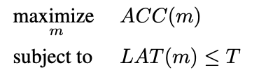
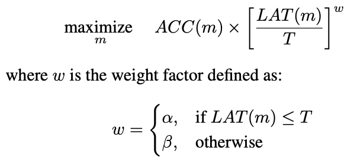
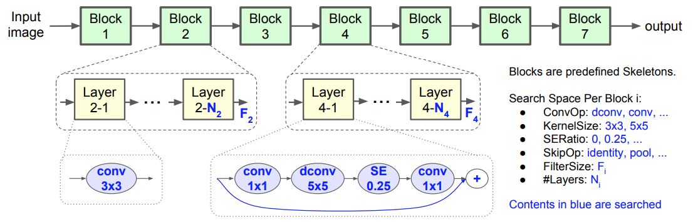
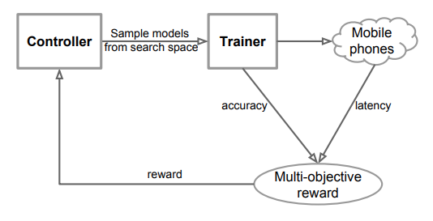
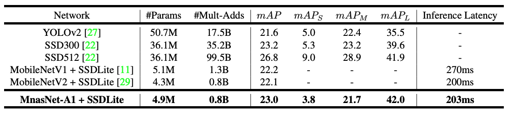
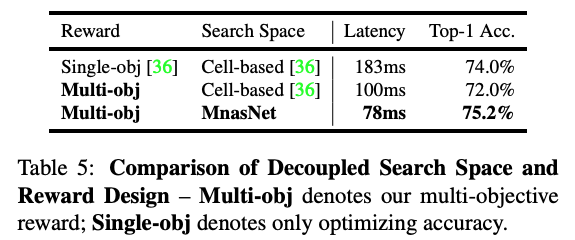

# MnasNet: Platform-Aware Neural Architecture Search for Mobile
 
### 論文著者
- Mingxing Tan1 
- Bo Chen2 
- Ruoming Pang1 
- Vijay Vasudevan1 
- Mark Sandler2 
- Andrew Howard2 
- Quoc V. Le
論文
<https://arxiv.org/pdf/1807.11626.pdf>

Googleのブログ
<https://ai.googleblog.com/2018/08/mnasnet-towards-automating-design-of.html>

コード
<https://github.com/tensorflow/tpu/tree/master/models/official/mnasnet>

(まとめ: @wkluk-hk)

## どんなもの？
- 携帯上の分類/検出で、精度と速度(Latency)を両立した手法の提案
- automated neural architecture search =　自動的に最適network構造を探す アプローチ 
	- 実験では強化学習で探索

## 先行研究と比べてどこがすごい？
- FLOPS to approximate inference latency
	- 性能をfeedbackするのは初めてではないが、FLOPSで擬似的にlatencyを計算
	- 自分たちは、実機でlatencyを測定
	- objective functionも工夫（後述)
 
- factorized hierarchical search space
	- 今までの類似取り組みでは、search spaceが小さい。「決まった一種類のセルを積み上げているだけ」

## 技術や手法の肝は？
### 1.multi-objective optimization
#### 従来
- 目標latencyは制約条件として与える
- reward関数は実際ACCだけのもの

#### 今回
- reward関数に、ACCとLAT両方組み込んだ -> LATの山を乗り越えてサーチ可能

### 2.factorized hierarchical search space
 

- 基本の形はMobileNetV2の流用
	- おなじみの、 後ろにいけばいくほど Resolution ( HとW )が小さくなり、Filter Size が大きくなる形
	
- それに、blockという考え方を導入して、可変アクテクチャーにした
	- Block i は、 N_i個のLayerから構成される
	- 同じBlock内のLayerは基本全部同じもの(HWが変わるときだけ最初のやつでstride=2)
	- Block個数や、Block間のHWサイズは固定
- Blockごとのアーキテクチャは、以下の変数で定義される：
	- Layer数 N_i (MobileNetV2をベースに段階増減）
	- 個々のLayer構造。つまり
		- 出力Filterサイズ F_i (MobileNetV2をベースに段階増減）
		- 畳み込み操作 (通常conv/ depthwise
conv / mobile inverted bottleneck conv の３択）
		- 叩き込みサイズ (5x5 / 3x3)
		- skip操作 (identity residual/pooling/skipなしか）
		- Squeeze-and-excitation ratio ( 0 / 0.25)

### 3.search
 

- 強化学習で探す(たまたま、使いやすいため）
- 学習、実機で推論したあと、rewardは、先の式で計算される
- controllerは、RNNで各layerを定義する離散値をsoftmaxで出力

## どうやって有効だと検証した？
- 重いため、CIFAR10 で 8Kモデルを試して、15個だけImageNet に、さらに1個だけCOCOに適用した
### MobileNetV2との分類性能比較

### SSD, YOLOとの検出性能比較
Mnasで特徴抽出したあとSSDLiteにつなぐ

		
## 議論はある？
- Search space単体の評価という意味で、強化学習部分が同じなNASnet(本論文をインスパイヤした論文と比べても、優位性が分かる)

- 結果のアーキテクチャーに、5x5 kernelが残っているのは興味深い (hand craftな mobile向けDNNは全部3x3まで）  

## 次に読むべきタイトルは？
NASnetの論文
Learning Transferable Architectures for Scalable Image Recognition <https://arxiv.org/pdf/1707.07012.pdf>
