# [\[arxiv\]](https://arxiv.org/abs/1912.04958) Analyzing and Improving the Image Quality of StyleGAN

- 著者
    - Tero Karras *1
    - Samuli Laine *1
    - Miika Aittala *1
    - Janne Hellsten *1
    - Jaakko Lehtinen *2
    - Timo Aila *1
- 所属
    - 1: NVIDIA
    - 2: NVIDIA and Aalto University

## どんなもの？
### StyleGAN2 (通称)
StyleGAN で生成した画像に出現する水滴のようなノイズの発生メカニズムを解析して対策した。
さらに、いくつかの工夫を StyleGAN へ適用することで画像生成の品質を改善した。

- Weight demodulation
- Lazy regularization
- Path length regularization
- Alternative network architectures (No growing, new G & D arch.)
- Large networks

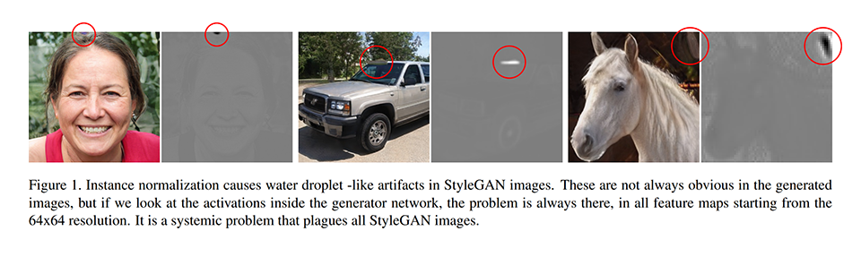
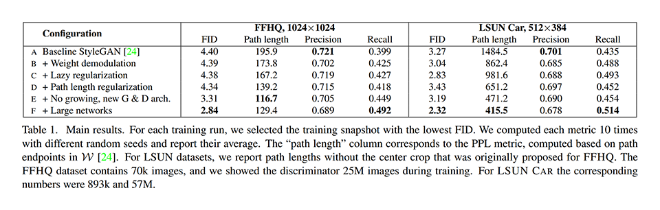

## 先行研究と比べてどこがすごい？
### StyleGAN2 (通称)
- StyleGAN より画像生成の品膣が大幅に改善した。
- StyleGAN より訓練速度が 40% 速くなった。

## 技術や手法の肝は？

### Weight demodulation
次の手順に従って generator のアーキテクチャを再設計した（実現したいことを変えずにシンプルにした）。これにより若干 FID が改善した。

- (a) … StyleGAN の generator のアーキテクチャ。
- (b) … (a) の convolution と AdaIN を展開する。意味は変わらない。
- (c) … (b) のバイアス b (with LeakyReLu) とノイズ B を StyleBlock の外へ移動する。少し意味は変わるが、実現したいことはできている。移動により、平均の修正と平均の正規化が打ち消し合うので削除する。平均の正規化の削除は意味を変えてしまうが、StyleBlock の入力の期待値が 0 になるように初期化すれば影響は少ない。
- (d) … 式 (3) に従って (c) の標準偏差の修正と標準偏差の正規化を convolution の重みの正規化に変換する。少し意味は変わるが、StyleBlock の入力の期待値が 0、標準偏差が 1 になるように初期化すれば影響は少ない。

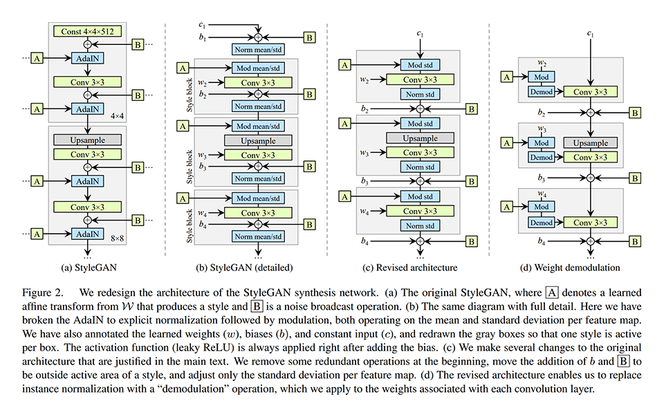
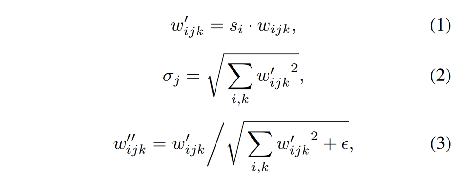

### Lazy regularization
Path length regularization の計算が重いので、16 ミニバッチごとに計算するようにした。

### Path length regularization
StyleGAN の研究で PPL (Perceptual Path Length) が画像の品質とよく相関することが分かったので、それを正則化に用いた。FID・Precision・Recall は GAN のメトリクスとして優れているが、画像の品質を測るという点において PPL に劣る。

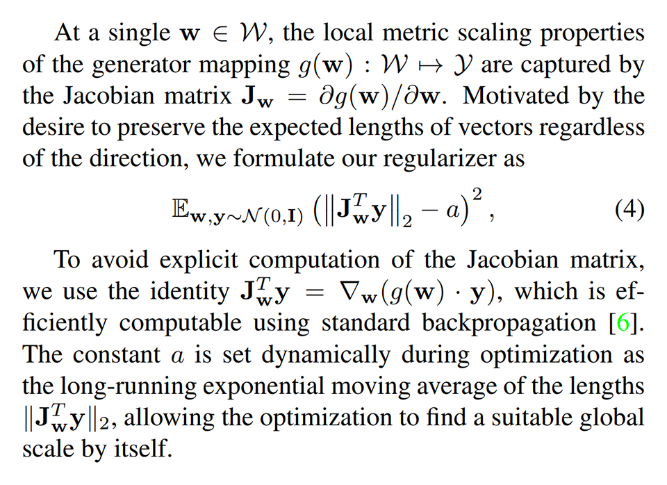

### Alternative network architectures
次に挙げる画像のアップサンプリングアーキテクチャ (generator 用) とダウンサンプリングアーキテクチャ (discriminator 用) をそれぞれ 3 つ考案した。

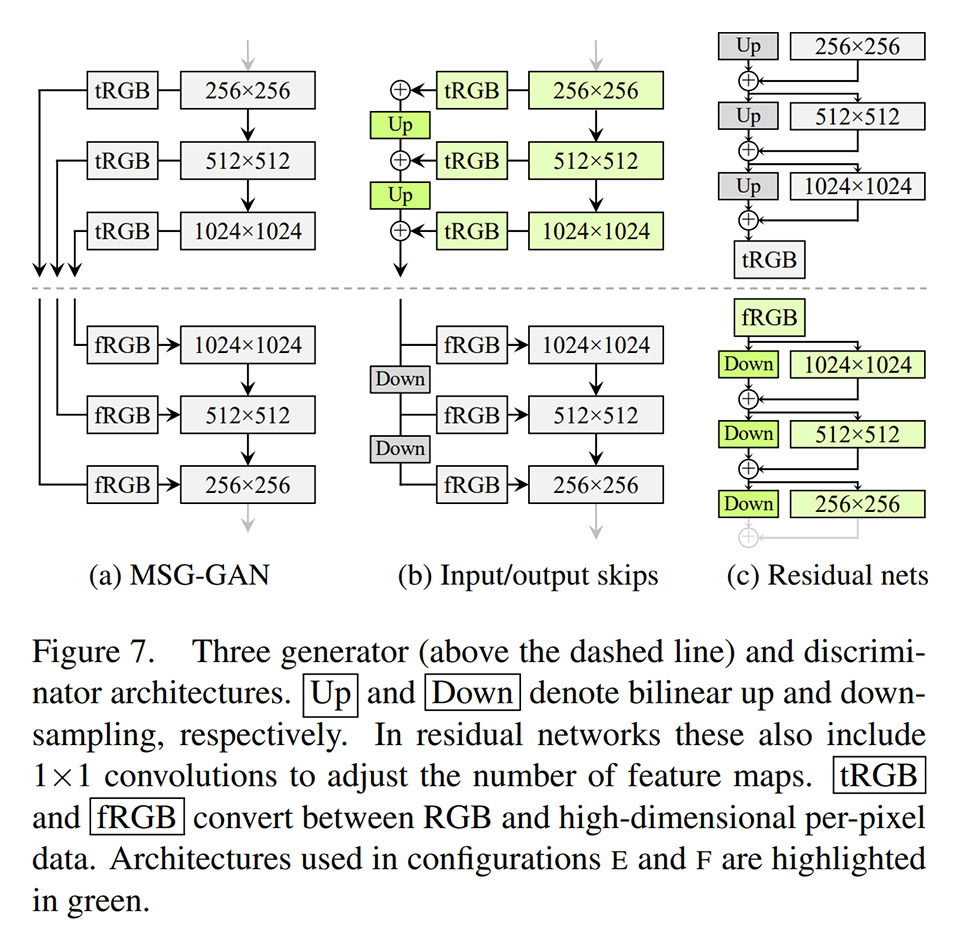

全ての組み合わせを検討したところ、generator には (b) input/output skips、discriminator には (c) Residual nets が良いことが分かった。以降の実験ではこの組み合わせを用いた。

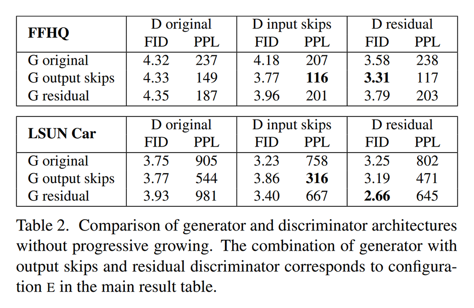

### Large networks
generator の出力が各スケールの出力とどのくらい関係しているかを調べた。
(c) Residual nets で構成された generator の出力は各スケールの線形和になっているため、各スケールの出力の標準偏差の大きさで関係の強さを推し量れる。

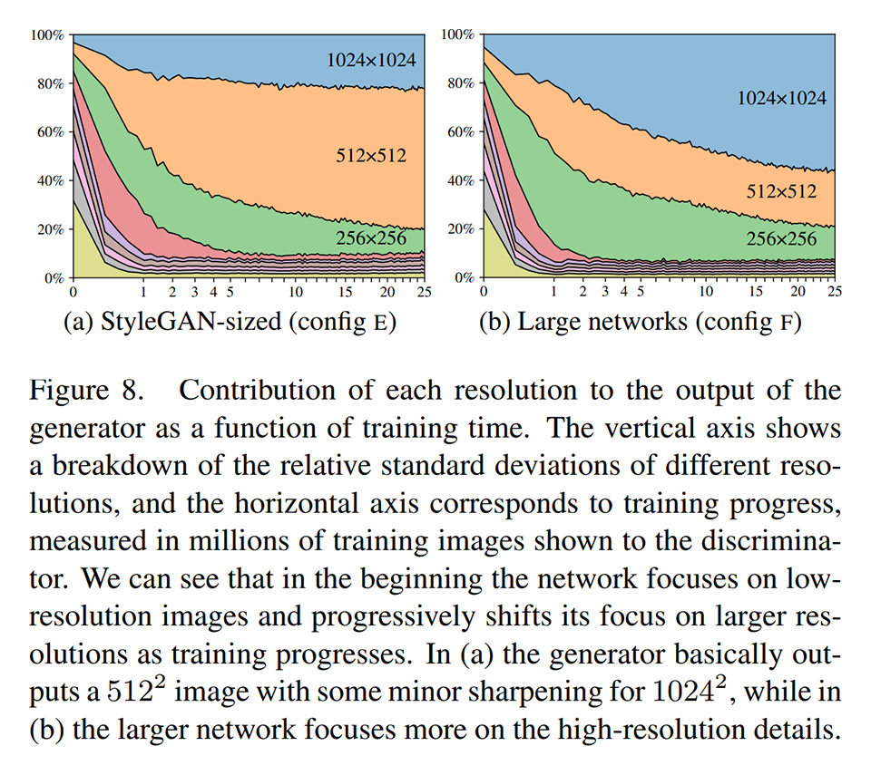

最も解像度が高いスケールが最も関係していると自然であるが、既存の StyleGAN はそうなっていなかった。
そこで、最も解像度が高いスケールのチャネル数を倍にしたところ、期待する分布になり、性能も大幅に改善した。

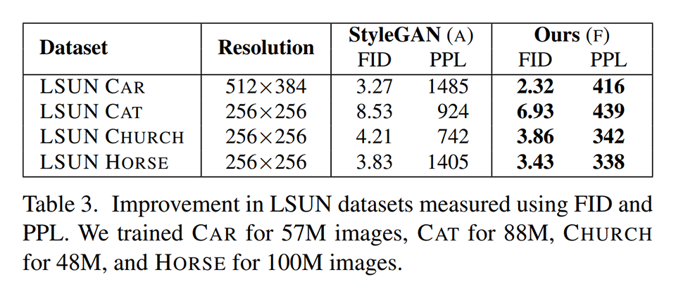

### Projection of images to latent space
画像から潜在ベクトルを求める (generator の逆) 際には、目的画像を生成するスタイル (各スケールの A と B) を勾配法で探索する（projection-based method）。
スタイルから目的画像を生成できているかどうかは LPIPS distance で測定し、その値を損失として用いる。

次の図は、生成画像（上の行）とそれから求めた潜在ベクトルを画像に戻したもの（下の行）を、StyleGAN と StyleGAN2 で比較した結果である。
StyleGAN は生成画像に完全に対応する潜在ベクトルの探索に失敗することがあるが、StyleGAN2 では全て成功している。StyleGAN2 の方が滑らか潜在空間になっていると考えられる。
生成画像ではなくリアル画像を用いると、StyleGAN2 であっても完全に対応する潜在ベクトルの探索に失敗する（復元画像が破綻することはない）。

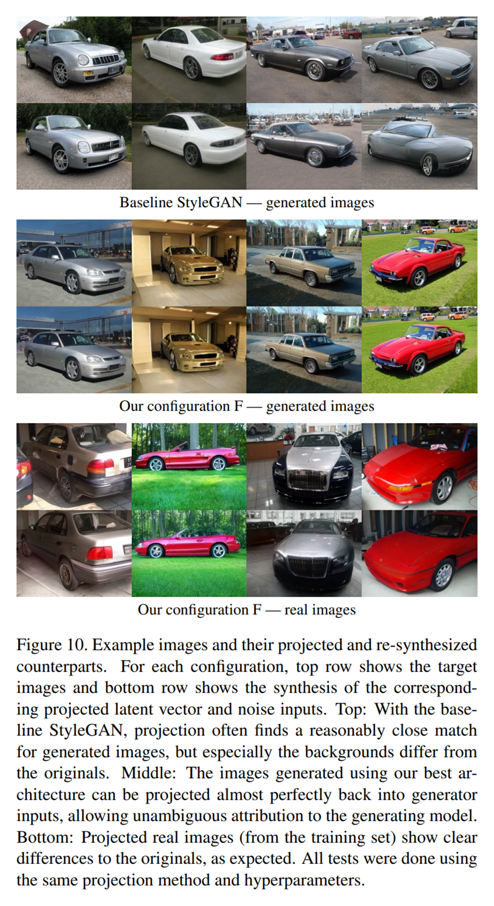

LPIPS distance を用いると、生成画像かどうかがはっきり分かるという特徴がある。

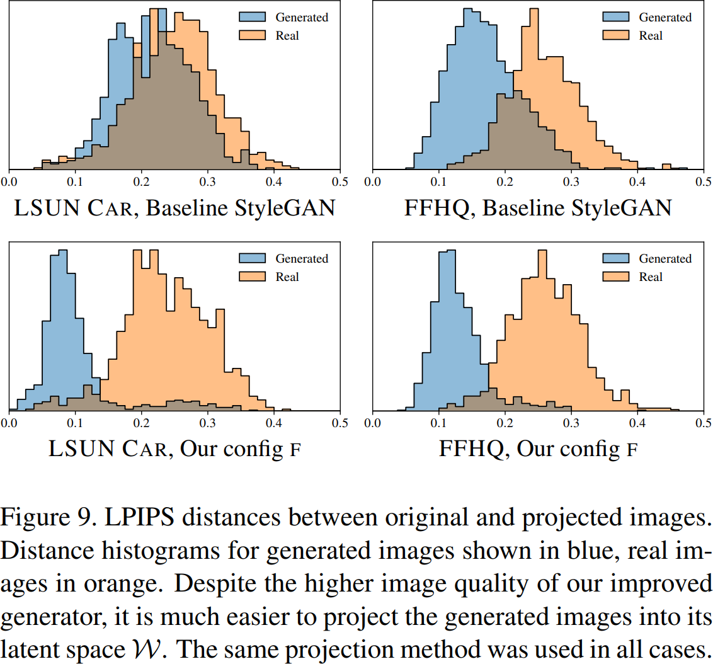

## どうやって有効だと検証した？
節「技術や手法の肝は？」の実験の通り、LSUN と FFHQ を用いて各手法を比較した。

## 議論はある？
- StyleGAN より画像生成の品膣が大幅に改善した。
- StyleGAN より訓練速度が 40% 速くなった。
- L2 距離をデータドリブン距離で置き換えて、Path length regularization を改善したい。

## 次に読むべきタイトルは？
- [\[arxiv\]](https://arxiv.org/abs/1904.03189) R. Abdal, Y. Qin, and P. Wonka, "Image2StyleGAN: How to embed images into the StyleGAN latent space?", ICCV, 2019.
- [\[arxiv\]](https://arxiv.org/abs/1905.02259) M. Albright and S. McCloskey, "Source generator attribution via inversion", CVPR, 2019.
- [\[arxiv\]](https://arxiv.org/abs/1812.04948) T. Karras, S. Laine, and T. Aila, "A style-based generator architecture for generative adversarial networks", CVPR, 2018.
