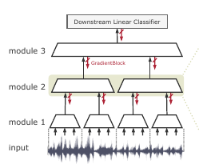
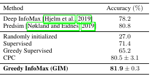
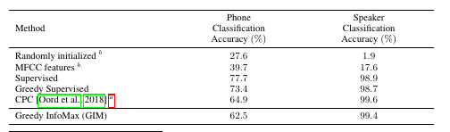

# Putting An End to End-to-End: Gradient-Isolated Learning of Representations
[https://arxiv.org/abs/1905.11786](https://arxiv.org/abs/1905.11786)
(まとめ @n-kats)

著者
* Sindy Löwe 
* Peter O’Connor
* Bastiaan S. Veeling 

アムステルダム大学の人たち

今月あったNeurIPS 2019で新しい方向性を指し示す研究として受賞

# どんなもの？
local self-supervised representation learningで教師やend-to-endの逆伝播が無い学習方法を提案

# 先行研究と比べてどこがすごい？
既存の深層学習のend-to-endなモデルの問題
* メモリ不足
* 生物の脳は逆伝播なんてしない
* 生物の脳は高度にモジュール化されている
* 教師データが大量に要る

ネットワークをモジュールに分け、モジュール毎に入力データを分別できるように訓練して表現を学習する（GIMを提案）。

モジュール毎で訓練できるから並列して訓練できる。浅い層の訓練を先にして、そのアウトレットをデータセットとして記録し、次のモジュールを訓練することも可能。

# 技術や手法の肝は？
## 逆伝播を途中で止める

 

## モジュール内で解く問題
 

インプットが同類かどうかを、モジュールのアウトプットで判定する問題を解く。

似た入力（近い時刻のデータ・近い位置のパッチ）なら同じ、全く関係がなければ異なるという認識ができるように学習する。

## 損失関数（module-local InfoNCE）
 

* z_{t+k}: 似た入力の場合のモジュールのインプット
* z_j in X: 関係の無い入力の場合のモジュールのインプット

## 具体的な問題への適用
### 画像
* 似た入力の選び方・・・時系列になっているわけではないので、上下の位置の特徴ベクトルは似ていると判定
* 異なる入力の選び方・・・ミニバッチの中の他の画像

STL-10というデータセットで訓練（これは教師データが少なめのデータセット。教師なしのデータが多量に存在）。

### 音声
似た入力の選び方・・・同じ録音の近くのデータ

LibriSpeechデータセットを利用。スピーチの話者の分類問題や単純な分類問題の教師がある。

# どうやって有効だと検証した？
STL-10とLibriSpeechでそれなりの評価が出た

 

 

# 議論はある？
ent-to-endな学習なんていらなくない？

GIMならオーバーフィットに強いはずだし、勾配消失問題も起きない。メモリ効率のいい訓練もできる。

# 次に読むべき論文は？
* [CPC](https://arxiv.org/abs/1807.03748)