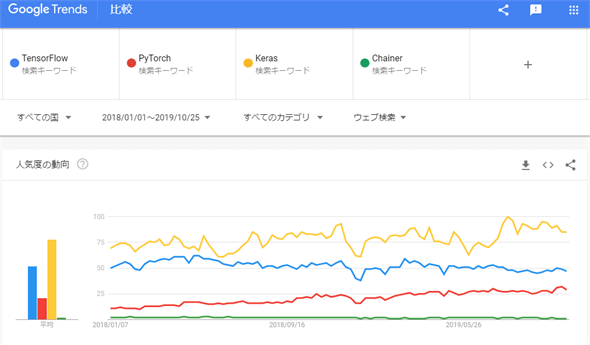
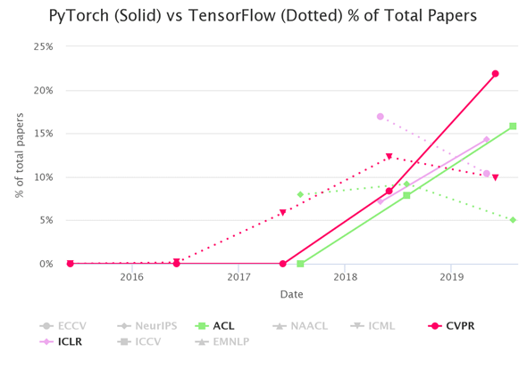

PyTorch vs. TensorFlow
===
一色政彦，デジタルアドバンテージ

https://www.atmarkit.co.jp/ait/articles/1910/31/news028.html

@cohama

## どんなもの?

- PyTorch と TensorFlow について、論文での採用数などから比較
  - PyTorch の方が人気が高い
  - TensorFlow の人気は横ばい
- PyTorh と TensorFlow 2.0 について著者の私見も述べられている
  - TensorFlow 2.0 は登場が遅かった
  - TensorFlow のほうがクラウドモバイルなど運用環境が整っている

## どうやって有効だと検証した？

- 検索エンジンのトレンド
  
  - TensorFlow： やや下降傾向
  - Keras： 緩やかに上昇傾向
  - PyTorch： 一番大きく上昇傾向
  - Chainer： 下降傾向
- 国際学会の採択論文で利用しているフレームワークの調査
  
  - PyTorch vs. TensorFlow で 3:2 〜 3:1
- パフォーマンス比較
  - 他の人のブログの引用
  - 推論時:大差がない
  - 訓練時:不明

## 議論はある?

- PyTorch のほうが API が優れている
- 産業界では TensorFlow に一日の長
 - TensorFlow Lite, TensorFlow.js, TensorFlow Serving
- 私見
  - TensorFlow 1系と2系をごちゃまぜで統計している

## 次に読むべき論文
- [The State of Machine Learning Frameworks in 2019](https://thegradient.pub/state-of-ml-frameworks-2019-pytorch-dominates-research-tensorflow-dominates-industry/) 本文中で引用されていたブログ
