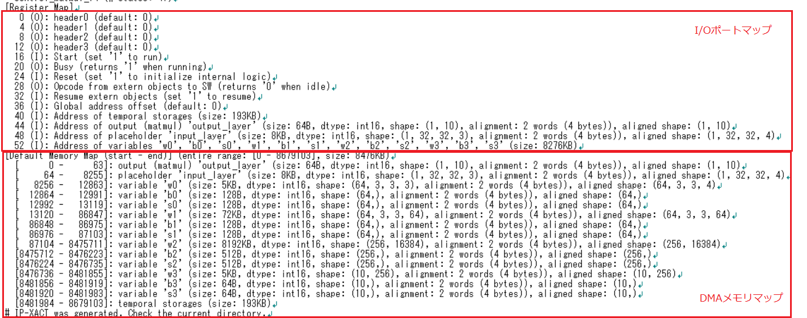

NNgen  
===

Shinya Takamaeda-Yamazaki  

[https://github.com/NNgen/nngen](https://github.com/NNgen/nngen)

---

## どんなもの？

* NeuralNetをFPGAに実装する高位合成コンパイラ。  
　エッジデバイスへDNNを実装する用途で開発されている。  
　(GPUやTPUのような計算機アクセラレータ的なものではない。)  

---

## 先行研究と比べて何がすごい？  

* いくつかの企業から、FPGAにNeuralNetを実装するものがあるが、オープンソースで公開されているものは少ないのでは？  
* デバイスベンダから提供されう有償ツール等もあるが、実際に触れる機会がなかなかない。  

---

## どうやって有効だと検証した？  

* 添付されているExampleを触ってみました。  
　(pytorchの学習済みresnet18、VGG11の例が添付されています。)  

　以下、添付の「hello_nngen.py」の実行結果。  

 

[Resnet18のログ](NNgen/resnet18_log.txt)  
[VGG11のログ](NNgen/vgg11_log.txt)  

---

## 技術や手法の肝は？

* ONNXに対応しており、対応しているフレームワークのモデルをインポートできる。

* 重みデータは、整数化して扱う。(FPU、DSP等は必要ない)

* AXIバスにより接続。開始フラグを立てれば、内部のステートマシンにより処理シーケンスが実行される。

* IP-XACTという規格に対応しており、必要なIPコアのパラメータも自動で生成される。  
　(対応ツールであれば、簡単にインポートできそうである。)

* 出力として、NNのコアになるVerilogHDL、整数化した重みデータのバイナリ、メモリマップが得られる。  
  

---

## 議論はある？

* 個人的に気になること。  
　1) どの程度の回路規模が必要なのか？  
　　 デバイスに依存するリソース等は必要ないのか？  
　2) 実際、どのくらい性能に差がでるのか？  

* 呼び出し側のソフトの作りこみは自前で必要。  

---

## 次に読むべき論文は？

今回の結果は論文にはなっていないようでしたが、類似事例の論文を探してみたい。

