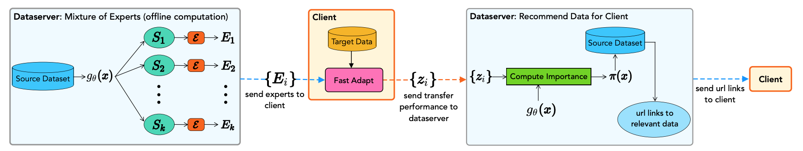
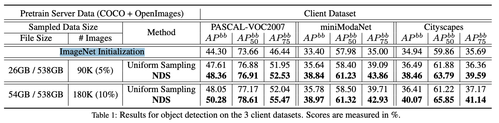
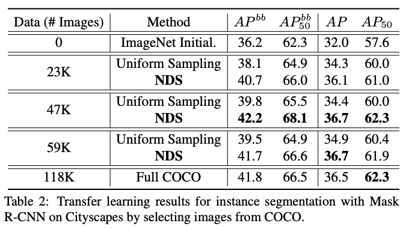

# Neural Data Server: A Large-Scale Search Engine for Transfer Learning Data
 

 
### 著者
- Xi Yan1,2∗
- David Acuna1,2,3∗ 
- Sanja Fidler1,2,3

1. University of Toronto 
2. Vector Institute 
3. NVIDIA

### リリース日
2020/1/9

### リンク
論文
<https://arxiv.org/pdf/2001.02799.pdf>

プロジェクト
<http://aidemos.cs.toronto.edu/nds/>

(まとめ: @wkluk-hk)

## どんなもの？
### 問題設定
- 目的タスクのために、すでにlabeled dataを少量作った
- 精度向上のため、公開されたdatasetを使ってtransfer learningしたい
	- スタートは「公開weight」ではなく、公開「model + 訓練logic + データ」らしい
	- 一回「公開データを使った再訓練」が前提
- そのとき、既存ものの再訓練は大変（データ多/処理リソース大変）
- 既存「model + 訓練logic + データ」の中、自分のタスクに合ったデータを絞り込めないか？

### やったこと
- onlineで複数「学習データ絞り込みたい」クライアントを集中されたサーバ上同時にさばけるほど、実用的なアルゴを提案
- 複数Datasetに対し実際index作り、一般向けのサービスを立ち上げた

  
## 先行研究と比べてどこがすごい？
似た問題設定に対して、すでにあるいろいろなアイデアを言及
#### Federated Learning
- 大量なclientにばらまく分散学習からは、アイデアを得たとのこと。

#### Active and Curriculum Learning
- データを増やすため「unlabeledデータを検索して、分類対象として良さげなものをタグ付けする」
- 作りかけのmodelをdatasetにかけるため、セキュリティと性能上無理

#### 論文「Large Scale Fine-Grained Categorization and Domain-Specific Transfer Learning」
- まったく同じ問題設定だが、scalabilityに問題あり (datasetの増加に対して、model作り直し要）

## 技術や手法の肝は？

### 基本な流れ
1. Server offline処理
	- データに対し複数のExpert (binary分類器）を訓練する (MoE: Mixture of Experts)
	- 各データに対し「Expert訓練における貢献度」を計算しておく
2. Client側: 
	- 作った Expertをダウンロードして、自分が持っているlabeledデータにかける (Fast Adapt）
	- その結果、目的タスクに対するExpertごとの重要度が得られる
3. 有用データの検索 (online)
	-  #2結果を重みに、目的タスクに対するデータの貢献度を計算
	-  貢献度の高いデータをClientに返す

### MoEの詳細
- 個別Datasetに対し、既存modelで特徴抽出
- 抽出した特徴をK-meansかけてK種類に分ける (label使わない場合。labelを使う バリエーションもある）
- K種類に対し、K子のExpertを訓練する
- ちなみに、rotation(0,90,180,270)でデータを４倍にする
- 種類kの Expertの訓練に使ったデータは、重要度 「1/(種類kの全データ数)」が与えられる
- classificationに限定して話しているが、segmentation,detectionにも拡張されている 

### Fast Adaptの詳細
- 最終層が取られたExpertは、clientにあるデータに対して推論し、featureを得る
- featureとlabelを使って、目的タスクの分類する単層NNを学習する
- 単層NNの精度が高いものは、Expertが「重要」とする

## どうやって有効だと検証した？

- ImageNet Initialization -> client Dataset で fine tune: 一番低い
- ImageNet Initialization -> ランダム選択追加でpre-train -> client Dataset で fine tune:　改善
- ImageNet Initialization -> NDSで選んだデータでpre-train -> client Dataset で fine tune:　一番よい

- 全部使うより、NDSで絞ったほうがよかったりする

		
## 議論はある？
Domain Adaptationとの関係についていろいろ書いてあったが…解読間に合わず割愛

## 次に読むべきタイトルは？
Domain Adaptationをキーワードで調べてみたい
