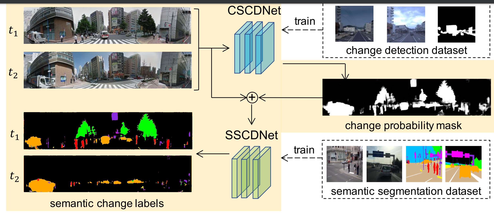
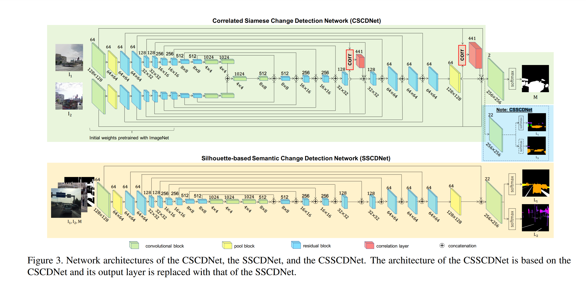

Weakly Supervised Silhouette-based Semantic Change Detection
===

2018/11/29 Ken Sakurada(AIST)

https://arxiv.org/abs/1811.11985

（まとめ：@yuji38kwmt）

---

## どんなもの？
* weak supervisionでsemantic change detection(意味的変更検出)する方法を提案
* semantic change detection用のデータセットを公開した（PSCD Dataset: panoramic semantic change detection）

---

## 技術や手法の肝は？

* 提案手法
    1. change detection datasetから、 CSCDNet で、change probability mask を作成する
    2. semantic iamge datasetで訓練したSSCDNetに、画像のペアとchange probability maskを渡すと、ピクセル単位のセマンティックラベルを推定する
* CSCDNet は、カメラの視点の違いに対処できる

* CSCDNet（Correlated Siamese Change Detection Networ）
* SSCDNet（Silhouette-based Semantic Change Detection Networ）
* CSSCDNet（Correlated Siamese Semantic Change Detection Networ）：CSCDNetの出力層をSSCDNetに変えた

---

## 先行研究と比べて何がすごい？
* 既存の方法は、変化の検出や、シーンの存在する長さで推定していた

---

## どうやって有効だと検証した？
分からなかった

---

## 議論はある？
なし

---

## 次に読むべき論文は？

+ Reference の他の論文で読んだ方が良さげなものをピックアップ
+ [Web で公開されている論文ならリンクにする](https://arxiv.org/pdf/1710.05941.pdf)
    + サブリストでそれがどんな論文か一言あるとBetter

https://www.arxiv-vanity.com/papers/1712.02941/

------------------------
# memo
“patch similarity estimation” and “pixel-wise segmentation”,

* 156 minutes per image pair.

### 問題点
Changint Detection Datasetがない

### 英語
* superimpose: 重ねる
* silhouettes: シルエット
* Synthesis: 合成する

### 用語
* U-Net
* Siamese Network
* Network Aarchitectureのcorrelation layer
* PCD dataset

#### 分からない
* 何がCorrelated