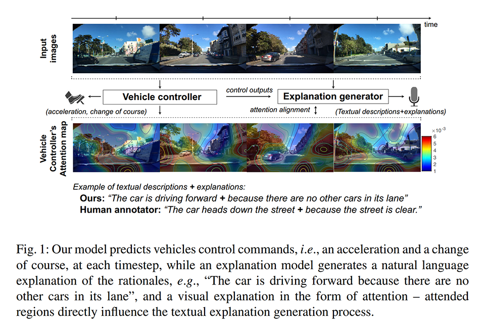
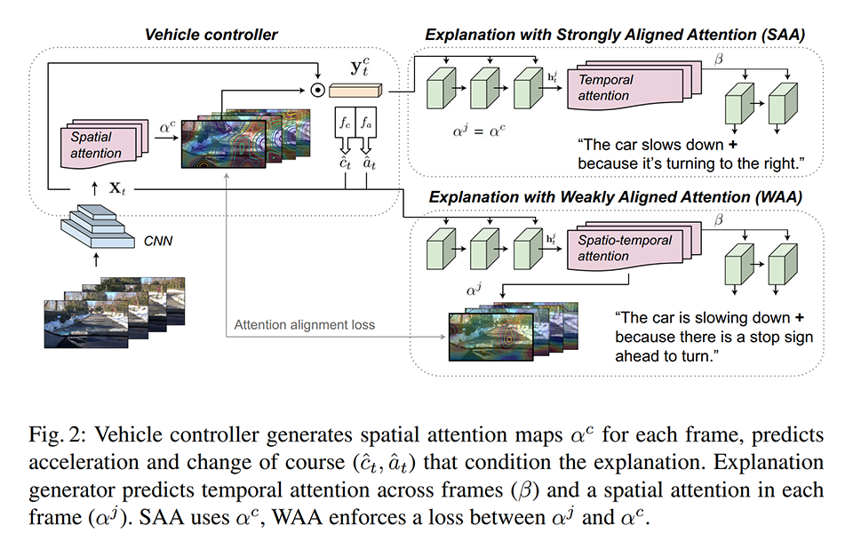
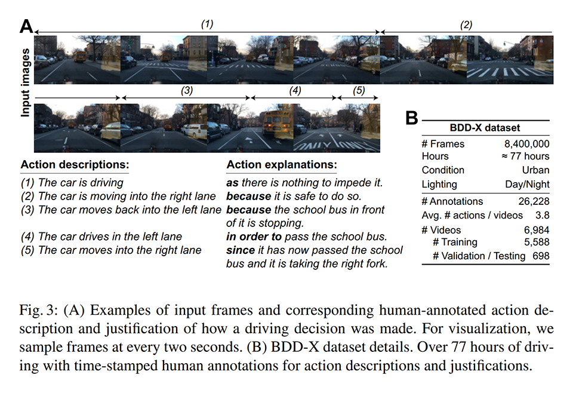
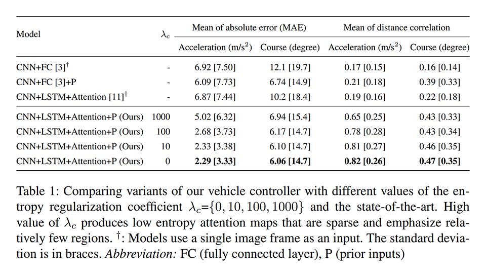
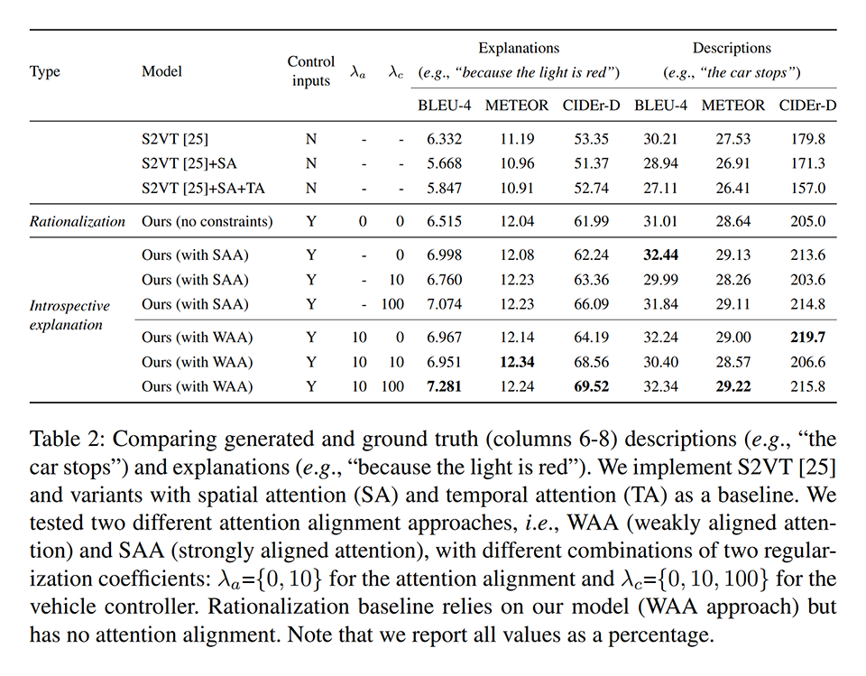
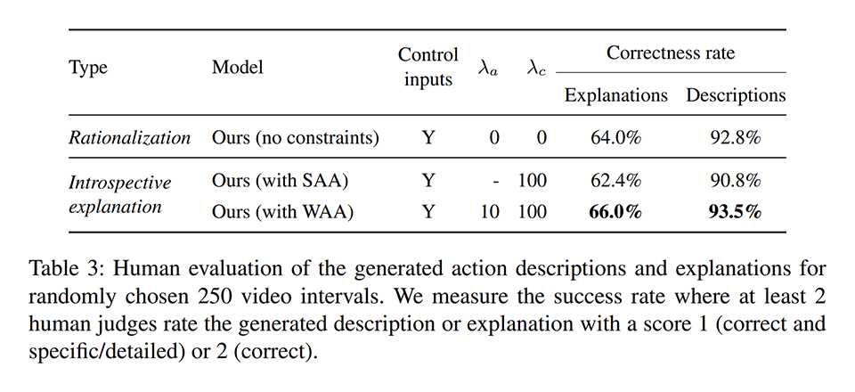
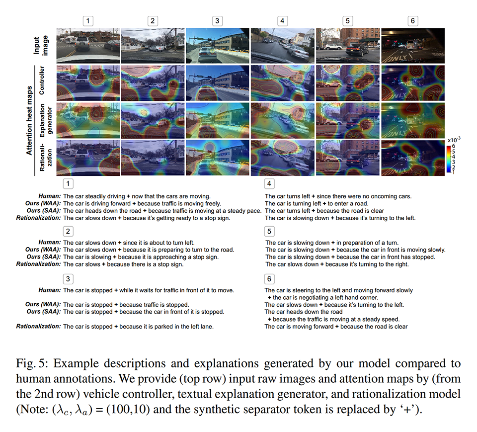

# [\[arxiv\]](https://arxiv.org/abs/1807.11546) Textual Explanations for Self-Driving Vehicles

- 著者
    - Jinkyu Kim *1
    - Anna Rohrbach *1 *2
    - Trevor Darrell *1
    - John Canny *1
    - Zeynep Akata *2 *3
- 所属
    - 1: EECS, University of California, Berkeley CA 94720, USA
    - 2: MPI for Informatics, Saarland Informatics Campus, 66123 Saarbrucken, Germany
    - 3: AMLab, University of Amsterdam, 1098 XH Amsterdam, Netherlands

## どんなもの？

### 提案手法
動画から自然言語の説明を生成する新しい手法（次の２つで構成され、end-to-end で学習できる DNN）を提案した。

- Vehicle controller: 動画から運転操作を予測する CNN（視覚注意機構付き）
- Explanation generator: 動画から自然言語の説明を生成する LSTM（注意機構付き）

本研究は DARPA XAI プロジェクトの１つである。

- [JST による解説](https://www.jst.go.jp/crds/sympo/201906_JSAI/pdf/02.pdf) 「機械学習の説明可能性への取り組み － DARPA XAI プロジェクトを中心に －」

### BDD-X (Berkeley DeepDrive eXplanation) dataset
提案手法を学習・評価するためのデータセットを作った。
BDD (Berkeley DeepDrive) dataset の動画の時間帯に対して自然言語の説明（次の２つで構成される文）を付与したものである。

- Description: どのような運転をしているか（前後進・加減速・右左折・車線変更など）を説明する文節
- Explanation: そのような運転をした理由（停車中の車がいるなど）を説明する文節

## 先行研究と比べてどこがすごい？
### 提案手法
- end-to-end で学習できるようにした。
- BDD-X を用いた定量評価により既存手法より高精度であることを明らかにした。

### BDD-X
- 運転操作とその理由が付いているデータセットを作った。

## 技術や手法の肝は？
### 提案手法
次のように視覚注意機構を工夫した。他は割と普通のやり方になっている。

- SAA (Strongly Aligned Attension): 普通の手法
- WAA (Weakly  Aligned Attension): ２つのフレームから求めた視覚注意マップの間の KL ダイバージェンスを損失関数にして正則化する手法

### BDD-X
アノテーションの際に泥臭い工夫をした。

## どうやって有効だと検証した？

### Vehicle controller の精度比較
Explanation generator をくっつけてマルチタスク学習することで、Vehicle controller の精度が改善する。

### 生成された説明の精度比較
end-to-end で学習できるようにしたことと、WAA を導入することで、説明の精度が改善する。

### 人間による説明の評価
視覚注意を導入することで、説明の精度が改善する。

## 議論はある？
- 視覚注意マップを因果フィルタリングすることで精度を高めることができそう。
- 因果フィルタリングすることでよりよい根拠を提示できるようになる。
- 物体検出などを視覚注意機構に組み込むことで精度を高めることができそう。
- ドライバーの視線と行動の関係を模倣できるようにすることも重要そう。
- (私見) Description が車両の運動にフォーカスしすぎていて、自然言語である必要がほぼないように見える。
- (私見) Explanation が信号の状態や周辺物との位置関係で説明できるので、自然言語である必要がほぼないように見える。
- (私見) 自然言語による説明は人が直接的に理解できる点がよいが、自車や周辺物の運動と状態で説明しても理解しやすいのではと思う。そっちの方が精度も高いだろうし。

## 次に読むべきタイトルは？
- [\[arxiv\]](https://arxiv.org/abs/1703.10631) Kim, J., Canny, J.: "Interpretable learning for self-driving cars by visualizing causal attention", ICCV, 2017.
