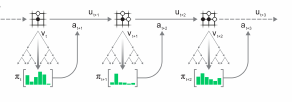
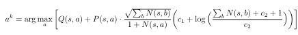
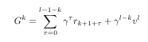
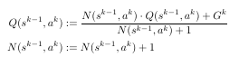
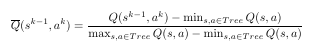
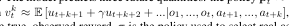
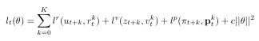
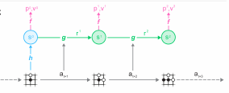
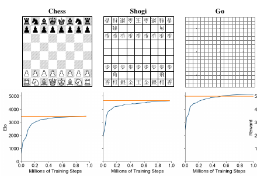
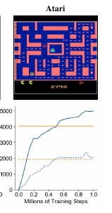

# Mastering Atari, Go, Chess and Shogi by Planning with a Learned Model
[https://arxiv.org/abs/1911.08265](https://arxiv.org/abs/1911.08265)
(まとめ @n-kats)

著者
* Julian Schrittwieser
* Ioannis Antonoglou
* Thomas Hubert
* Karen Simonyan
* Laurent Sifre
* Simon Schmitt
* Arthur Guez
* Edward Lockhart
* Demis Hassabis
* Thore Graepel
* Timothy Lillicrap
* David Silver

DeepMind（Hassabis含む）

# どんなもの？
AlphaGo から始まる一連の強化学習アルゴリズムの最新作 MuZero の論文

# 先行研究と比べてどこがすごい？
よくあるモデルベースの手法は厳密なシミュレーションを使って先読みの訓練を行う。MuZero ではシミュレーション部分をニューラルネットで表現。
シミュレータが用意できないときなどでもモンテカルロ木探索を行う。多くの Atari のゲームで SOTA を達成（モデルフリーでしないといけない問題がモデルベースに近い形がとれるようになった）。

# 技術や手法の肝は？
## 基本構成
* g: dynamics function
* h: representaion function
* f: prediction function
  * policy function
  * value function

### 入出力
* h: 環境 → 状態（s^0）
* g: 状態（s^i）, アクション → 報酬, 状態（s^{i+1}）
* f: 状態（s^i） → ポリシー（確率分布）, 評価値

## シミュレータ
シミュレータは dynamics function に基づき動作する。
representaion function でシミュレータの表現に変換する。
prediction function でシミュレータ内の状態を評価し、ゲームをプレイしたりする。

囲碁の場合は AlphaZero 準拠で800個のシミュレータを動かす。Atari　の場合はすぐに変化して少ないシミュレータで十分で50個としている。

## モンテカルロ木探索
AlphaGo 登場前の囲碁で採用され棋力を向上させた手法。確率に基づいてランダムにゲームを進行させ、その結果で勝てそうな手かを判断する。

MuZero の場合、ポリシーの値を使ってモンテカルロ木探索する。

モンテカルロ木探索するときに次の値を計算に使う
* N(s, a): aを採用した回数
* Q(s, a): 報酬の平均
* P(s, a): ポリシー
* R(s, a): 報酬
* S(s, a): 状態変化（キャッシュ用）

### upper confidence bound

c1=1.25, c2=19652のような値が使われている。

### 初期値
* N(s, a) = 0
* Q(s, a) = 0
* P(s, a) = ネットワークの出力

### update

### normalized
一般的な環境で報酬の値が有界とは限らないため、次の正規化をする

## 報酬
value function は次の値を意味する（γは割引率、0.997にしている）。

## 損失関数
報酬予測・評価値・ポリシーをターゲットに訓練を行う。

時刻 t での損失はシミュレータ K ステップまでを訓練する（実際は更に先のシミュレーション結果が必要。ここはモンテカルロ木探索で選ぶ。replay buffer に履歴を残す。）

いずれも第1引数が実際の結果で、第2引数がシミュレータのアウトレット

# どうやって有効だと検証した？

## チェス・将棋・囲碁
Elo（強さを表す指標）のグラフが次の通り。横線が AlphaZero。
将棋・チェスは

## Atari
横線は R2D2。実線が平均、破線が中央値（値は人間のスコアで正規化）

# 議論はある？
ルールが不明な状態で完全なシミュレータが無い状態でも、疑似的なシミュレータでモデルベースに近い方法が取れ、SOTAを連発した。

# 次に読むべき論文は？
* [R2D2](https://deepmind.com/research/publications/recurrent-experience-replay-distributed-reinforcement-learning)

## その他
* http://tadaoyamaoka.hatenablog.com/entry/2019/11/21/230612  
  コンピューター将棋などで名前を聞く山岡さんのブログに MuZero についてシリーズで解説されている
