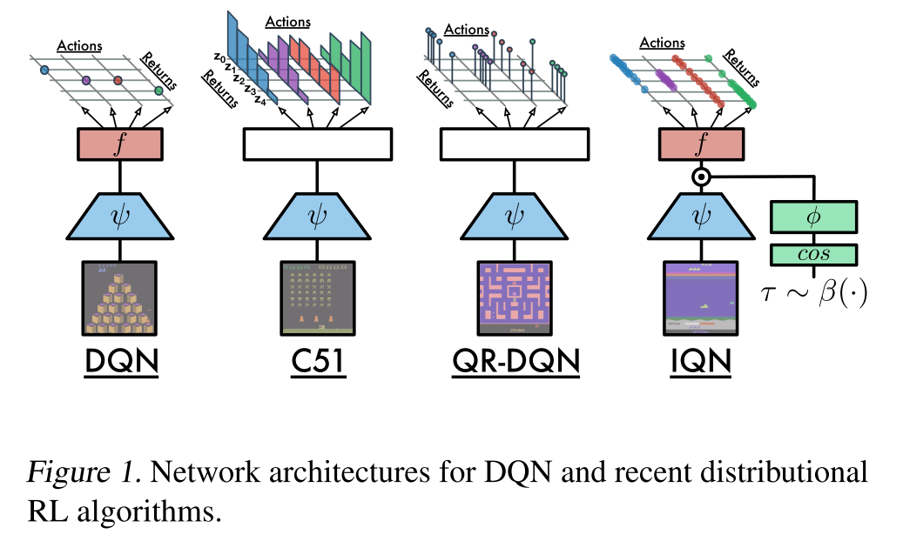
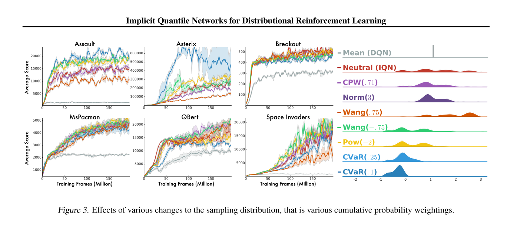
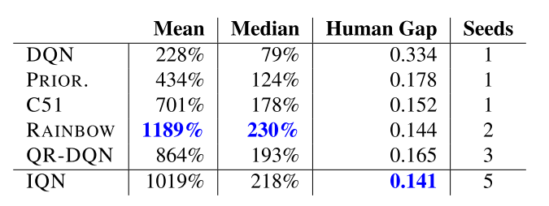
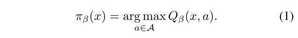

Implicit Quantile Networks for Distributional Reinforcement Learning  
===

Will Dabney , Georg Ostrovski , David Silver , R´emi Munos  

Google DeepMind

[https://arxiv.org/abs/1806.06923](https://arxiv.org/abs/1806.06923)

---

## どんなもの？

* Q学習ベースの強化学習アルゴリズム  
* 報酬をスカラーではなく、分布として扱う。
* 探索のポリシーとして「risk-sensitive policy」と呼ばれるリスクを測る尺度を用いた。  
  
  

---

## 先行研究と比べて何がすごい？  

* 報酬に分布を用いる手法として、先行研究としてC51、QR-DQNなどがある。  
  従来手法では、報酬の評価に分布の平均を用いていたが、本手法では分位回帰により報酬を評価する。  
  それにより報酬分布の偏りを考慮できる。外れ値に対して頑健である等が特徴  

* 探索のポリシーにリスク尺度に基づいた行動選択を行う。  

---

## どうやって有効だと検証した？  

* Atariのベンチマークによる比較。  
  
異なる分布の報酬を仮定した場合の比較。  
  

手法別の比較  
DQN、Rainbow、C51、QR-DQNなど  
  

Rainbowとほぼ同じような性能。

---

## 技術や手法の肝は？

* risk-sensitive policy  
  CPW、Wang、CVaRの三つのリスク測度を、実装して検証した。  

* Distributional RL、quantile regression  

価値関数  
  
ポリシー  
  
  

---

## 議論はある？

* 他のQ学習アルゴリズムに対しても拡張可能か？  

---

## 次に読むべき論文は？

C51、QR-DQNに関しても、どのようなものかを確認しておきたい。
確率・統計の数学理論がいろいろと出てきたので調べておきたい。

