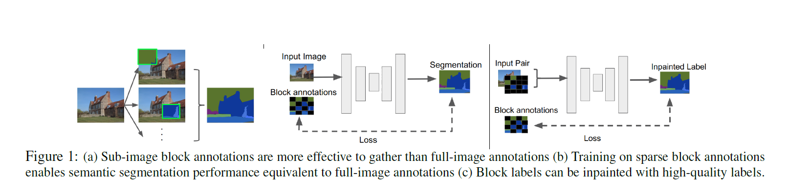
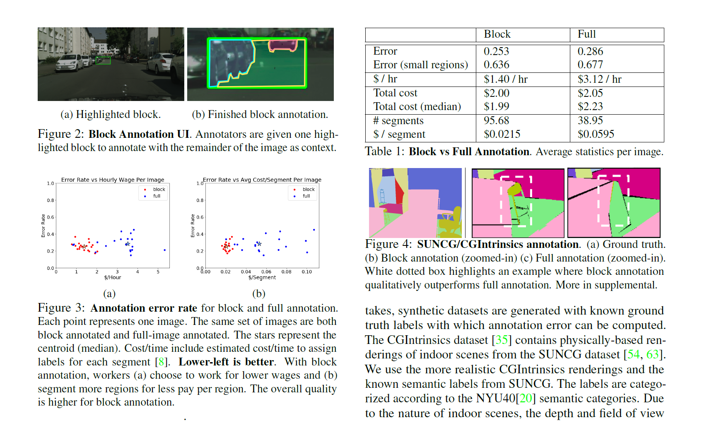
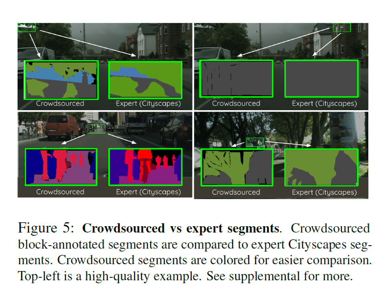
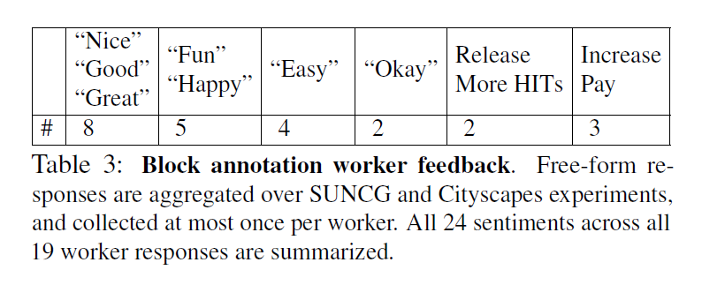
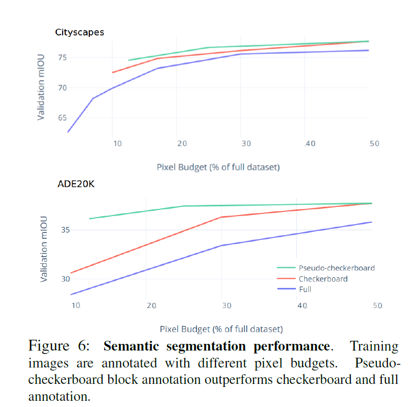

Block Annotation: Better Image Annotation for Semantic Segmentation with Sub-Image Decomposition
===

2020/02/16 Hubert Lin, Paul Upchurch, Kavita Bala

https://arxiv.org/abs/2002.06626

（まとめ：yuji38kmwt）

---

## どんなもの？
* 1枚の画像を複数のブロックに分割してアノテーションする「Block Annotation」を、従来の1枚の画像に対してアノテーションする「Full Annotation」と比較する。
* block annotationは1枚の画像に対するアノテーションよりも、
+ Abstract/Conclusion/Introduction で読んだ内容を書く。
+ リストで2～4項目程度

---

## どうやって有効だと検証した？

### block annotationとfull-image annotationの比較
* SUNCG/CGIntrinsics datasetのground-truthを使って、 Block Annotationは full-image annotationと比較した。
    * 金銭コストは同等だった。
    * 品質は block annotationの方が高かった。

* 給料に対してボーナスあり

#### 研究の詳細
* Amazon Mechanical Turkを使った
* full-image annotationとbox annotationに習熟した10人のワーカで構成されている
* 画像を16個に分割した（ブロックごとに平均3.5個のセグメントになるように）
* 難易度が高い画像20個を使った
    * 難易度はセグメントの数
    * >Image difficulty is estimated by counting the maximum number of ground truth segments in a fixed-size sliding window.
* 窓や鏡越しのオブジェクトに時間を使わないよう、窓や鏡は画像でマスクした
* 金額： $0.06 per block, $0.96 per full-image task

### エキスパートとクラウドソーシングの比較
* クラウドソーシングでもエキスパートと同等の品質だった。
* クラウドソーシングの方が品質が高い場合があった

 

### ワーカのフィードバックを得た。
* より高い賃金を求めた人：3/57人
* 「block annotationの賃金が減っても、full-image annotationはやりたくない」と言える

### セグメンテーションのパフォーマンスを評価した
* mIOUで評価した。
* full-image annotationより優れている？
* pixel budget（ピクセルの割合）が低くなると、ギャップが広くなる？
* checkerboard？
* pseudo-checkerboard？

---

## 技術や手法の肝は？
なし

---

## 議論はある？
なし

---

## 先行研究と比べて何がすごい？
なし

---

## 次に読むべき論文は？

* [Efficient Interactive Annotation of Segmentation Datasets with Polygon-RNN++](https://arxiv.org/abs/1803.09693)
    * アノテーション方法について論じている(はず)

---
### 所感
* アノテーションの実験方法について、詳細に記載している論文だと思った
    * 実際にアノテータのフィードバックを得たところなども、詳しく分析している印象を受けた

----------------------
# memo
* 品質コントロールしている

* Human Annotation
    * 3D scene?

### 英語
* investigate: 調べる
* spatial：空間的な
* exploration：探求
* accrue：生じる
* outperform：優れている
* Remarkably：驚くべきことに
* intrinsically:本質的に
* paratable：趣味に合う
* influence：影響
* synthetics：総合的な

